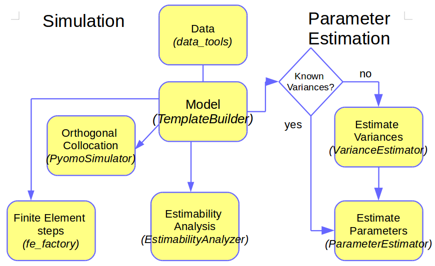
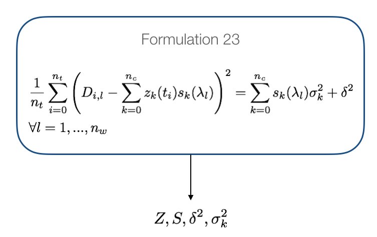
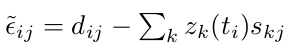
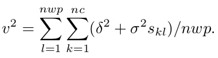
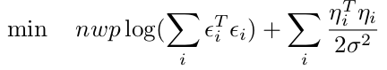

Background
==========

This documentation focuses on kinetic studies for the investigation of chemical reactions and identification of associated rate constants from spectroscopic data. The methodology is the same as published in Chen, et al. (2016), where the technical details are laid out in significant detail. In this document the user will find a summary of the procedure in the paper as well as how this method has been transferred to KIPET. This document will therefore attempt to only describe as much detail as necessary in order to understand and use KIPET.

General modeling strategy and method
------------------------------------
After installing and importing the package users can do the following things:
 * Build a chemical reaction model
 * Simulate the model
 * Estimate variances in the data
 * Preprocess data
 * Perform estimability analysis
 * Estimate parameters
 * Ascertain whether a different subset of wavelengths is more suitable for the model
 * Compute confidence intervals of the estimated parameters
 * Plot concentration and absorbance profiles

This can be done for problems where we have multiple datasets from separate experiments or in the case of having concentration data only and not spectra.

The first step in KIPET is to create a model. A model contains the physical equations that represent the chemical reaction system dynamics. Once a model is created users can either make a simulation by solving the DAE equations with a multi-step integrator or through a discretization in finite elements. Alternatively an optimization can be performed in which the DAE equations are the constraints of the optimization problem. In general, KIPET provides functionality to solve optimization problems for parameter estimation of kinetic systems. For the construction of optimization models KIPET relies on the Python-based open-source software Pyomo. Pyomo can be used to formulate general optimization problems in Python. After a model is created users can extend the model by adding variables, equations, constraints or customized objective functions in a similar way to Pyomo. After the simulation or the optimization is solved, users can visualize the concentration and absorbance profiles of the reactive system. These steps are summarized in the following figure.

   The steps/modules involved in setting up a KIPET model

The variable nomenclature follows the same labeling structure as used in the original paper, Chen et al. (2016). Once the model is created it can be simulated or optimized. KIPET simulates and optimizes Pyomo models following a simultaneous approach. In the simultaneous approach all of the time-dependent variables are discretized to construct a large nonlinear problem. Due to the nature of large nonlinear problems, good initial guesses for variables are essential. KIPET provides a number of tools to help users to initialize their problems, including through the use of running simulations with fixed guessed parameters, using a least squares approach with fixed parameters, or through a finite element by finite element approach using KIPET’s in-built fe_factory (recommended for large problems and necessary for problems in which we have dosing).
KIPET therefore offers a number of simulator and optimizer classes that facilitate the initialization and scaling of models before these are called for simulation. In addition, the simulator and optimizer classes available in KIPET will store the results of the simulation/optimization in pandas DataFrames for easy visualization and analysis. More information on this and why this is relevant to the user will follow during the tutorial problems.
KIPET offers two classes for the optimization of reactive models. The ParameterEstimator class estimates kinetic parameters from spectral data by solving the problem formulation described in Chen, et al. (2016). Within this class the objective function is constructed with Pyomo and added to the model that is passed to the solver. If the user provides a model with an active objective function however, the ParameterEstimator will optimize the objective function provided by the user. This class also offers the ability to determine the confidence intervals of the estimated parameters. For all calculations in the ParameterEstimator class the variances of the spectral data need to be provided. When the variances are not known the user can use the VarianceEstimator optimizer class instead to determine them.
We provide a number of different approaches to estimate the variances. The first one is the one described in Chen et al. (2016). The procedure consists of solving three different nonlinear optimization problems in a loop until convergence on the concentration profiles is achieved. The following figure summarizes the variance estimation procedure based on maximum likelihood principles:

.. figure:: background2.png
   :width: 400px
   :align: center

   The VarianceEstimator class algorithm 1 from Chen et al. (2016)

The VarianceEstimator class will construct the three problems and solve them with a nonlinear solver until the convergence criteria is satisfied. By default KIPET checks for the infinite norm of the residuals of Z between two iterations. If the infinity norm is less than the tolerance (default 5e-5) then variances are estimated by solving the overdetermined system shown in the next figure.

   Variance estimation equations

The solution of each subproblem in this procedure is logged in the file iterations.log. Examples on how to use the optimization classes and their corresponding options can be found in the tutorial section of this document. It should be noted at this point that all that is required to determine the variances in this way are the components, their initial concentrations, the differential equations describing the reactions, and the spectroscopic data absorption matrix, D, which consists of the experimental absorption data with rows (i) being the time points and columns (l) being the measured wavelengths.
The above method was described in the initial paper from Chen et al. (2016). This method can be problematic for certain problems and so a new variance estimation procedure has been developed and implemented in version 1.1.01 whereby direct maximum likelihood formulations are solved. We propose and include 2 new methods as well as a number of functions in order to obtain good initial guesses for variance.  The first and recommended method is known as the “alternate” strategy within KIPET. Here we solve for the worst-case device variance first:

.. figure:: background4.png
   :width: 400px
   :align: center

where

Then we set:

.. figure:: background6.png
   :width: 400px
   :align: center

We also know that, from derivations in Chen et al. (2016):

We guess initial values for σ (which the user provides) and solve the maximum likelihood-derived objective:

and then we are able to determine \delta from:

.. figure:: background9.png
   :width: 400px
   :align: center

Following this we can evaluate:

.. figure:: background10.png
   :width: 400px
   :align: center

This function then provides us with the difference between our overall variance and the model and device variances. If the value of the function is below tolerance we stop or we update σ using a secant method and re-solve until we find convergence. 

A third method is provided, referred to as “direct_sigmas” in KIPET, which  first assumes that there is no model variance and solves directly for a worst-case device variance. The formulation solved is thus:

.. figure:: background11.png
   :width: 400px
   :align: center

And from this formulation, the device variance can be solved for directly assuming that there is no model variance. Once the worst-possible device variance is known, we can obtain some region in which to solve for the model variances knowing the range in which the device variance is likely to lie. The following equation can be used to solve for different values of device variance:

.. figure:: background12.png
   :width: 400px
   :align: center

Once these solutions are obtained we can solve directly for the model variances. A selection of model and device variances are then provided to the user, and the user is able to decide on the appropriate combination for their problem. More rigorous mathematical derivations of these methods will be provided in future documentation versions.
Once the variances are estimated we not only attain good estimates for the system noise and the measurement error, but we have also obtained excellent initializations for the parameter estimation problem, as well as good initial values for the kinetic parameters to pass onto the  ParameterEstimator class.
Where Equation 17 from Chen, et al. (2016) is solved directly:

.. figure:: background13.png
   :width: 400px
   :align: center

Note here that this can be solved either directly with the variances and measurement errors manually added and fixed by the user, or through the use of the VarianceEstimator.
It is also important at this point to note that we can solve the ParameterEstimator problem either using IPOPT to get the kinetic parameters or we can use sIPOPT or k_aug to perform the optimization with sensitivities in order to determine the confidence intervals.

Setting up and understanding a model in KIPET
---------------------------------------------
Once all of the software required for KIPET is installed, we can begin learning and testing the toolkit by opening the “Ex_1_ode_sim.py”. The template examples are some simple tutorial examples designed to assist new users in utilizing the software and are also meant to allow for easy manipulation so that the user can alter the code for their own specific uses.
Before getting started with KIPET it is useful for users to be familiar with basic Python programming. The Python website provides users with a basic tutorial.
If you are new to Python or a novice in coding, you can open the example by starting the IDE of your choice and loading the example from the folder where KIPET is installed. For those using the recommended Anaconda platform, launch Anaconda-Navigator (either from the start menu in Windows or by typing “anaconda-navigator” into the terminal in Linux/MacOS) and then launching the Spyder IDE from the Homepage.
In this section the user will be guided through the various types of problems that KIPET was designed to solve, with detailed line-by-line analysis of the example files, with particular attention being given to the areas of the code where it is intended for users to interact in order to implement their own problems. The tutorials section will be broken down into:

General model details
^^^^^^^^^^^^^^^^^^^^^

This is information that needs to be supplied by the user for every problem to be solved in KIPET.
Data handling
In this section we will look at which types of data can be handled by KIPET and what form the data files need to be supplied in.

Simulation
^^^^^^^^^^

This section deals with the simplest type of problem that can be solved in KIPET, involving plotting concentration vs time graphs for the specified systems with the systems’ parameters specified. If the individual pure species’ absorbances (S-matrices) are known these can also be inputted to obtain the expected absorbance profiles (D-matrix) for the system.

Variance Estimation
^^^^^^^^^^^^^^^^^^^

This section will show how to use the VarianceEstimator class to estimate the measurement error and noise in the data.

Parameter Estimation
^^^^^^^^^^^^^^^^^^^^

KIPET’s most valuable and powerful class is described here, allowing for the estimation of kinetic parameters. This section will explain how the user calls upon the ParameterEstimator class and how to solve the discretization and optimization problem.

Advanced problems with complementary states
^^^^^^^^^^^^^^^^^^^^^^^^^^^^^^^^^^^^^^^^^^^
This section will demonstrate the way in which more advanced systems can be solved by introducing complementary state variables and algebraic variables to introduce complexities that may also change with time such as temperature, densities, volumes, etc.

Modeling approach and organization
----------------------------------

This section will look at specific example files provided with the KIPET software and explain, line-by-line the sections that a user will need to modify in order to solve their own problems. All lines of code that are not explained in this tutorial are necessary for the code to function, but should not need to be altered by the user. For brevity these lines are omitted.
Firstly we will look at the pieces of information that every KIPET model requires to function.

In order to fully understand the model-building process and results obtained, the user needs to be familiar with the nomenclature used.

Variables:

Z -- unnoised concentrations of each species, continuous in time.

C – concentration matrices with noise. 
 
S -- pure component absorbance matrices.

X – algebraic variables such as volume, temperatures, densities, etc.

P – kinetic parameters (can be fixed for simulations)

Parameters and (indices):

Components, (k) – the components, with index k

Meas_times, (t) – the measurement times from the data file.

Meas_lambdas, (l) – the wavelengths from the experimental data.

Every KIPET model requires a number of things in order to function. This includes a list of the components in the system, identification of the components that will be absorbing, a list of the reactions (noting that each component requires an ODE), and a number of class and function calls that will be detailed in the sections to follow.
Generally the code can be broken down into a number of steps, with some of the steps only being applicable to certain model applications. Each of these steps will be described in the sections to follow within this document, with examples as to how to use the relevant functions for your own problems. Please note that, at the moment of writing this document, it is required that you import the library that you are using in each example. The import statement for each of the sets of tools described below is included. These steps are summarized as:

Reading / manipulating / preprocessing data
^^^^^^^^^^^^^^^^^^^^^^^^^^^^^^^^^^^^^^^^^^^

Required for problems where data is available or needs to be generated. A wide variety of 	reading, writing and data manipulation tools are available within this module.
::

    from kipet.library.data_tools import *	

TemplateBuilder
^^^^^^^^^^^^^^^

This section is required for all models and is where the components, ODEs, and other 	problem-specific data is inputted.
::

    from kipet.library.TemplateBuilder import *	

Simulator
^^^^^^^^^

This section is required if a simulation is being performed and can call either upon PyomoSimulator of FESimulator. Noise can also be simulated and added to the results or used to generate a D-matrix. The simulators can also be used to initialize the parameter estimation problem if needed.
::

    from kipet.library.PyomoSimulator import *	
	
If the fe_factory is used to initialize the simulator then we can use the FESimulator module, 	which acts as an automatic wrapper function to use fe_factory with KIPET models.
::

    from kipet.library.FESimulator import *
    from kipet.library.fe_factory import *

VarianceEstimator
^^^^^^^^^^^^^^^^^
This is meant for problems where we have a D-matrix from experimental data with measurement error and random noise. Can also be used to initialize the kinetic parameter estimation.
::

    from kipet.library.VarianceEstimator import *	

ParameterEstimator
^^^^^^^^^^^^^^^^^^
Used to simultaneously determine the concentration-time profiles and kinetic parameters using orthogonal collocation on finite elements, as described previously in this document. Can also determine the covariances and confidence intervals associated with the kinetic 	parameters. Module also contains the tools used to determine the appropriate subset of wavelengths to be used for the parameter estimation based on a lack-of-fit.
::

    from kipet.library.ParameterEstimator import *	

MultipleExperimentsEstimator
^^^^^^^^^^^^^^^^^^^^^^^^^^^^
Class called when performing parameter estimation from multiple datasets. Works through constructing pyomo blocks containing each individual dataset and performing the variance and parameter estimation separately before solving them simultaneously with parameters linked across datasets. 
::

    from kipet.library.MultipleExperimentsEstimator import *

EstimabilityAnalyzer
^^^^^^^^^^^^^^^^^^^^

Uses k_aug to obtain sensitivities and then uses these sensitivities to obtain the parameter 	estimability rankings. These ranked parameters are then used to compute mean squared errors for various simplified models using some paramters fixed and others remaining as variables. Currently only functional for concentration-data problems.
::

    from kipet.library.EstimabilityAnalyzer import *

Visualising and viewing results
^^^^^^^^^^^^^^^^^^^^^^^^^^^^^^^
Finally we can visualize the results by using the matplotlib graphing functions as well as 	printing the variances, kinetic parameters, and confidence intervals.

The next sections will provide some tutorials as to allow the user to use all of KIPET’s functionality.

