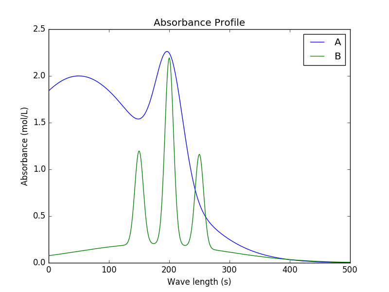

Overview/Introduction
=====================
KIPET is an open-source Python package developed through a partnership between Eli Lilly and Company and Carnegie Mellon University. The package is primarily used for the estimation of kinetic parameters from spectral/concentration data. It can also be used to preprocess data, simulate reactive systems, estimate data variances, obtain confidence intervals of the kinetic parameters obtained, and do estimability analysis. This is all possible through a unified framework based on maximum likelihood principles, robust discretization methods, and large-scale nonlinear optimization.
In this documentatation the capabilities of KIPET are described and examples and tutorials are given so that a user with basic programming knowledge can use the toolkit for their own purposes.

.. figure:: introimg1.png
   :width: 400px
   :align: center

   Visualization of a multi-wavelength spectroscopic dataset

   Example of the decomposition of the spectra in single component absorbance and concentration profiles (absorbance)

.. figure:: introimg3.png
   :width: 400px
   :align: center

   Example of the decomposition of the spectra in single component absorbance and concentration profiles (concentration)

Additionally, KIPET can be used to obtain a better understanding of a chemical reaction system through inclusion of functionalities that allow for the simulation and optimization of reactive systems that are described by differential algebraic equations (DAEs). The following functionalities are included within the KIPET package:

	*	Simulation of a reactive system described with DAEs  
	* 	Solve DAE systems with collocation methods
	*	Pre-process data
	*	Estimability analysis
	* 	Estimate data variances
	* 	Estimate kinetic parameters
	* 	Estimate confidence intervals of the estimated parameters
	*	Obtain the most informative wavelength set to obtain minimal lack-of-fit
	*	Tools for system analysis (SVD, PCA, lack of fit, etc.)
	* 	Visualize results

In the sections that follow, this document provides guidelines on how to make use of KIPET. A detailed installation guide is provided, including a list of all packages required to use KIPET. Some background theory into how KIPET works, as well as the structure of KIPET is then explained in Section 3. A guide for using some of the various capabilities is then provided in the form of tutorial examples (Section 4).  In Section 5 a more detailed look into some of the classes and functions that are not explicitly explained in Section 4 is provided. Finally, in Section 6, the documentation provides references and further reading that provides more detail on the theory behind the numerical techniques implemented in KIPET.

KIPET is made available under the GNU General Public License, GPL-3. For more details on this  license please review the terms on the Github page or at this link.
The KIPET team involves Salvador Garcia-Munoz (Eli Lilly), Santiago Rodriguez (Purdue University),  Lorenz T. Biegler, David M. Thierry, Christina Schenk, and Michael Short (all Carnegie Mellon University).

