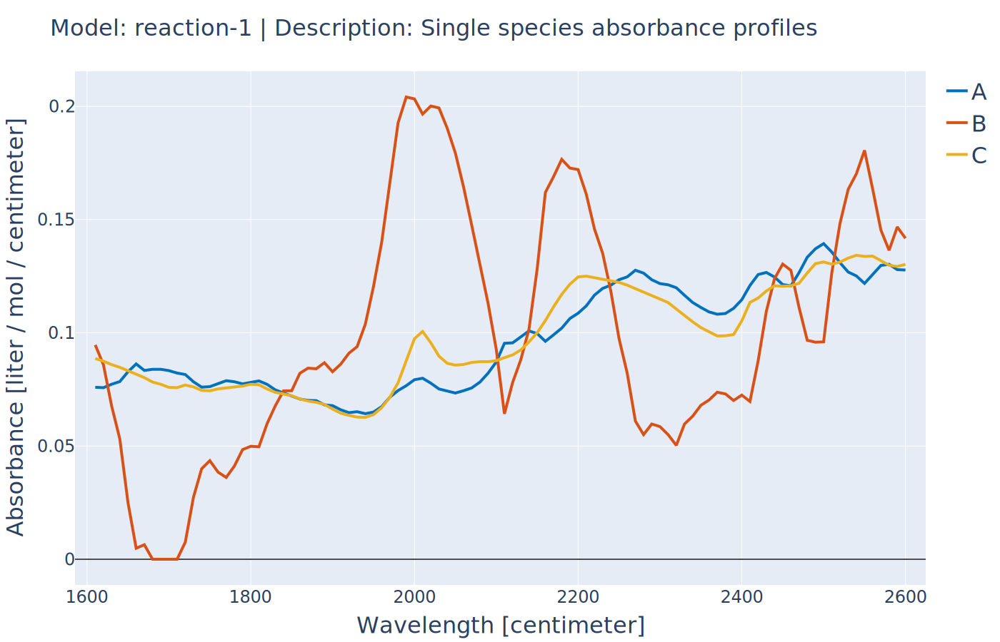

Using Wavelength Selection Tools
--------------------------------
:Files:
    `Ex_10_estimation_lof_correlation_subset_selection.py <https://github.com/kwmcbride/kipet_examples/blob/master/examples/example_10/Ex_10_estimation_lof_correlation_subset_selection.py>`_

In this example we are assuming that we have certain wavelengths that do not contribute much to the model, rather increasing the noise and decreasing the goodness of the fit of the model to the data. We can set up the problem in the same way as in Example 2 and solve the full variance and parameter estimation problem with all wavelengths selected.

::

    import kipet

    r1 = kipet.ReactionModel('reaction-1')

    # Add the model parameters	
    k1 = r1.parameter('k1', value=2, bounds=(0.0, 5.0))
    k2 = r1.parameter('k2, value=0.2, bounds=(0.0, 2.0))
    
    # Declare the components and give the initial values
    A = r1.component('A', value=1)
    B = r1.component('B', value=0.0)
    C = r1.component('C', value=0.0)
    
    # Use this function to replace the old filename set-up
    r1.add_data('D_frame', category='spectral', file='data/Dij.txt')

    # Define explicit system of ODEs
    rA = r1.add_reaction('rA', k1*A)
    rB = r1.add_reaction('rB', k2*B)
    
    # Add the ODEs to the model
    r1.add_ode('A', -rA)
    r1.add_ode('B', rA - rB)
    r1.add_ode('C', rB)
    
	# Place a bound on the species' absorption profiles (if known)
    r1.bound_profile(var='S', bounds=(0, 200))

    # Settings
    r1.settings.collocation.ncp = 3
    r1.settings.collocation.nfe = 60
    # This needs to be set to False to keep the reduced hessian output surpressed
    r1.settings.parameter_estimator.tee = False
    r1.settings.parameter_estimator.solver = 'ipopt_sens'
    r1.settings.solver.mu_init = 1e-4
    
    r1.run_opt()
   
    # Display the results
    r1.results.show_parameters
    r1.plot()
    
After completing the normal parameter estimation, we can determine the lack of fit with the following function:
::
    
    lof = r1.lack_of_fit()
	>> The lack of fit is  1.3914660989504697  %
	
  
This returns the lack of fit as a percentage, in this case 1.37 % lack of fit. We can now determine which wavelengths have the most significant correlations to the concentration matrix predicted by the model:
::
  
    correlations = r1.wavelength_correlation(corr_plot=True)
    
This function prints a figure that shows the correlations (0,1) of each wavelngth in the output to the concentration profiles. As we can see from figure, some wavelengths are highly correlated, while others have little correlation to the model concentrations. Note that the returned correlations variable contains a dictionary (unsorted) with the wavelengths and their correlations. 
    
.. figure:: ../../images/ex_10_corr.svg
   :width: 600px
   :align: center

   Wavelength correlations
    
We now have the option of whether to select a certain amount of correlation to cut off, or whether to do a quick analysis of the full correlation space, in the hopes that certain filter strengths will improve our lack of fit. Ultimately, we wish to find a subset of wavelengths that will provide us with the lowest lack of fit. In this example, we first run a lack of fit analysis that will solve, in succession, the parameter estimation problem with wavelengths of less than 0.2, 0.4, 0.6, and 0.8 correlation removed using the following function:

::

    r1.run_lof_analysis()
    
Where the arguments are builder_before_data (the copied TemplateBuilder before the spectral data is added), the end_time (the end time of the experiment), correlations (the dictionary of wavelngths and their correlations obtained above), lof (the lack of fit from the full parameter estimation problem, i.e. where all the wavelengths are selected), followed by the nfe (number of finite elements), ncp (number of collocation points), and the sigmas (variances from VarianceEstimator).
These are the required arguments for the function. The outputs are as follows:

::

   >> r1.run_lof_analysis()

   When wavelengths of less than  0.00 correlation are removed
   The lack of fit is:  1.391466 %
   When wavelengths of less than  0.20 correlation are removed
   The lack of fit is:  1.407669 %
   When wavelengths of less than  0.40 correlation are removed
   The lack of fit is:  1.412721 %
   When wavelengths of less than  0.60 correlation are removed
   The lack of fit is:  1.431436 %
   When wavelengths of less than  0.80 correlation are removed
   The lack of fit is:  1.684903 %

From this analysis, we can observe that by removing many wavelengths we do not obtain a much better lack of fit, however, let us say that we would like to do a finer search between 0 and 0.12 filter on the correlations with a search step size of 0.01. We can do that with the following extra arguments:
::

   >> r1.run_lof_analysis(step_size = 0.01, search_range = (0, 0.12))

   When wavelengths of less than 0.000 correlation are removed
   The lack of fit is: 1.391466 %
   When wavelengths of less than 0.010 correlation are removed
   The lack of fit is: 1.391466 %
   When wavelengths of less than 0.020 correlation are removed
   The lack of fit is: 1.391466 %
   When wavelengths of less than 0.030 correlation are removed
   The lack of fit is: 1.387124 %
   When wavelengths of less than 0.040 correlation are removed
   The lack of fit is: 1.387124 %
   When wavelengths of less than 0.050 correlation are removed
   The lack of fit is: 1.388986 %
   When wavelengths of less than 0.060 correlation are removed
   The lack of fit is: 1.393768 %
   When wavelengths of less than 0.070 correlation are removed
   The lack of fit is: 1.390587 %
   When wavelengths of less than 0.080 correlation are removed
   The lack of fit is: 1.388974 %
   When wavelengths of less than 0.090 correlation are removed
   The lack of fit is: 1.391290 %
   When wavelengths of less than 0.100 correlation are removed
   The lack of fit is: 1.391290 %
   When wavelengths of less than 0.110 correlation are removed
   The lack of fit is: 1.391290 %
   When wavelengths of less than 0.120 correlation are removed
   The lack of fit is: 1.391290 %
    

So from this output, we can see that the best lack of fit is possibly somewhere around  0.095, so we could either refine our search or we could just run a single parameter estimation problem based on this specific wavelength correlation. In order to do this, we can obtain the data matrix for the parameter estimation by running the following function:
::
    
    subset = r1.wavelength_subset_selection(n=0.095) 
    
Which will just return the dictionary with all the correlations below the threshold removed. Finally, we run the ParameterEstimator on this new data set, followed by a lack of fit analysis, using:
::

    subset_results = r1.run_opt_with_subset_lambdas(subset) 
    
    # Display the new results
    subset_results.show_parameters
    
In this function, the arguments are all explained above and the outputs are the follows:
::

    The estimated parameters are:
    k1 0.3387633623377142
    k2 1.4770816755838945

.. figure:: ../../images/ex_10_C.svg
   :width: 600px
   :align: center

   Resulting concentration profiles

   Absorbance profiles