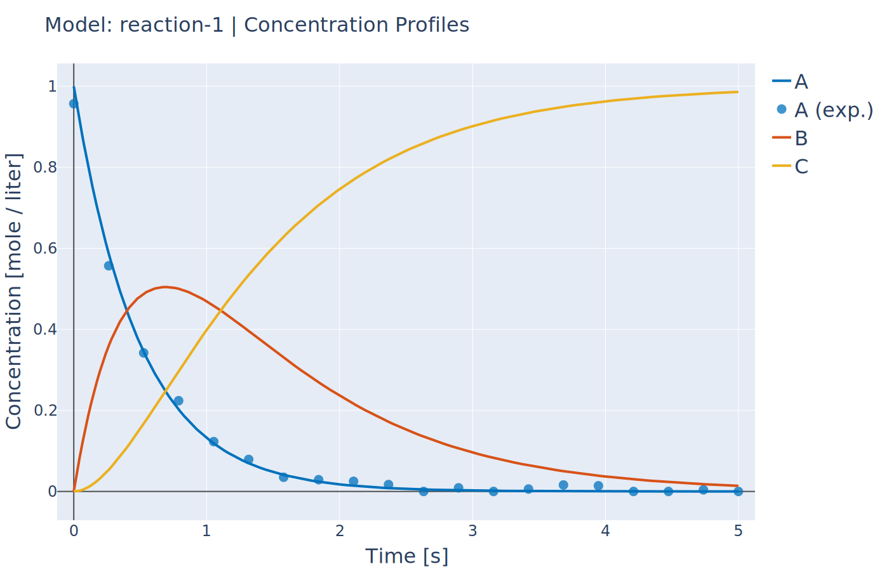
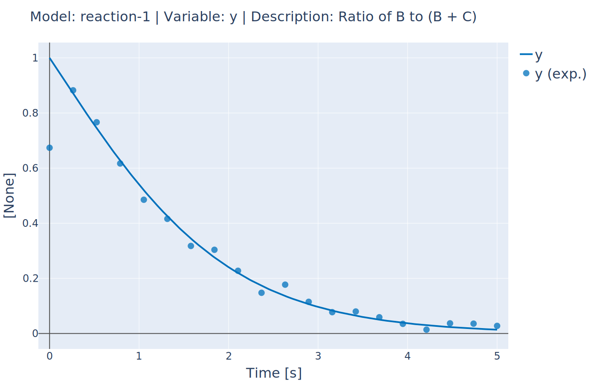

Adding Custom Data for Parameter Fitting
----------------------------------------
:Files:
    `Ex_17_custom_objective.py <https://github.com/kwmcbride/kipet_examples/blob/master/examples/example_17/Ex_17_custom_objective.py>`_

In the case where you have data that does not fit into one of the predefined categories, such as ratios between components for examples, you can still use this data to fit kinetic models in KIPET. How to do this is shown in the following code. The data needs to be entered into the model with the category 'custom' and labeled with a name, in this case 'y'. You then need to declare an algebraic variable of the same name and define the term to be used in fitting this data. The algebraic relationship will then be added to the objective function using a least squares term. The only extra requirement is to tell the model that this algebraic variable 'y' represents this new objective term. This is done using the method :ref:`add_objective_from_algebraic` with 'y' as the only argument.

In this example, concentration data for component A is available as normal. However, only the fraction of B compared to C (B/(B + C)) is provided for these components. This data can also be used in fitting the model.

.. note::
    If you use an expression with a division term that may go to zero, KIPET will automatically acount for this by adding very small amounts to both the numerator and denominator. In this way, the ratio will approach unity if both the numerator and the denominator approach zero.

::

    import kipet
    
    r1 = kipet.ReactionModel('reaction-1')
    r1.unit_base.time = 's'
    
    full_data = kipet.read_data('data/ratios.csv')
    
    # Add the model parameters
    k1 = r1.parameter('k1', value=2, bounds=(0.0, 10.0), units='1/s')
    k2 = r1.parameter('k2', value=0.2, bounds=(0.0, 10.0), units='1/s')
    
    # Declare the components and give the valueial values
    A = r1.component('A', value=1.0, units='mol/l')
    B = r1.component('B', value=0.0, units='mol/l')
    C = r1.component('C', value=0.0, units='mol/l')
    
    r1.add_data('C_data', data=full_data[['A']], remove_negatives=True)
    r1.add_data('y_data', data=full_data[['y']])
    
    r1.add_ode('A', -k1 * A )
    r1.add_ode('B', k1 * A - k2 * B )
    r1.add_ode('C', k2 * B )
    
    r1.add_expression('y', B/(B + C), description='Ratio of B to (B + C)' )
   
    r1.check_model_units()
    
    # Add the custom objective varibale to the model using the following method:
    r1.add_objective_from_algebraic('y')
    
    # Perform parameter fitting
    r1.run_opt()
    
    r1.results.show_parameters
    r1.plot()
	

	Concentration profiles (notice that only A has been measured)

	Fitted custom data (ratio of B to B plus C)
	
	
	