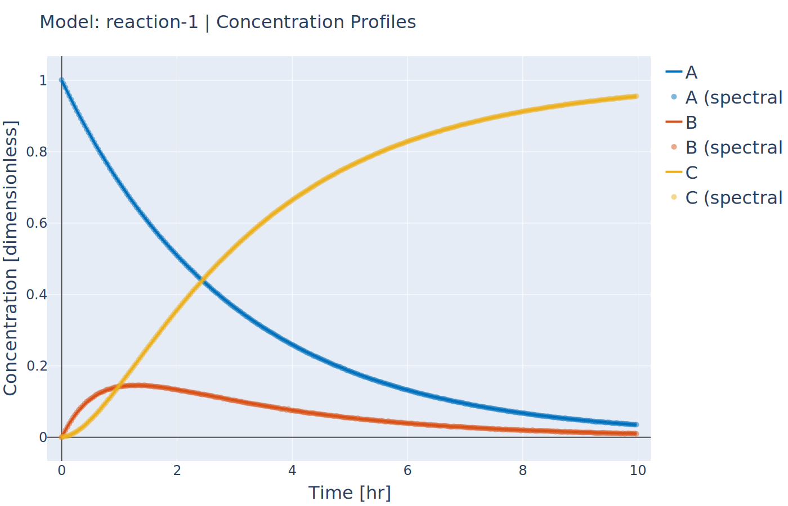

Introduction to Parameter Estimation
------------------------------------
:Files:
    `Ex_2_estimation.py <https://github.com/kwmcbride/kipet_examples/blob/master/examples/example_2/Ex_2_estimation.py>`_

In the second example we will be looking at a parameter estimation problem where we combine most of the elements discussed in the Overview section of this document. This example is the same reaction system as the previous example, except in this case we use a simulated spectral data set as our input D-matrix. This example, while not too computationally complex provides a good overview of all the capabilities of KIPET. So, again we are considering the following:

.. math::

	\mathrm{A} \xrightarrow{r_A} \mathrm{B} \xrightarrow{r_B} \mathrm{C}\\

.. math::

	\mathrm{r}_A = k_1C_A\\
	\mathrm{r}_B = k_2C_B

The full code for this example:
::
    
    import kipet

    r1 = kipet.ReactionModel('reaction-1')

    # Add the model parameters
    k1 = r1.parameter('k1', value=0.3, bounds=(0.0, 5.0))
    k2 = r1.parameter('k2', value=1.4, bounds=(0.0, 3.0))
    
    # Declare the components and give the initial values
    A = r1.component('A', value=1)
    B = r1.component('B', value=0.0)
    C = r1.component('C', value=0.0)
    
    # Input data
    file_name = 'data/Dij.txt'
    r1.add_data(category='spectral', file=file_name)

    # Input the reactions as expressions
    rA = r1.add_reaction('rA', k1*A)
    rB = r1.add_reaction('rB', k2*B)
    
    # Input the ODEs
    r1.add_ode('A', -rA )
    r1.add_ode('B', rA - rB )
    r1.add_ode('C', rB )
    
    # Optinal bounds on the S profiles
    r1.bound_profile(var='S', bounds=(0, 10))

    # Change some of the default settings
    r1.settings.collocation.ncp = 1
    r1.settings.collocation.nfe = 60
    r1.settings.parameter_estimator.tee = True
    
    # Parameter fitting
    r1.run_opt()
	
    # Plot results
    r1.plot()

As you can see, much of the modeling is similar to those found in the first example. The differences between the two are explained below.

Reading data
^^^^^^^^^^^^
Firstly we will need to input our D-matrix that contains the spectral data. More notes on the structure of these data files and which file types are permitted are found :ref:`here <data_format>`. In order to do this we need to point the model to the data file. We can do this by using the **add_dataset** method. If you are using spectral data, as in this case, the category argument needs to be 'spectral'. The location of the file should be given with the "file" argument.
::

    r1.add_data(category='spectral', file='data/Dij.txt')

Spectra data is handled in a different manner than state data. The ReactionModel object has a spectra attribute that is a SpectralData object that allows for various pre-processing techniques to be applied to the spectral data before the parameter fitting.

Also new here is the optional declaration of bounds for the individual species absorbance (S) profiles. This is done using the "bound_profile" method:
:: 

    r1.bound_profile(var='S', bounds=(0, 10)

Settings
^^^^^^^^

If you wish to change the default settings for the collocation method, you can access these using the settings attribute. The code below shows how to change the number of collocation points (ncp) and the number of finite elements (nfe) for the variance estimation and the parameter estimation.
::

    r1.settings.collocation.ncp = 1
    r1.settings.collocation.nfe = 60

You can also limit the set of wavelengths to use in initializing the problem. For large problems it might be worthwhile using smaller wavelength subsets to work with less data, saving computational time. For problems with a lot of noise, this can be very useful. This can be accessed using the **decrease_wavelengths** method of the spectra attribute. This method takes an integer as the first (and required) parameter.
::

    r1.spectra.decrease_wavelengths(4)

Many of the required options for the variance estimation and parameter estimation can be accessed using the settings attribute of the ReactionModel instance. You can look at the various options by printing the settings attribute to the console. For more information about settings in KIPET, see :ref:`here <settings>`.
::

    r1.settings

For many of the problems it is not possible to use the user scaling option as the solver type has now changed. In addition, since the stochastic solver requires the solving of a more difficult problem, it is sometimes necessary to apply different solver options in order to find a feasible solution. Among the options commonly found to increase the chances of a feasible solution, the ‘mu-init’, option can be set to a suitably small, positive value. This option changes the initial variable value of the barrier variable. More information can be found in the `IPOPT documentation <https://coin-or.github.io/Ipopt/OPTIONS.html>`_.

Solver settings can be set in the following manner:

::

    r1.settings.solver.<solver setting> = <option>
    

Variance Estimation and Parameter Fitting
^^^^^^^^^^^^^^^^^^^^^^^^^^^^^^^^^^^^^^^^^

Previously the variance estimation step was required to be set up by the user. This is now handled in the background by KIPET for you. You can change the way in which the variances are calculated by altering the settings.

To solve the problem, simply run the following:
::

    r1.run_opt()

The results and plots can now be displayed.

::

    r1.results.show_parameters
    r1.plot()

The results will then be shown as:
::

   The estimated parameters are:
   k2 0.201735984306
   k1 2.03870135529

Providing us with the following plots:

   Concentration profile results from tutorial example 2

.. figure:: ../../images/ex_2_S.svg
   :width: 600px
   :align: center

   Pure component absorbance profiles (S) result from tutorial example 2