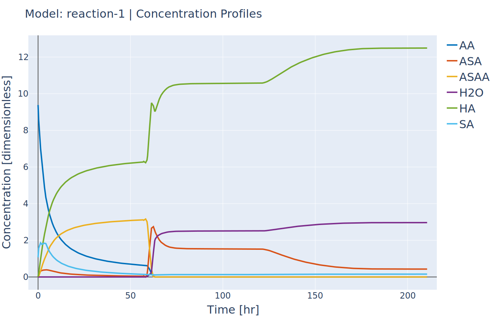

Simulation of Advanced Reaction System with Algebraic equations (I)
-------------------------------------------------------------------
:Files:
    `Ex_4_sim_aspirin.py <https://github.com/kwmcbride/kipet_examples/blob/master/examples/example_4/Ex_4_sim_aspirin.py>`_

Now that complementary states are understood we can explain perhaps the most conceptually difficult part in KIPET, the idea of algebraic variables. The terms algebraics and algebraic variables are used in KIPET when referring to equations and variables in larger models that can be used to determine the ODEs where we have a number of states and equations. This can be illustrated with the Aspirin case study from Chen et al. (2016) where we have the more complex reaction mechanism:

.. math::

	\begin{align}
    \mathrm{SA} + \mathrm{AA} & \xrightarrow{k_1} \mathrm{ASA} + \mathrm{HA}\\
	\mathrm{ASA} + \mathrm{AA} & \xrightarrow{k_2} \mathrm{ASAA} + \mathrm{HA}\\
	\mathrm{ASAA} + \mathrm{H_2O} & \xrightarrow{k_3} \mathrm{ASA} + \mathrm{HA}\\
	\mathrm{AA} + \mathrm{H_2O} & \xrightarrow{k_4} 2\cdot\mathrm{HA}\\
	\mathrm{SA}(s) & \xrightarrow{k_d} \mathrm{SA}(l)\\
	\mathrm{ASA}(l) & \xrightarrow{k_c} \mathrm{ASA}(s)
	\end{align}
	
With rate laws:

.. math::
	
	\begin{align}
	r_1 &= k_1c_{SA}(t)c_{AA}(t)\\
	r_2 &= k_2c_{ASA}(t)c_{AA}(t)\\
	r_3 &= k_3c_{ASAA}(t)c_{H_2O}(t)\\
	r_4 &= k_4c_{AA}(t)c_{H_2O}(t)\\
	r_d &= 
	\begin{cases}
	    k_d(c^{sat}_{SA}(T) - c_{SA}(t))^d,& \text{if } m_{SA}\geq 0\\
	    0,& \text{otherwise}
	\end{cases}\\
	r_c &= k_c(\mathrm{max}(c_{ASA}(t) - c^{sat}_{ASA}(T), \; 0))^c
	\end{align}

And these can then be used to describe the concentrations of the liquid and solid components with the ODEs:

.. math::

	\begin{align}
    \dot{m}_{SA} &= -M_{SA}Vr_d\\
	\dot{c}_{SA} &= r_d - r_1 - \frac{\dot{V}}{V}c_{SA}\\
	\dot{c}_{AA} &= - r_1 - r_2 - r_4 - \frac{\dot{V}}{V}c_{AA}\\
	\dot{c}_{HA} &= r_1 + r_2 + r_3 + 2\cdot r_4 - \frac{\dot{V}}{V}c_{HA}\\
	\dot{m}_{ASA} &= M_{ASA}Vr_g\\
	\dot{c}_{ASA} &= r_1 - r_2 + r_3 - r_g - \frac{\dot{V}}{V}c_{ASA}\\
	\dot{c}_{ASAA} &= r_2 - r_3 - \frac{\dot{V}}{V}c_{ASAA}\\
	\dot{c}_{H_2O} &= - r_3 - r_4 + \frac{f}{V}c_{H_2O}^{in} - \frac{\dot{V}}{V}c_{H_2O}\\
	\dot{V} &= V\sum_{i=1}^{ns}\nu_i\left( \sum_{j=1}^4 \gamma_{i,j}r_j + \gamma_{i,d}r_d + \gamma_{i,c}r_c + \epsilon_i\frac{f}{V}c_{H_2O}^{in}\right)
	\end{align}

From these two sets of equations, we can derive the algebraic expressions for the reactions and then construct the ODEs for the components and other states.

::

    from pyomo.environ import exp
    import kipet

    rm = kipet.ReactionModel('reaction-1')

    # Components
    SA = rm.component('SA', value=1.0714, description='Salicitilc acid')
    AA = rm.component('AA', value=9.3828, description='Acetic anhydride')
    ASA = rm.component('ASA', value=0.0177, description='Acetylsalicylic acid')
    HA = rm.component('HA', value=0.0177, description='Acetic acid')
    ASAA = rm.component('ASAA', value=0.000015, description='Acetylsalicylic anhydride')
    H2O = rm.component('H2O', value=0.0, description='Water')
    
    # Parameters
    k0 = rm.parameter('k0', value=0.0360309)
    k1 = rm.parameter('k1', value=0.1596062)
    k2 = rm.parameter('k2', value=6.8032345)
    k3 = rm.parameter('k3', value=1.8028763)
    kd = rm.parameter('ks', value=7.1108682)
    kc = rm.parameter('kc', value=0.7566864)
    Csa = rm.parameter('Csa',value=2.06269996)

In this example we need to declare new sets of states in addition to our components and parameters, as with the previous example.
::
    
    # Additional state variables
    V = rm.state('V', value=0.0202)
    Masa = rm.state('Masa', value=0.0)
    Msa = rm.state('Msa', value=9.537)

    # Fixed states (data is provided using the data keyword argument)
    f = rm.fixed_state('f', description='flow f', data='traj')
    Csat = rm.fixed_state('Csat', description='C saturation', data='traj')

.. note::

	When using fixed states the FESimulator cannot be used! The simulator needs to be set to 'dae.collocation' in the settings. This is due to the fixed algebraic trajectories not being supported at this time.

For the final equation in the model (Equn 36) we also need to define the stoichiometric coefficients, gammas, and the epsilon for how the added water affects the changes in volume.
::

    gammas = dict()
    gammas['SA']=    [-1, 0, 0, 0, 1, 0]
    gammas['AA']=    [-1,-1, 0,-1, 0, 0]
    gammas['ASA']=   [ 1,-1, 1, 0, 0,-1]
    gammas['HA']=    [ 1, 1, 1, 2, 0, 0]
    gammas['ASAA']=  [ 0, 1,-1, 0, 0, 0]
    gammas['H2O']=   [ 0, 0,-1,-1, 0, 0]

    epsilon = dict()
    epsilon['SA']= 0.0
    epsilon['AA']= 0.0
    epsilon['ASA']= 0.0
    epsilon['HA']= 0.0
    epsilon['ASAA']= 0.0
    epsilon['H2O']= 1.0
    
    partial_vol = dict()
    partial_vol['SA']=0.0952552311614
    partial_vol['AA']=0.101672206869
    partial_vol['ASA']=0.132335206093
    partial_vol['HA']=0.060320218688
    partial_vol['ASAA']=0.186550717015
    partial_vol['H2O']=0.0883603912169

At this point we can add the data to the model. The external files are the csv’s and the state is considered to be "trajectory". Following this, external files are also used for the flow of water fed into the reactor, as well as the saturation concentrations of SA and ASA (functions of temperature, calculated externally).

::

    filename = 'data/extra_states.txt'
    rm.add_data('traj', category='trajectory', file=filename)
    
    filename = 'data/concentrations.txt'
    rm.add_data('conc', category='trajectory', file=filename)
    
    filename = 'data/init_Z.csv'
    rm.add_data('init_Z', category='trajectory', file=filename)
    
    filename = 'data/init_X.csv'
    rm.add_data('init_X', category='trajectory', file=filename)
    
    filename = 'data/init_Y.csv'
    rm.add_data('init_Y', category='trajectory', file=filename)
    
To define the algebraic equations in Equn (35) we then use:
::
    
    # Reaction rates
    r0 = rm.add_reaction('r0', k0*SA*AA, description='Reaction 0')
    r1 = rm.add_reaction('r1', k1*ASA*AA, description='Reaction 1' )
    r2 = rm.add_reaction('r2', k2*ASAA*H2O, description='Reaction 2' )
    r3 = rm.add_reaction('r3', k3*AA*H2O, description='Reaction 3')
    
    step = 1/(1 + exp(-Msa/1e-4))
    r4 = rm.add_reaction('r4', kd*(Csa - SA + 1e-6)**1.90*step, description='Reaction 4' )
    
    diff = ASA - Csat
    r5 = rm.add_reaction('r5', 0.3950206559*kc*(diff+((diff)**2+1e-6)**0.5)**1.34, description='Reaction 5' )
    
Since the stoichiometric coefficients and the reaction equations are known, the component ODEs can be built automatically. Since the ODEs need to be augmented with the volume changes, the ODEs are returned from the :ref:`reactions_from_stoich` method. Once finished with the ODEs, they need to be added to the model in the usual way using :ref:`add_ode`.
::

    # Generate the ODEs for the reactions based on the stoichiometric matrix
    # Since we need to modfiy the ODEs, add_odes should be False
    odes = rm.reactions_from_stoich(gammas, add_odes=False)
    
    v_sum_float = 0
    Cin = 39.1
    
    # Build expression for the volume
    for com in rm.components.names:
        v_sum_float += partial_vol[com] * (odes[com] + epsilon[com]*f/V*Cin)
    
    v_sum = rm.add_expression('v_sum', v_sum_float, description='Volume Sum')
    
    # If calling a component (such as A or B) in a loop, use the pyomo_var attribute
    # Add ODEs for the components
    for com in rm.components.names:
        rm.add_ode(com, odes[com] + epsilon[com]*f/V*Cin - v_sum*rm.components[com].pyomo_var)
    
    # Add ODEs for complementary states
    rm.add_ode('V', V*v_sum )
    rm.add_ode('Masa', 180.157*V*r5 )
    rm.add_ode('Msa', -138.121*V*r4 )

At this point the model is almost ready and only the final details are needed before simulation.
::

    # Simulations require a time span
    rm.set_time(210.5257)

    # Settings
    rm.settings.collocation.nfe = 100
	rm.settings.simulator.method = 'dae.collocation'
    rm.settings.simulator.solver_opts.update({'halt_on_ampl_error' :'yes'})
    
    # Initialize the model variables with the provided data
    rm.initialize_from_trajectory('Z', 'init_Z')
    rm.initialize_from_trajectory('X', 'init_X')
    rm.initialize_from_trajectory('Y', 'init_Y')

    # Run the simulation
    rm.simulate()

	# Plot the results
	    rm.plot('Z')
		

   Concentration profiles from Tutorial 4.