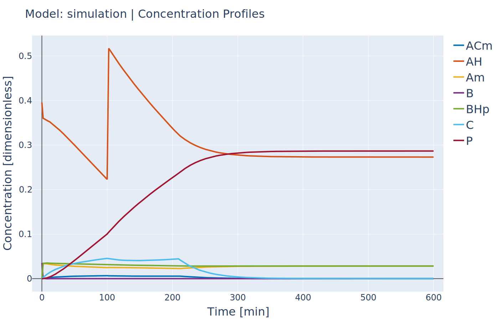

.. _Example5:

Simulation of Advanced Reaction System with Algebraic equations (II)
--------------------------------------------------------------------
:Files:
    `Ex_5_sim_fe_by_fe.py <https://github.com/kwmcbride/kipet_examples/blob/master/examples/example_5/Ex_5_sim_fe_by_fe_jump.py>`_

Another functionality within KIPET is to use a finite element by element approach to initialize a problem. If you consider a fed-batch process, certain substances are added during the process in a specific manner dependent on time. This can be modeled using additional algebraic and state variables, similar to the process shown in the previous example. In this tutorial, the following reaction system is simulated.

.. math::

    \begin{align}
    \mathrm{AH} + \mathrm{B} &\xrightarrow{r_1} \mathrm{A}^- + \mathrm{BH}^+\\
	\mathrm{A}^- + \mathrm{C} &\xrightarrow{r_2} \mathrm{AC}^-\\
	\mathrm{AC}^- &\xrightarrow{r_{-2}} \mathrm{A}^- + \mathrm{C}\\
	\mathrm{AC}^- + \mathrm{AH} &\xrightarrow{r_3} \mathrm{P} + \mathrm{A}^-\\
	\mathrm{AC}^- + \mathrm{BH}^+ &\xrightarrow{r_4} \mathrm{P} + \mathrm{B}\\
	\\
	r_1 &= k_1C_{AH}C_B\\
	r_2 &= k_2C_{A^{-}}C_C\\
	r_{-2} &= k_{-2}C_{AC^-}\\
	r_3 &= k_3C_{AC^-}C_{AH}\\
	r_4 &= k_4C_{AC^-}C_{BH^+}
    \end{align}

Which is represented by the following ODE system:

.. math::

    \begin{align}
	\frac{dV}{dt} &= 
	    \begin{cases}
		\text{const flowrate},& t\lt 3.5h\\
		0,& t \geq 3.5h
		\end{cases}\\
	\frac{dC_{AH}}{dt} &= - r_1 - r_3 - \frac{\dot{V}}{V}C_{AH}\\
	\frac{dC_{B}}{dt} &= - r_1 + r_4 - \frac{\dot{V}}{V}C_{B}\\
	\frac{dC_{A^{-}}}{dt} &= r_1 - r_2 + r_{-2} + r_3 - \frac{\dot{V}}{V}C_{A^{-}}\\
	\frac{dC_{BH^+}}{dt} &= r_1 - r_4 - \frac{\dot{V}}{V}C_{BH^+}\\
	\frac{dC_{C}}{dt} &= - r_2 + r_{-2} - \frac{\dot{V}}{V}C_{C} +
	    \begin{cases}
		    m_{C_{add}}/V/3.5,& t\lt 3.5h\\
			0,& t \geq 3.5h
		\end{cases}\\
	\frac{dC_{AC^-}}{dt} &= r_2 - r_{-2} - r_3 - r_4 - \frac{\dot{V}}{V}C_{AC^-}\\
	\frac{dC_{P}}{dt} &= r_3 + r_4 - \frac{\dot{V}}{V}C_{P}
	\end{align}

::
    
    import kipet
	
	r1 = kipet.ReactionModel('reaction-1')
	
    # Components
    AH = r1.component('AH', value= 0.395555)
    B = r1.component('B', value= 0.0351202)
    C = r1.component('C', value= 0.0)
    BHp = r1.component('BHp', value= 0.0)
    Am = r1.component('Am', value= 0.0)
    ACm = r1.component('ACm', value= 0.0)
    P = r1.component('P', value= 0.0)
    
    # Parameters
    k0 = r1.parameter('k0', value=49.7796)
    k1 = r1.parameter('k1', value=8.93156)
    k2 = r1.parameter('k2', value=1.31765)
    k3 = r1.parameter('k3', value=0.31087)
    k4 = r1.parameter('k4', value=3.87809)
    
    # States
    V = r1.volume(value=0.0629418, units='L')
   
    # Stoichiometric coefficients
    stoich_coeff = dict()
    stoich_coeff['AH'] = [-1, 0, 0, -1, 0]
    stoich_coeff['B'] = [-1, 0, 0, 0, 1]
    stoich_coeff['C'] = [0, -1, 1, 0, 0]
    stoich_coeff['BHp'] = [1, 0, 0, 0, -1]
    stoich_coeff['Am'] = [1, -1, 1, 1, 0]
    stoich_coeff['ACm'] = [0, 1, -1, -1, -1]
    stoich_coeff['P'] = [0, 0, 0, 1, 1]
    
    V_step = r1.step('V_step', time=210, fixed=True, switch='off')
    V_flow = r1.constant('V_flow', value=7.27609e-5)
    
    y0 = r1.add_reaction('y0', k0*AH*B, description='Reaction 0')
    y1 = r1.add_reaction('y1', k1*Am*C, description='Reaction 1')
    y2 = r1.add_reaction('y2', k2*ACm, description='Reaction 2')
    y3 = r1.add_reaction('y3', k3*ACm*AH, description='Reaction 3')
    y4 = r1.add_reaction('y4', k4*ACm*BHp, description='Reaction 4')
    
    RE = r1.reactions_from_stoich(stoich_coeff, add_odes=False)
    # Modify component C
    RE['C'] += 0.02247311828 / (V * 210) * V_step
	
    # ODEs - volume change terms added automatically
    r1.add_odes(RE)
    r1.add_ode('V', V_flow*V_step)

The dosing points need to be entered in using the following syntax: ('component name', time, amount). See the following code as an example. You can add as many such dosing points as needed.
::    

    # Add dosing points (as many as you want in this format)
    # ('component_name', time, conc=(value, units), volume=(amount, units))
    r1.add_dosing_point('AH', time=100, conc=(1.3, 'M'), vol=(20, 'mL'))

The simulation is now ready.
::

    r1.set_time(600)
    r1.settings.collocation.nfe = 40
    r1.settings.simulator.method = 'fe'
    
    r1.simulate()
    
    if with_plots:
        r1.plot('Z')

   Concentration profile of solution to Tutorial 5