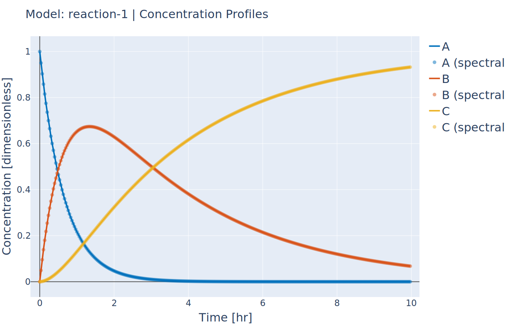
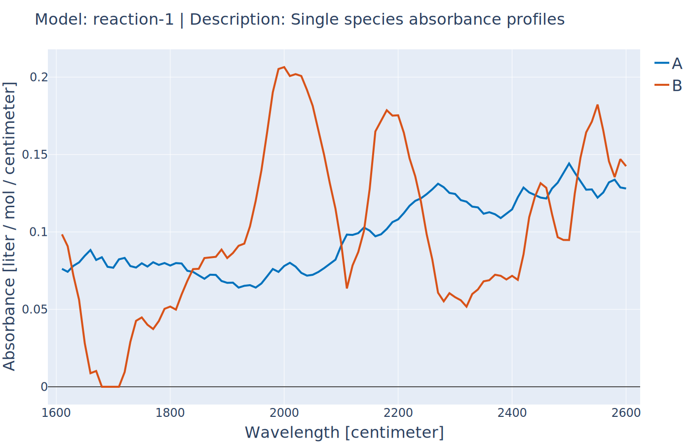

Reaction Systems with Known Non-Absorbing Species
-------------------------------------------------
:Files:
    `Ex_6_non_absorbing.py <https://github.com/kwmcbride/kipet_examples/blob/master/examples/example_6/Ex_6_non_absorbing.py>`_

If you are aware of which species are non-absorbing in your case in advance, you can exclude them from the identification process, fixing the associated column in the S-matrix to zero, and also excluding its variance.
You declare your components as in the examples above and then additionally declare the non-absorbing species by the following lines. If species ‘C’ is non-absorbing, then simply set its absorbing argument to False when declaring the component.
::

    r1.component('C', value=0.0, absorbing=False)

In the plot of the absorbance profile the non-absorbing species then remains zero as you can see in the following results. 

::

    import kipet

    r1 = kipet.ReactionModel('reaction-1')
    
    # Add the model parameters
    r1.parameter('k1', value=2, bounds=(0.1, 5.0))
    r1.parameter('k2', value=0.2, bounds=(0.01, 2.0))
    
    # Declare the components and give the initial values
    A = r1.component('A', value=1)
    B = r1.component('B', value=0.0, known=True, bounds=(1e-8, 1e-4))
    C = r1.component('C', value=0.0, absorbing=False)
    
    # Add the data
    r1.add_data(category='spectral', file='example_data/Dij.txt')

    # define explicit system of ODEs
    rA = r1.add_reaction('rA', k1*A, description='Reaction A' )
    rB = r1.add_reaction('rB', k2*B, description='Reaction B' )
    
    # Use the stoichiometry to build the reaction network:
    stoich_data = {'rA': [-1, 1, 0],
                   'rB': [0, -1, 1]}
    
    r1.reactions_from_stoich(stoich_data)

    # Settings
    r1.settings.collocation.ncp = 1
    r1.settings.collocation.nfe = 60
    
    r1.run_opt()
    r1.results.show_parameters
    r1.plot()
    
::

   Confidence intervals:
   k2 (0.9999997318555397,1.0000000029408624)
   k1 (0.09999999598268668,0.10000000502792096)

   The estimated parameters are:
   k2 0.999999867398201
   k1 0.10000000050530382

   Concentration profile of solution to Tutorial 6

   Absorbance profiles in Tutorial 6