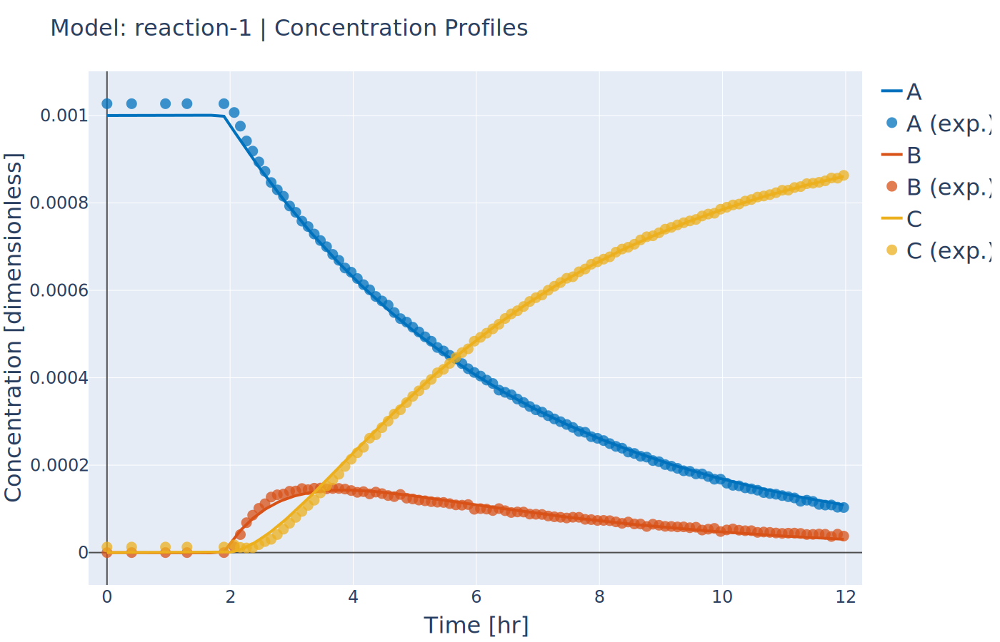
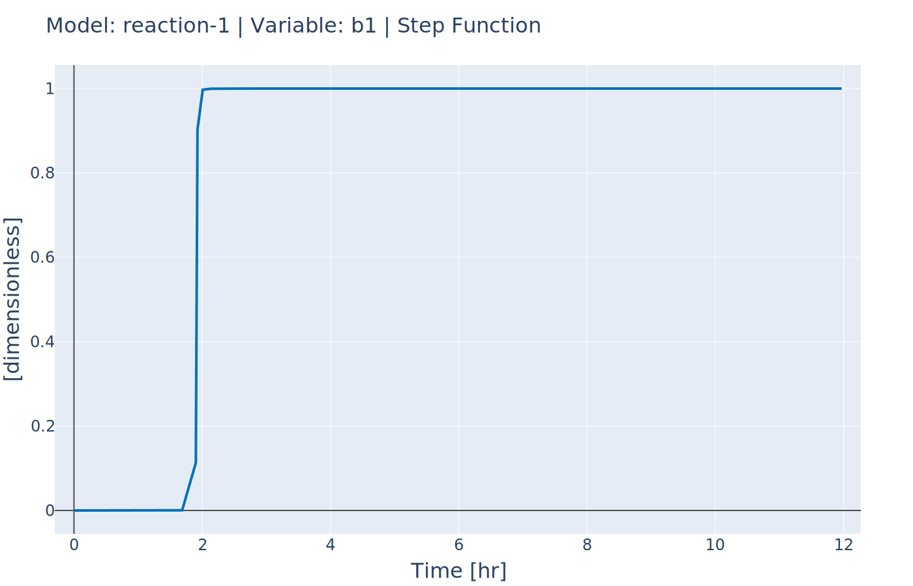

Parameter Estimation Using Concentration Data
---------------------------------------------
:Files:
    | `Ex_7_concentration_heterogeneous_data.py <https://github.com/kwmcbride/kipet_examples/blob/master/examples/example_7/Ex_7_concentration_heterogeneous_data.py>`_
    | `Ex_7_concentration_input.py <https://github.com/kwmcbride/kipet_examples/blob/master/examples/example_7/Ex_7_concentration_input.py>`_
    | `Ex_7_binary_reaction.py <https://github.com/kwmcbride/kipet_examples/blob/master/examples/example_7/Ex_7_binary_reaction.py>`_

KIPET provides the option to also input concentration data in order to perform parameter estimation.  The first term in the objective function (equation 17) is disabled in order to achieve this, so the problem essentially becomes a least squares minimization problem. The example, “Ex_7_concentration_input.py”, shows how to use this feature. 

::

    import kipet

    r1 = kipet.ReactionModel('reaction-1')
 
    # Add the model parameters
    k1 = r1.parameter('k1', value=2.0, bounds=(0.0, 5.0))
    k2 = r1.parameter('k2', value=0.2, bounds=(0.0, 2.0), fixed=False)
    
    # Declare the components and give the initial values
    A = r1.component('A', value=0.001, variance=1e-10, known=True, bounds=(0.0, 3))
    B = r1.component('B', value=0.0, variance=1e-11)
    C = r1.component('C', value=0.0, variance=1e-8)
    
If the component data has been entered into the model before the data, the add_dataset method will automatically check if the component names match the column headers in the dataframe and add them to the model template in the correct category. In the case that data is added before, KIPET will match up the data with components before building the model in TemplateBuilder.

In the following, the data is first loaded and only every 10th data point is used in parameter fitting.
::
   
    # Load the data and reduce the number of data points
    filename = 'data/Ex_1_C_data.txt'
    full_data = kipet.read_data(filename)
    r1.add_data(data=full_data.iloc[::10, :], remove_negatives=True)   
    
    # Define the reaction model
    r1.add_ode('A', -k1 * A )
    r1.add_ode('B', k1 * A - k2 * B )
    r1.add_ode('C', k2 * B )
    
    # Settings
    r1.settings.collocation.nfe = 60
    r1.settings.parameter_estimator.solver = 'ipopt_sens'
    
    # Run KIPET
    r1.run_opt()  
    
    # Display the results
    r1.results.show_parameters
    r1.plot()

If the user is interested in analyzing the confidence intervals associated with each estimated parameter, the same procedure as shown previously is used. You simply need to use sIPOPT:
::

    r1.settings.parameter_estimator.solver = 'ipopt_sens'

    
This can also be done using the new package developed by David M. Thierry called k_aug, which computes the reduced hessian instead of sIpopt. In order to use this instead of sIpopt, when calling the solver, the solver needs to be set to be ‘k_aug’. All other steps are the same as in previous examples.
::

    r1.settings.parameter_estimator.solver = 'k_aug'

The covariance matrix of the parameters can then be displayed:
::
        
    r1.results.parameter_covariance

.. figure:: ../../images/ex_7_C.svg
   :width: 600px
   :align: center

   Concentration profile results using concentration data (concentration input)

In `Ex_7_binary_reaction.py <https://github.com/kwmcbride/kipet_examples/blob/master/examples/example_7/Ex_7_binary_reaction.py>`_ the same problem is solved. The only difference is that measurements occur before the reaction begins. Although this may not be realistic, its purpose is to show how parameter fitting can be performed when the exact time the reaction starts is unknown. This is done use approximated binary decision variables that are still continuous variables. Thus, no integer decisions neede to be made.

You can very easily include such decision variables using the step method of the ReactionModel class. This method takes several arguments including the variable name, the time where the step changes, whether this time is fixed, and whether the step is turning on or off (going to one or to zero). If fixed is False, then the time argument is used as the initial value.

::

    # Use step functions to turn on the reactions
    b1 = r1.step('b1', time=2, fixed=False, switch='on')

    # If desired, you can use different times for each reaction
    # b2 = r1.step('b2', time=2.1, fixed=True, switch='on')
    
    rA = b1*(k1*A)
    rB = b1*(k2*B)

   Concentration profile with unknown reaction start (binary_reaction)

   Profile of step function used to model the reaction start (binary reaction)