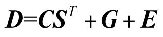
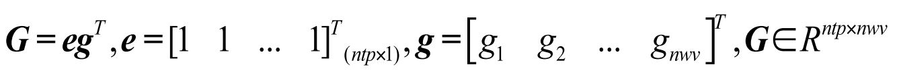
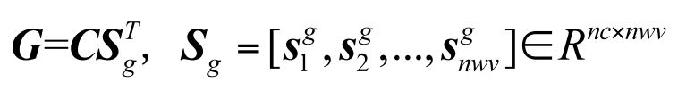
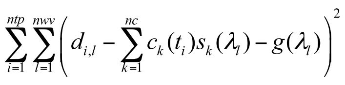
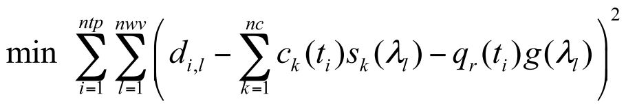
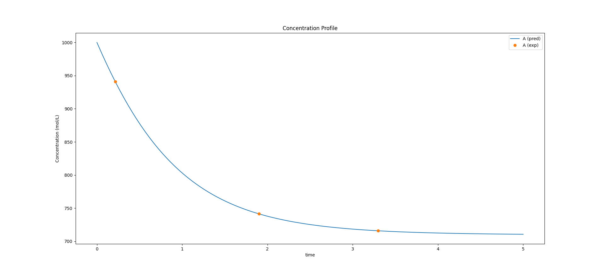
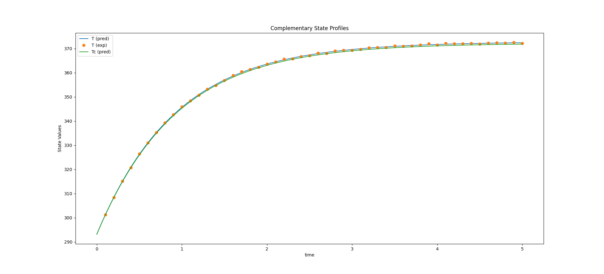

=========
Tutorials
=========

In this section we show a collection of tutorials, all of which are included in the examples folder in KIPET's main directory. In addition to the tutorial examples that are covered here which show a wide range of KIPET's functionality, there are extra examples that are listed in the table at the end of this section.

A Note About the New Version
----------------------------
If you have previously used KIPET, then this tutorial will look somewhat familiar, but also very different. There are many new changes to the structure of KIPET that greatly reduce the amount of coding on the part of the user. Whereas before you had to create instances of the VarianceEstimator, the ParameterEstimator, or of other classes, this is no longer required and has for the most part been automated. You can still modify the behavior of these tools through the new settings attribute of the top-level KipetModel object or the ReactionModel objects. These can be seen in the updated tutorial exercises that follow.

Tutorial 1 – Simulating a Simple Example
----------------------------------------
:Files:
    Ex_1_ode_sim.py

If you do not know how to get started, open Anaconda Navigator and then run Spyder IDE. In Spyder open the example by navigating into KIPET’s example folder and opening the relevant example. Run the example by pressing the green play button.

This example provides a basic 3-component, 2 reaction system with A → B and B → C, where the kinetic rate constants are fixed.

Before going into more detail, the complete block of code required to simulate this simple reaction is presented. As you can see, the user does not  require much coding to use KIPET.

::

    from kipet import KipetModel

    kipet_model = KipetModel()

    r1 = kipet_model.new_reaction('reaction-1')

    # Add the model parameters
    r1.add_parameter('k1', 2)
    r1.add_parameter('k2', 0.2)

    # Declare the components and give the initial values
    r1.add_component('A', state='concentration', init=1)
    r1.add_component('B', state='concentration', init=0.0)
    r1.add_component('C', state='concentration', init=0.0)

    # Define explicit system of ODEs
    def rule_odes(m,t):
        exprs = dict()
        exprs['A'] = -m.P['k1']*m.Z[t,'A']
        exprs['B'] = m.P['k1']*m.Z[t,'A']-m.P['k2']*m.Z[t,'B']
        exprs['C'] = m.P['k2']*m.Z[t,'B']
        return exprs

    # Add the rules to the model
    r1.add_equations(rule_odes)

    # Create the model - simulations require times
    r1.set_times(0, 10)

    # Simulate with default options
    r1.simulate()
    
    r1.results.plot()
    
We will now break this down step by step. The first step is to import the kipet module or the KipetModel class from the kipet module as in the example.
::

    from kipet import KipetModel
    
The KipetModel class contains all of the methods necessary to use KIPET. The next step is to create an instance of the KipetModel class.
::
    
    kipet_model = KipetModel()
    
The KipetModel class has the attribute "models" that acts like a dictionary and contains instances of the ReactionModel, which is where individual reaction models are contained. To create a new reaction model, it is added to the KipetModel using the method "new_reaction". Note that the reaction requires a name as the first argument.

:: 

    r1 = kipet_model.new_reaction('reaction-1')
    
We can now use the ReactionModel instance "r1" to add all of the expected model components such as the kinetic model and its parameters, the component information, and the data (if any). Parameters are added using the method "add_parameter", as seen in the current example where there are two parameters:

::

    r1.add_parameter('k1', 2)
    r1.add_parameter('k2', 0.2)

Since our system has three components, A, B, and C, these need to be declared as well. Each component requires a name and a state. The state can be concentration, spectral, state, trajectory, or custom. Each one of these states will be convered in more detail later in this tutorial. At the moment, the only state we are concerned about is concentration. For simulations, an initial value for each of the components is required. 

::

    r1.add_component('A', state='concentration', init=1)
    r1.add_component('B', state='concentration', init=0.0)
    r1.add_component('C', state='concentration', init=0.0)
    
The next step is to provide the reaction kinetics in a Pyomo friendly format. The reaction scheme for this example is defined as a python function containing each component's specific ODE within a dictionary. This is probably the most coding work that will be necessary when using KIPET. The reaction kinetic rules are placed into the model using the "add_equations" method. Please note that KIPET requires that each declared component has its own expression.

::

    def rule_odes(m,t):
        exprs = dict()
        exprs['A'] = -m.P['k1']*m.Z[t,'A']
        exprs['B'] = m.P['k1']*m.Z[t,'A']-m.P['k2']*m.Z[t,'B']
        exprs['C'] = m.P['k2']*m.Z[t,'B']
        return exprs

    r1.add_equations(rule_odes)

At this point we have provided KIPET with a reaction model, component information, and parameter data. The only thing still required for our simulation are the start and end times. Times are provided using the method "set_times". As we will see in the parameter estimation problems, explicitly providing start and end times is not necessary.

::

    r1.set_times(0, 10)
    
After this we are ready to simulate using the "simulate" method. The results are then accessible using the "results" attribute. This is an instance of the ResultsObject class, which contains convenient plotting methods to display the results. The most basic plotting tool can be accessed using the "plot" method of the "results" attribute.

::

    r1.simulate()
    r1.results.plot()
    
The results are then presented in a new browser tab using Plotly similar to the following figure.

.. _fig-coordsys-rect:

.. figure:: ex_1_plot_sim_results.png
   :width: 600px
   :align: center

   Plot obtained from tutorial example 1

Tutorial 2 – Parameter Estimation
---------------------------------
:Files:
    Ex_2_estimation.py

In the second example we will be looking at a parameter estimation problem where we combine most of the elements discussed in the Overview section of this document. This example is the same reaction system as Tutorial 1, except in this case we use a simulated data set as our input D-matrix. This example, while not too computationally complex provides a good overview of all the capabilities of KIPET.

The full code for this example:

::

    from kipet import KipetModel
    
    kipet_model = KipetModel()
    
    r1 = kipet_model.new_reaction('reaction-1')
    
    # Add the model parameters
    r1.add_parameter('k1', init=2, bounds=(0.0, 5.0))
    r1.add_parameter('k2', init=0.2, bounds=(0.0, 2.0))
    
    # Declare the components and give the initial values
    r1.add_component('A', state='concentration', init=1)
    r1.add_component('B', state='concentration', init=0.0)
    r1.add_component('C', state='concentration', init=0.0)
    
    # Add data to model
    r1.add_dataset('D_frame', category='spectral', file='Dij.txt')

    # define explicit system of ODEs
    def rule_odes(m,t):
        exprs = dict()
        exprs['A'] = -m.P['k1']*m.Z[t,'A']
        exprs['B'] = m.P['k1']*m.Z[t,'A']-m.P['k2']*m.Z[t,'B']
        exprs['C'] = m.P['k2']*m.Z[t,'B']
        return exprs
    
    r1.add_equations(rule_odes)
    
    r1.bound_profile(var='S', bounds=(0, 200))

    # Settings
    r1.settings.collocation.ncp = 1
    r1.settings.collocation.nfe = 60
    r1.settings.variance_estimator.use_subset_lambdas = True
    r1.settings.parameter_estimator.tee = False
    r1.settings.parameter_estimator.solver = 'ipopt_sens'
    
    # Solve and display the results
    r1.run_opt()
    r1.results.show_parameters
    r1.results.plot()

As you can see, much of the modeling is similar to those found in Tutorial 1. The differences between the two are explained below.

Reading data
^^^^^^^^^^^^
Firstly we will need to input our D-matrix, which contains the spectral data. More notes on the structure of these data files and which file types are permitted are included in the section on data files. In order to do this we need to point the model to the data file. We can do this by using the "add_dataset" method. If you are using spectral data, as in this case, the "category" argument needs to be 'spectral'. The location of the file should be given with the "file" argument.
::

    r1.add_dataset(category='spectral', file='Dij.txt')

The KipetModel instance has a default data directory where it expects the data file to be found. This can be changed to another directory if desired through the settings object:

::

    kipet_model.settings.general.data_directory = 'path/to/data/directory'
    
KIPET has many built-in features to handle the data after adding it to the model. These features are explored in later tutorials.

Also new here is the optional declaration of bounds for the individual species absorbance (S) profiles. This is done using the "bound_profile" method:

:: 

    r1.bound_profile(var='S', bounds=(0, 200)

Settings
^^^^^^^^

If you wish to change the default settings for the collocation method, you can access these using the settings attribute. The code below shows how to change the number of collocation points (ncp) and the number of finite elements (nfe) for the variance estimation and the parameter estimation.

::

    r1.settings.collocation.ncp = 1
    r1.settings.collocation.nfe = 60

You can also limit the set of wavelengths to use in initializing the problem. For large problems it might be worthwhile using smaller wavelength subsets to work with less data, saving computational time. For problems with a lot of noise, this can be very useful and was shown in the paper to be equally effective as including the entire set of wavelengths. This can be accessed using the "use_subset_lambdas" option by setting it equal to True. You can choose the frequency of wavelengths by changing the freq_subset_lambdas option to an integer number from the default of 4.

::

    r1.settings.variance_estimator.use_subset_lambdas = True
    
    # Default
    r1.settings.variance_estimator.freq_subset_lambdas = 4

Many of the required options for the variance estimation and parameter estimation can be accessed using the settings attribute of the ReactionModel instance. You can look at the various options by printing the settings attribute to the console.

::

    print(r1.settings)

You can also change whether or not the optimization results are displayed or not (tee) and the solver used to fit the parameters (solver). In this case, you can use ipopt_sens to calculate the confidence intervals for the parameters.

::

    r1.settings.parameter_estimator.tee = False
    r1.settings.parameter_estimator.solver = 'ipopt_sens'

Please note that if this fails to run, it is likely that sIPOPT is not correctly installed, or it has not been added to your environmental variable. For help with sIPOPT, please refer to section 2.4.

For many of the problems it is not possible to use the user scaling option as the solver type has now changed. In addition, since the stochastic solver requires the solving of a more difficult problem, it is sometimes necessary to apply different solver options in order to find a feasible solution. Among the options commonly found to increase the chances of a feasible solution, the ‘mu-init’, option can be set to a suitably small, positive value. This option changes the initial variable value of the barrier variable. More information can be found on the IPOPT options website in COIN-OR.

Solver settings can be set in the following manner:

::

    r1.settings.solver.<solver setting> = <option>
    

Variance Estimation and Parameter Fitting
^^^^^^^^^^^^^^^^^^^^^^^^^^^^^^^^^^^^^^^^^

To solve the problem, simply run the following:

::

    r1.run_opt()

The results and plots can now be displayed.

::

    r1.results.show_parameters
    r1.results.plot()

The results will then be shown as:
::

   The estimated parameters are:
   k2 0.201735984306
   k1 2.03870135529

Providing us with the following plots:

.. figure:: ex_2_plot_conc_results.png
   :width: 600px
   :align: center

   Concentration profile results from tutorial example 2

.. figure:: ex_2_plot_S_results.png
   :width: 600px
   :align: center

   Pure component absorbance profiles (S) result from tutorial example 2

Tutorial 3 – Advanced reaction systems with additional states
-------------------------------------------------------------
:Files:
    Ex_3_complementary.py

It is also possible to combine additional complementary states, equations and variables into a KIPET model. In the example labeled “Ex_3_complementary.py” an example is solved that includes a temperature and volume change. In this example the model is defined in the same way as was shown before, however this time the complementary state variable temperature is added as a component using the state "state".

::
    
    # This is needed for the construction of the ODEs
    from pyomo.core import exp
    
    from kipet import KipetModel
    
    kipet_model = KipetModel()
    
    r1 = kipet_model.new_reaction('reaction-1')
    
    # Declare the components and give the initial values
    r1.add_component('A', state='concentration', init=1.0)
    r1.add_component('B', state='concentration', init=0.0)
    r1.add_component('C', state='concentration', init=0.0)
    
    # Complementary states have the state 'state'
    r1.add_component('T', state='state', init=290)
    r1.add_component('V', state='state', init=100)
    
    
When using complimentary states (not concentration), the variables are labeled using "X" instead of "Z". This same formulation can be used to add any sort of additional complementary state information to the model. Now, similarly to with the components, each complementary state will require an ODE to accompany it. In the case of this tutorial example, the following ODEs are defined:
::
    
    # Define the ODEs
    def rule_odes(m, t):
        k1 = 1.25*exp((9500/1.987)*(1/320.0 - 1/m.X[t, 'T']))
        k2 = 0.08*exp((7000/1.987)*(1/290.0 - 1/m.X[t, 'T']))
        ra = -k1*m.Z[t, 'A']
        rb = 0.5*k1*m.Z[t, 'A'] - k2*m.Z[t, 'B']
        rc = 3*k2*m.Z[t, 'B']
        cao = 4.0
        vo = 240
        T1 = 35000*(298 - m.X[t, 'T'])
        T2 = 4*240*30.0*(m.X[t, 'T'] - 305.0)
        T3 = m.X[t, 'V']*(6500.0*k1*m.Z[t, 'A'] - 8000.0*k2*m.Z[t, 'B'])
        Den = (30*m.Z[t, 'A'] + 60*m.Z[t, 'B'] + 20*m.Z[t, 'C'])*m.X[t, 'V'] + 3500.0
        exprs = dict()
        exprs['A'] = ra + (cao - m.Z[t, 'A'])/m.X[t, 'V']
        exprs['B'] = rb - m.Z[t, 'B']*vo/m.X[t, 'V']
        exprs['C'] = rc - m.Z[t, 'C']*vo/m.X[t, 'V']
        exprs['T'] = (T1 + T2 + T3)/Den
        exprs['V'] = vo
        return exprs
    
    r1.add_equations(rule_odes)
    r1.set_times(0.0, 2.0)
    
    r1.settings.collocation.nfe = 20
    r1.settings.collocation.ncp = 1

    r1.simulate()
    r1.results.plot()

Where “m.X[t, 'V']” and “m.X[t, 'T']” are the additional state variables and “m.Z[t, component]” is the concentration of the component at time t. We can then simulate the model (or use experimental data if available and estimate the parameters) in the same way as described in the previous examples. Please follow the rest of the code and run the examples to obtain the output.

.. figure:: ex3result1.png
   :width: 400px
   :align: center

   Output of Tutorial example 3

.. figure:: ex3result2.png
   :width: 400px
   :align: center

   Output of Tutorial example 3

Tutorial 4 – Simulation of Advanced Reaction system with Algebraic equations
----------------------------------------------------------------------------
:Files:
    Ex_4_sim_aspirin.py

Now that complementary states are understood we can explain perhaps the most conceptually difficult part in KIPET, the idea of algebraic variables. The terms algebraics and algebraic variables are used in KIPET when referring to equations and variables in larger models that can be used to determine the ODEs where we have a number of states and equations. This can be illustrated with the Aspirin case study from Chen et al. (2016) where we have the more complex reaction mechanism:

.. figure:: ex4eq1.png
   :width: 400px
   :align: center

With the rate laws being\:

.. figure:: ex4eq2.png
   :width: 400px
   :align: center

And these can then be used to describe the concentrations of the liquid and solid components with the ODEs:

.. figure:: ex4eq3.png
   :width: 400px
   :align: center

This example can be described by the equations 35 (which are the “algebraics” in KIPET) and the ODEs, equations 36. which will then be the ODEs defining the system, making use of the reaction rate laws from the algebraics.

::

    import pandas as pd
    from pyomo.environ import exp
    
    from kipet import KipetModel
   
    kipet_model = KipetModel()
    
    r1 = kipet_model.new_reaction('reaction-1')

    # Components
    components = dict()
    components['SA'] = 1.0714               # Salicitilc acid
    components['AA'] = 9.3828               # Acetic anhydride
    components['ASA'] = 0.0177              # Acetylsalicylic acid
    components['HA'] = 0.0177               # Acetic acid
    components['ASAA'] = 0.000015           # Acetylsalicylic anhydride
    components['H2O'] = 0.0                 # water

    for comp, init_value in components.items():
        r1.add_component(comp, state='concentration', init=init_value)

    # Parameters
    params = dict()
    params['k0'] = 0.0360309
    params['k1'] = 0.1596062
    params['k2'] = 6.8032345
    params['k3'] = 1.8028763
    params['kd'] = 7.1108682
    params['kc'] = 0.7566864
    params['Csa'] = 2.06269996

    for param, init_value in params.items():
        r1.add_parameter(param, init=init_value)

In this example we need to declare new sets of states in addition to our components and parameters, as with Tutorial 3:
::

    # Additional state variables
    extra_states = dict()
    extra_states['V'] = 0.0202
    extra_states['Masa'] = 0.0
    extra_states['Msa'] = 9.537
    
    for comp, init_value in extra_states.items():
        r1.add_component(comp, state='state', init=init_value)
        
With the initial values given. In addition we can declare our algebraic variables (the rate variables and other algebraics):
::

    # Algebraics
    algebraics = ['f','r0','r1','r2','r3','r4','r5','v_sum','Csat']

    r1.add_algebraic_variables(algebraics)
    
Where f represents the addition of liquid to the reactor during the batch reaction.

For the final equation in the model (Equn 36) we also need to define the stoichiometric coefficients, gammas, and the epsilon for how the added water affects the changes in volume.
::

    gammas = dict()
    gammas['SA']=    [-1, 0, 0, 0, 1, 0]
    gammas['AA']=    [-1,-1, 0,-1, 0, 0]
    gammas['ASA']=   [ 1,-1, 1, 0, 0,-1]
    gammas['HA']=    [ 1, 1, 1, 2, 0, 0]
    gammas['ASAA']=  [ 0, 1,-1, 0, 0, 0]
    gammas['H2O']=   [ 0, 0,-1,-1, 0, 0]

    epsilon = dict()
    epsilon['SA']= 0.0
    epsilon['AA']= 0.0
    epsilon['ASA']= 0.0
    epsilon['HA']= 0.0
    epsilon['ASAA']= 0.0
    epsilon['H2O']= 1.0
    
    partial_vol = dict()
    partial_vol['SA']=0.0952552311614
    partial_vol['AA']=0.101672206869
    partial_vol['ASA']=0.132335206093
    partial_vol['HA']=0.060320218688
    partial_vol['ASAA']=0.186550717015
    partial_vol['H2O']=0.0883603912169
    
To define the algebraic equations in Equn (35) we then use:
::
    
    def rule_algebraics(m,t):
        r = list()
        r.append(m.Y[t,'r0']-m.P['k0']*m.Z[t,'SA']*m.Z[t,'AA'])
        r.append(m.Y[t,'r1']-m.P['k1']*m.Z[t,'ASA']*m.Z[t,'AA'])
        r.append(m.Y[t,'r2']-m.P['k2']*m.Z[t,'ASAA']*m.Z[t,'H2O'])
        r.append(m.Y[t,'r3']-m.P['k3']*m.Z[t,'AA']*m.Z[t,'H2O'])

        # dissolution rate
        step = 1.0/(1.0+exp(-m.X[t,'Msa']/1e-4))
        rd = m.P['kd']*(m.P['Csa']-m.Z[t,'SA']+1e-6)**1.90*step
        r.append(m.Y[t,'r4']-rd)
        
        # crystalization rate
        diff = m.Z[t,'ASA'] - m.Y[t,'Csat']
        rc = 0.3950206559*m.P['kc']*(diff+((diff)**2+1e-6)**0.5)**1.34
        r.append(m.Y[t,'r5']-rc)

        Cin = 39.1
        v_sum = 0.0
        V = m.X[t,'V']
        f = m.Y[t,'f']
        for c in m.mixture_components:
            v_sum += partial_vol[c]*(sum(gammas[c][j]*m.Y[t,'r{}'.format(j)] for j in range(6))+ epsilon[c]*f/V*Cin)
        r.append(m.Y[t,'v_sum']-v_sum)

        return r

    r1.add_algebraics(rule_algebraics)
    
Where the algebraics are given the variable name m.Y[t,’r1’]. We can then use these algebraic equations to define our system of ODEs:
::
    
    def rule_odes(m,t):
        exprs = dict()

        V = m.X[t,'V']
        f = m.Y[t,'f']
        Cin = 41.4
        # volume balance
        vol_sum = 0.0
        for c in m.mixture_components:
            vol_sum += partial_vol[c]*(sum(gammas[c][j]*m.Y[t,'r{}'.format(j)] for j in range(6))+ epsilon[c]*f/V*Cin)
        exprs['V'] = V*m.Y[t,'v_sum']

        # mass balances
        for c in m.mixture_components:
            exprs[c] = sum(gammas[c][j]*m.Y[t,'r{}'.format(j)] for j in range(6))+ epsilon[c]*f/V*Cin - m.Y[t,'v_sum']*m.Z[t,c]

        exprs['Masa'] = 180.157*V*m.Y[t,'r5']
        exprs['Msa'] = -138.121*V*m.Y[t,'r4']
        return exprs

    r1.add_equations(rule_odes)
    
The rest can then be defined in the same way as other simulation problems. Note that in this problem the method for providing initializations from an external file is also shown with the lines:
::
    
    # Data set-up: Use trajectory as the category for initialization data
    # as this is not added to the pyomo model
    
    filename = r1.set_directory('extra_states.txt')
    r1.add_dataset('traj', category='trajectory', file=filename)
    
    filename = r1.set_directory('concentrations.txt')
    r1.add_dataset('conc', category='trajectory', file=filename)
    
    filename = r1.set_directory('init_Z.csv')
    r1.add_dataset('init_Z', category='trajectory', file=filename)
    
    filename = r1.set_directory('init_X.csv')
    r1.add_dataset('init_X', category='trajectory', file=filename)
    
    filename = r1.set_directory('init_Y.csv')
    r1.add_dataset('init_Y', category='trajectory', file=filename)

where the external files are the csv’s and the state is considered to be "trajectory". Following this, external files are also used for the flow of water fed into the reactor, as well as the saturation concentrations of SA and ASA (functions of temperature, calculated externally).
::

    # Create the model
    r1.set_times(0, 210.5257)

    # Settings
    r1.settings.collocation.nfe = 100
    
    r1.settings.simulator.solver_opts.update({'halt_on_ampl_error' :'yes'})
    
    # If you need to fix a trajectory or initialize, do so here:
    r1.fix_from_trajectory('Y', 'Csat', 'traj') 
    r1.fix_from_trajectory('Y', 'f', 'traj')
    
    r1.initialize_from_trajectory('Z', 'init_Z')
    r1.initialize_from_trajectory('X', 'init_X')
    r1.initialize_from_trajectory('Y', 'init_Y')

    # Run the simulation
    r1.simulate()

You can add extra data to the plot method to compare results with other data by using a dictionary as shown below:
::

    # Plot the results
    r1.results.plot('Z')
    r1.datasets['conc'].show_data()
    r1.results.plot('Y', 'Csat', extra_data={'data': r1.datasets['traj'].data['Csat'], 'label': 'traj'})
    r1.results.plot('X', 'V', extra_data={'data': r1.datasets['traj'].data['V'], 'label': 'traj'})
    r1.results.plot('X', 'Msa', extra_data={'data': r1.datasets['traj'].data['Msa'], 'label': 'traj'})
    r1.results.plot('Y', 'f')
    r1.results.plot('X', 'Masa', extra_data={'data': r1.datasets['traj'].data['Masa'], 'label': 'traj'})

Tutorial 5 – Advanced reaction systems with additional states using finite element by finite element approach
-------------------------------------------------------------------------------------------------------------
:Files:
    | Ex_5_sim_fe_by_fe.py
    | Ex_5_sim_fe_by_fe_multiplejumpsandinputs.py

Another functionality within KIPET is to use a finite element by element approach to initialize a problem. If you consider a fed-batch process, certain substances are added during the process in a specific manner dependent on time. This can be modeled using additional algebraic and state variables, similar to the process shown in Tutorial 4. In this tutorial, the following reaction system is simulated.

.. figure:: ex5eq1.png
   :width: 400px
   :align: center

Which is represented by the following ODE system:

.. figure:: ex5eq2.png
   :width: 400px
   :align: center

::

    import pandas as pd
    from pyomo.environ import exp
    
    from kipet import KipetModel
     
    kipet_model = KipetModel()
    
    r1 = kipet_model.new_reaction('simulation')
    
    # components
    components = dict()
    components['AH'] = 0.395555
    components['B'] = 0.0351202
    components['C'] = 0.0
    components['BH+'] = 0.0
    components['A-'] = 0.0
    components['AC-'] = 0.0
    components['P'] = 0.0

    for comp, init_value in components.items():
        r1.add_component(comp, state='concentration', init=init_value)

In the case of having 5 rate laws, you will have 5 algebraic variables but an extra algebraic variable can be added which basically works as an input, such that you have 6 in total. 
::

    # add algebraics
    algebraics = [0, 1, 2, 3, 4, 5]  # the indices of the rate rxns
    # note the fifth component. Which basically works as an input

    r1.add_algebraic_variables(algebraics)

    params = dict()
    params['k0'] = 49.7796
    params['k1'] = 8.93156
    params['k2'] = 1.31765
    params['k3'] = 0.310870
    params['k4'] = 3.87809

    for param, init_value in params.items():
        r1.add_parameter(param, init=init_value)

Then additional state variables can be added, which in this example is one additional state variable which models the volume. 
::

    r1.add_component('V', state='state', init=0.0629418)

    # stoichiometric coefficients
    gammas = dict()
    gammas['AH'] = [-1, 0, 0, -1, 0]
    gammas['B'] = [-1, 0, 0, 0, 1]
    gammas['C'] = [0, -1, 1, 0, 0]
    gammas['BH+'] = [1, 0, 0, 0, -1]
    gammas['A-'] = [1, -1, 1, 1, 0]
    gammas['AC-'] = [0, 1, -1, -1, -1]
    gammas['P'] = [0, 0, 0, 1, 1]

    def rule_algebraics(m, t):
        r = list()
        r.append(m.Y[t, 0] - m.P['k0'] * m.Z[t, 'AH'] * m.Z[t, 'B'])
        r.append(m.Y[t, 1] - m.P['k1'] * m.Z[t, 'A-'] * m.Z[t, 'C'])
        r.append(m.Y[t, 2] - m.P['k2'] * m.Z[t, 'AC-'])
        r.append(m.Y[t, 3] - m.P['k3'] * m.Z[t, 'AC-'] * m.Z[t, 'AH'])
        r.append(m.Y[t, 4] - m.P['k4'] * m.Z[t, 'AC-'] * m.Z[t, 'BH+'])
        return r
    #: there is no AE for Y[t,5] because step equn under rule_odes functions as the switch for the "C" equation

    r1.add_algebraics(rule_algebraics)
 
    def rule_odes(m, t):
        exprs = dict()
        eta = 1e-2
        step = 0.5 * ((m.Y[t, 5] + 1) / ((m.Y[t, 5] + 1) ** 2 + eta ** 2) ** 0.5 + (210.0 - m.Y[t,5]) / ((210.0 - m.Y[t, 5]) ** 2 + eta ** 2) ** 0.5)
        exprs['V'] = 7.27609e-05 * step
        V = m.X[t, 'V']
        
        # mass balances
        for c in m.mixture_components:
            exprs[c] = sum(gammas[c][j] * m.Y[t, j] for j in m.algebraics if j != 5) - exprs['V'] / V * m.Z[t, c]
            if c == 'C':
                exprs[c] += 0.02247311828 / (m.X[t, 'V'] * 210) * step
        return exprs

    r1.add_equations(rule_odes)
    
Please be aware that the step equation and its application to the algebraic variable and equation m.Y[t,5] will act as a switch for the equations that require an action at a specific time. 

It is then necessary to declare the dosing variable that acts as the input. Use the "add_dosing_point" method to declare which component is changed at a certain time by a specific amount. You can add as many dosing points as needed.
::

    # Declare dosing algebraic
    r1.set_dosing_var(5) 
    
    # Add dosing points 
    r1.add_dosing_point('AH', 100, 0.3)

    r1.set_times(0, 600)
      
    r1.simulate()
    
    r1.results.plot('Z')
    r1.results.plot('Y')

.. figure:: ex5result1.png
   :width: 400px
   :align: center

   Concentration profile of solution to Tutorial 5

.. figure:: ex5result2.png
   :width: 400px
   :align: center

   Algebraic state profiles of solution to Tutorial 5

Tutorial 6 – Reaction systems with known non-absorbing species in advance
-------------------------------------------------------------------------
:Files:
    Ex_6_non_absorbing.py

If you are aware of which species are non-absorbing in your case in advance, you can exclude them from the identification process, fixing the associated column in the S-matrix to zero, and also excluding its variance.
You declare your components as in the examples above and then additionally declare the non-absorbing species by the following lines. If species ‘C’ is non-absorbing, then simply set its absorbing argument to False when declaring the component.
::

    r1.add_component('C', state='concentration', init=0.0, absorbing=False)

In the plot of the absorbance profile the non-absorbing species then remains zero as you can see in the following results. 

::

    from kipet import KipetModel

    kipet_model = KipetModel()
    
    r1 = kipet_model.new_reaction('reaction-1')
    
    # Add the model parameters
    r1.add_parameter('k1', init=2, bounds=(0.1, 5.0))
    r1.add_parameter('k2', init=0.2, bounds=(0.01, 2.0))
    
    # Declare the components and give the initial values
    r1.add_component('A', state='concentration', init=1e-3)
    r1.add_component('B', state='concentration', init=0.0)
    r1.add_component('C', state='concentration', init=0.0, absorbing=False)
    
    # Add the data
    r1.add_dataset('D_frame', category='spectral', file='Dij.txt')

    # define explicit system of ODEs
    def rule_odes(m,t):
        exprs = dict()
        exprs['A'] = -m.P['k1']*m.Z[t,'A']
        exprs['B'] = m.P['k1']*m.Z[t,'A']-m.P['k2']*m.Z[t,'B']
        exprs['C'] = m.P['k2']*m.Z[t,'B']
        return exprs
    
    r1.add_equations(rule_odes)

    # Settings
    r1.settings.collocation.ncp = 1
    r1.settings.collocation.nfe = 60
    r1.settings.variance_estimator.use_subset_lambdas = True
    r1.settings.variance_estimator.max_iter = 5
    r1.settings.variance_estimator.tolerance = 1e-4
    r1.settings.parameter_estimator.tee = False
    
    r1.run_opt()
    r1.results.show_parameters
    r1.results.plot()
    
::

   Confidence intervals:
   k2 (0.9999997318555397,1.0000000029408624)
   k1 (0.09999999598268668,0.10000000502792096)

   The estimated parameters are:
   k2 0.999999867398201
   k1 0.10000000050530382

.. figure:: ex6result1.png
   :width: 400px
   :align: center

   Concentration profile of solution to Tutorial 6

.. figure:: ex6result2.png
   :width: 400px
   :align: center

   Absorbance profile of Tutorial 6

Tutorial 7– Parameter Estimation using concentration data
---------------------------------------------------------
:Files:
    | Ex_7_concentration_heterogeneous_data.py 
    | Ex_7_concentration_input.py

KIPET provides the option to also input concentration data in order to perform parameter estimation.  The first term in the objective function (equation 17) is disabled in order to achieve this, so the problem essentially becomes a least squares minimization problem. The example, “Ex_7_concentration_input.py”, shows how to use this feature. 

::

    from kipet import KipetModel
                                                                                                    
    kipet_model = KipetModel()
 
    r1 = kipet_model.new_reaction('reaction-1')   
 
    # Add the model parameters
    r1.add_parameter('k1', init=2.0, bounds=(0.0, 5.0))
    r1.add_parameter('k2', init=0.2, bounds=(0.0, 2.0))
    
    # Declare the components and give the initial values
    r1.add_component('A', state='concentration', init=0.001)
    r1.add_component('B', state='concentration', init=0.0)
    r1.add_component('C', state='concentration', init=0.0)
    
If the component data has been entered into the model before the data, the add_dataset method will automatically check if the component names match the column headers in the dataframe and add them to the model template in the correct category.
::
   
    # Add data
    r1.add_dataset(file='Ex_1_C_data.txt')
    
    # Define the reaction model
    def rule_odes(m,t):
        exprs = dict()
        exprs['A'] = -m.P['k1']*m.Z[t,'A']
        exprs['B'] = m.P['k1']*m.Z[t,'A']-m.P['k2']*m.Z[t,'B']
        exprs['C'] = m.P['k2']*m.Z[t,'B']
        return exprs 
    
    r1.add_equations(rule_odes)
    
    # Settings
    r1.settings.collocation.nfe = 60
    r1.settings.parameter_estimator.solver = 'ipopt'
    
    # Run KIPET
    r1.run_opt()  
    r1.results.show_parameters
    r1.results.plot()

If the user is interested in analyzing the confidence intervals associated with each estimated parameter, the same procedure as shown previously is used. You simply need to use sIPOPT:
::

    r1.settings.parameter_estimator.solver = 'ipopt_sens'
    
This can also be done using the new package developed by David M. Thierry called k_aug, which computes the reduced hessian instead of sIpopt. In order to use this instead of sIpopt, when calling the solver, the solver needs to be set to be ‘k_aug’. All other steps are the same as in previous examples. The examples that demonstrate this functionality are “Ex_7_conc_input_conf_k_aug.py” and “Ex_2_estimation_conf_k_aug.py”.

::

    r1.settings.parameter_estimator.solver = 'k_aug'

That concludes the basic tutorials with the types of problems and how they can be solved. Provided in Table 2 is a list of the additional examples and how they differ. While this section not only acts as a tutorial, it also shows a host of the most commonly used functions in KIPET and how they work and which arguments they take. In the next section additional functions that are included in KIPET are explained, as well as any information regarding the functions discussed in the tutorials is also included.

Tutorial 8 – Variance and parameter estimation with time-dependent inputs using finite element by finite element approach
-------------------------------------------------------------------------------------------------------------------------

This tutorial is under construction! Check back shortly.

Tutorial 9 – Interfering species and fixing absorbances
--------------------------------------------------------

This tutorial is under construction! Check back shortly.

Tutorial 10 – Estimability analysis
-----------------------------------
:Files:
    Ex_8_estimability.py

The EstimabilityAnalyzer module is used for all algorithms and tools pertaining to estimability. Thus far, estimability analysis tools are only provided for cases where concentration data is available. The methods rely on k_aug to obtain sensitivities, so will only work if k_aug is installed and added to path.

::

    from kipet import KipetModel
    from kipet.library.EstimabilityAnalyzer import *

    kipet_model = KipetModel()   
 
    r1 = kipet_model.new_reaction('reaction-1')   
 
    # Add the model parameters
    r1.add_parameter('k1', bounds=(0.1,2))
    r1.add_parameter('k2', bounds=(0.0,2))
    r1.add_parameter('k3', bounds=(0.0,2))
    r1.add_parameter('k4', bounds=(0.0,2))
    
    # Declare the components and give the initial values
    r1.add_component('A', state='concentration', init=0.3)
    r1.add_component('B', state='concentration', init=0.0)
    r1.add_component('C', state='concentration', init=0.0)
    r1.add_component('D', state='concentration', init=0.01)
    r1.add_component('E', state='concentration', init=0.0)
    
    filename = r1.set_directory('new_estim_problem_conc.csv')
    r1.add_dataset('C_frame', category='concentration', file=filename) 
    
    # define explicit system of ODEs
    def rule_odes(m,t):
        exprs = dict()
        exprs['A'] = -m.P['k1']*m.Z[t,'A']-m.P['k4']*m.Z[t,'A']
        exprs['B'] = m.P['k1']*m.Z[t,'A']-m.P['k2']*m.Z[t,'B']-m.P['k3']*m.Z[t,'B']
        exprs['C'] = m.P['k2']*m.Z[t,'B']-m.P['k4']*m.Z[t,'C']
        exprs['D'] = m.P['k4']*m.Z[t,'A']-m.P['k3']*m.Z[t,'D']
        exprs['E'] = m.P['k3']*m.Z[t,'B']
        
        return exprs
    
    r1.add_equations(rule_odes)
    r1.set_times(0, 20)
    r1.create_pyomo_model()

After setting up the model in TemplateBuilder, we can now create the new class:
::

    e_analyzer = EstimabilityAnalyzer(r1.model)

It is very important to apply discretization before running the parameter ranking function.
::

    e_analyzer.apply_discretization('dae.collocation', nfe=60, ncp=1, scheme='LAGRANGE-RADAU')
    
The algorithm for parameter ranking requires the definition by the user of the confidences in the parameter initial guesses, as well as measurement device error in order to scale the sensitivities obtained. In order to run the full optimization problem, the variances for the model are also still required, as in previous examples.
:: 
   
    param_uncertainties = {'k1':0.09,'k2':0.01,'k3':0.02,'k4':0.5}
    sigmas = {'A':1e-10,'B':1e-10,'C':1e-11, 'D':1e-11,'E':1e-11,'device':3e-9}
    meas_uncertainty = 0.05
    
The parameter ranking algorithm from Yao, et al. (2003) needs to be applied first in order to supply a list of parameters that are ranked. This algorithm ranks parameters using a sensitivity matrix computed from the model at the initial parameter values (in the middle of the bounds automatically, or at the initial guess provided the user explicitly).  This function is only applicable to the case where you are providing concentration data, and returns a list of parameters ranked from most estimable to least estimable. Once these scalings are defined we can call the ranking function:
::
	
    listparams = e_analyzer.rank_params_yao(meas_scaling=meas_uncertainty, param_scaling=param_uncertainties, sigmas=sigmas)

    
This function returns the parameters in order from most estimable to least estimable. Finally we can use these ranked parameters to perform the estimability analysis methodology suggested by Wu, et al. (2011) which uses an algorithm where a set of simplified models are compared to the full model and the model which provides the smallest mean squared error is chosen as the optimal number of parameters to estimate. This is done using:
::

    params_to_select = e_analyzer.run_analyzer(method='Wu', parameter_rankings=listparams, meas_scaling=meas_uncertainty, variances=sigmas)

This will return a list with only the estimable parameters returned. All remaining parameters (non-estimable) should be fixed at their most likely values.

For a larger example with more parameters and which includes the data generation, noising of data, as well as the application of the estimability to a final parameter estimation problem see “Ex_9_estimability_with_problem_gen.py”

Tutorial 11 – Using the wavelength selection tools
--------------------------------------------------
:Files:
    Find the file name

In this example we are assuming that we have certain wavelengths that do not contribute much to the model, rather increasing the noise and decreasing the goodness of the fit of the model to the data. We can set up the problem in the same way as in Example 2 and solve the full variance and parameter estimation problem with all wavelengths selected.

::

    from kipet import KipetModel
 
    kipet_model = KipetModel()
    
    r1 = kipet_model.new_reaction('reaction-1')
    
    # Add the model parameters
    r1.add_parameter('k1', init=4.0, bounds=(0.0, 5.0))
    r1.add_parameter('k2', init=0.5, bounds=(0.0, 1.0))
    
    # Declare the components and give the initial values
    r1.add_component('A', state='concentration', init=1e-3)
    r1.add_component('B', state='concentration', init=0.0)
    r1.add_component('C', state='concentration', init=0.0)
    
    # Add data
    r1.add_dataset('D_frame', category='spectral', file='Dij.txt')

    # define explicit system of ODEs
    def rule_odes(m,t):
        exprs = dict()
        exprs['A'] = -m.P['k1']*m.Z[t,'A']
        exprs['B'] = m.P['k1']*m.Z[t,'A']-m.P['k2']*m.Z[t,'B']
        exprs['C'] = m.P['k2']*m.Z[t,'B']
        return exprs
    
    r1.add_equations(rule_odes)
    
    # Settings
    r1.settings.collocation.ncp = 3
    r1.settings.collocation.nfe = 60
    r1.settings.variance_estimator.use_subset_lambdas = True
    r1.settings.variance_estimator.tolerance = 1e-5
    r1.settings.parameter_estimator.tee = False

    r1.run_opt()
    r1.results.show_parameters
    r1.results.plot()
    
After completing the normal parameter estimation, we can determine the lack of fit with the following function:
::
    
    lof = r1.lack_of_fit()
  
This returns the lack of fit as a percentage, in this case 1.37 % lack of fit. We can now determine which wavelengths have the most significant correlations to the concentration matrix predicted by the model:
::
  
    correlations = r1.wavelength_correlation()
    
This function prints a figure that shows the correlations (0,1) of each wavelngth in the output to the concentration profiles. As we can see from figure, some wavelengths are highly correlated, while others have little correlation to the model concentrations. Note that the returned correlations variable contains a dictionary (unsorted) with the wavelengths and their correlations. In order to print the figure, these need to be sorted and decoupled with the following code:
    
.. figure:: ex13result1.png
   :width: 400px
   :align: center

   Wavelength correlations for the tutorial example 11
    
We now have the option of whether to select a certain amount of correlation to cut off, or whether to do a quick analysis of the full correlation space, in the hopes that certain filter strengths will improve our lack of fit. Ultimately, we wish to find a subset of wavelengths that will provide us with the lowest lack of fit. In this example, we first run a lack of fit analysis that will solve, in succession, the parameter estimation problem with wavelengths of less than 0.2, 0.4, 0.6, and 0.8 correlation removed using the following function:

::

    r1.run_lof_analysis()
    
Where the arguments are builder_before_data (the copied TemplateBuilder before the spectral data is added), the end_time (the end time of the experiment), correlations (the dictionary of wavelngths and their correlations obtained above), lof (the lack of fit from the full parameter estimation problem, i.e. where all the wavelengths are selected), followed by the nfe (number of finite elements), ncp (number of collocation points), and the sigmas (variances from VarianceEstimator).
These are the required arguments for the function. The outputs are as follows:

::

   When wavelengths of less than  0 correlation are removed
   The lack of fit is:  1.3759210191412483
   When wavelengths of less than  0.2 correlation are removed
   The lack of fit is:  1.3902630158740596
   When wavelengths of less than  0.4 correlation are removed
   The lack of fit is:  1.4369628529062384
   When wavelengths of less than  0.6000000000000001 correlation are removed
   The lack of fit is:  1.4585991614309648
   When wavelengths of less than  0.8 correlation are removed
   The lack of fit is:  1.5927062320924816

From this analysis, we can observe that by removing many wavelengths we do not obtain a much better lack of fit, however, let us say that we would like to do a finer search between 0 and 0.12 filter on the correlations with a search step size of 0.01. We can do that with the following extra arguments:
::

   r1.run_lof_analysis(step_size = 0.01, search_range = (0, 0.12))

   With the additional arguments above, the output is:
   When wavelengths of less than  0 correlation are removed
   The lack of fit is:  1.3759210191412483
   When wavelengths of less than  0.01 correlation are removed
   The lack of fit is:  1.3759210099692445
   When wavelengths of less than  0.02 correlation are removed
   The lack of fit is:  1.3759210099692445
   When wavelengths of less than  0.03 correlation are removed
   The lack of fit is:  1.3759210099692445
   When wavelengths of less than  0.04 correlation are removed
   The lack of fit is:  1.3733116835623844
   When wavelengths of less than  0.05 correlation are removed
   The lack of fit is:  1.3701575988048247
   When wavelengths of less than  0.06 correlation are removed
   The lack of fit is:  1.3701575988048247
   When wavelengths of less than  0.07 correlation are removed
   The lack of fit is:  1.3681439750540936
   When wavelengths of less than  0.08 correlation are removed
   The lack of fit is:  1.3681439750540936
   When wavelengths of less than  0.09 correlation are removed
   The lack of fit is:  1.366438881909768
   When wavelengths of less than  0.10 correlation are removed
   The lack of fit is:  1.366438881909768
   When wavelengths of less than  0.11 correlation are removed
   The lack of fit is:  1.3678616037309008
   When wavelengths of less than  0.12 correlation are removed
   The lack of fit is:  1.370173019880385
    

So from this output, we can see that the best lack of fit is possibly somewhere around  0.095, so we could either refine our search or we could just run a single parameter estimation problem based on this specific wavelength correlation. In order to do this, we can obtain the data matrix for the parameter estimation by running the following function:
::
    
    subset = r1.wavelength_subset_selection(n=0.095) 
    
Which will just return  the dictionary with all the correlations below the threshold removed. Finally, we run the ParameterEstimator on this new data set, followed by a lack of fit analysis, using:
::

    subset_results = r1.run_opt_with_subset_lambdas(subset) 
    
    # Display the new results
    subset_results.show_parameters
    
    # display results
    subset_results.plot()

    
In this function, the arguments are all explained above and the outputs are the follows:
::

   The lack of fit is 1.366438881909768  %
   k2 0.9999999977885373
   k1 0.22728234196932856

.. figure:: ex13result2.png
   :width: 400px
   :align: center

   Concentration profile for the tutorial example 11

.. figure:: ex13result3.png
   :width: 400px
   :align: center

   Absorbance profile for the tutorial example 11
    

Tutorial 12 – Parameter estimation over multiple datasets
---------------------------------------------------------
:Files:
    | Ex_11_multiple_experiments_spectral.py
    | Ex_12_multiple_experiments_concentration.py

KIPET allows for the estimation of kinetic parameters with multiple experimental datasets through the MultipleExperimentsEstimator class. This is handled automatically and takes place when the KipetModel instance contains more than one ReactionModel instance in its models attibute. See the example code below for an overview.

Internally, this procedure is performed by running the VarianceEstimator (optionally) over each dataset, followed by ParameterEstimator on individual models. After the local parameter estimation has been performed, the code blocks are used to initialize the full parameter estimation problem. The algorithm automatically detects whether parameters are shared across experiments based on their names within each model. Note that this procedure can be fairly time-consuming. In addition, it may be necessary to spend considerable time tuning the solver parameters in these problems, as the system involves the solution of large, dense linear systems in a block structure linked via equality constraints (parameters). It is advised to try different linear solver combinations with various IPOPT solver options if difficulty is found solving these. The problems may also require large amounts of RAM, depending on the size.

The first example we will look at in this tutorial is entitled “Ex_12_mult_exp_conc.py”, wherein we have a dataset that contains concentration data for a simple reaction and another dataset that is the same one with added noise using the following function:

::

    from kipet import KipetModel
 
    kipet_model = KipetModel()
    
    r1 = kipet_model.new_reaction(name='reaction-1')
    
    # Add the model parameters
    r1.add_parameter('k1', init=1.0, bounds=(0.0, 10.0))
    r1.add_parameter('k2', init=0.224, bounds=(0.0, 10.0))
    
    # Declare the components and give the initial values
    r1.add_component('A', state='concentration', init=1e-3)
    r1.add_component('B', state='concentration', init=0.0)
    r1.add_component('C', state='concentration', init=0.0)
    
    # define explicit system of ODEs
    def rule_odes(m,t):
        exprs = dict()
        exprs['A'] = -m.P['k1']*m.Z[t,'A']
        exprs['B'] = m.P['k1']*m.Z[t,'A']-m.P['k2']*m.Z[t,'B']
        exprs['C'] = m.P['k2']*m.Z[t,'B']
        return exprs
    
    r1.add_equations(rule_odes)
    
    # Add the dataset for the first model
    r1.add_dataset(file='Dij_exp1.txt', category='spectral')

    # Repeat for the second model - the only difference is the dataset    
    r2 = kipet_model.new_reaction(name='reaction_2', model_to_clone=r1, items_not_copied='datasets')

    # Add the dataset for the second model
    r2.add_dataset(file='Dij_exp3_reduced.txt', category='spectral')

    kipet_model.settings.general.use_wavelength_subset = True
    kipet_model.settings.general.freq_wavelength_subset = 3
    kipet_model.settings.collocation.nfe = 100
    
    # If you provide your variances, they need to added directly to run_opt
    #user_provided_variances = {'A':1e-10,'B':1e-10,'C':1e-11,'device':1e-6}
    """Using confidence intervals - uncomment the following three lines"""
    
    kipet_model.settings.parameter_estimator.solver = 'ipopt_sens'
    #kipet_model.settings.parameter_estimator.covariance = True
    
    # If it is not solving properly, try scaling the variances
    #kipet_model.settings.parameter_estimator.scaled_variance = True
    
    """End of confidence interval section"""
    
    # Create the MultipleExperimentsEstimator and perform the parameter fitting
    kipet_model.run_opt()

    # Plot the results
    for model, results in kipet_model.results.items():
        results.show_parameters
        results.plot()

This outputs the following:
::

   The estimated parameters are:
   k2    1.357178
   k1    0.279039

.. figure:: ex15result1.png
   :width: 400px
   :align: center

   Concentration profiles for the tutorial example 12

.. figure:: ex15result2.png
   :width: 400px
   :align: center

   Absorbance profiles for the tutorial example 12

There are a number of other examples showing how to implement the multiple experiments across different models with shared global and local parameters as well as how to obtain confidence intervals for the problems.
It should be noted that obtaining confidence intervals can only be done when declaring a global model, as opposed to different models in each block. This is due to the construction of the covariance matrices. When obtaining confidence intervals for multiple experimental datasets it is very important to ensure that the solution obtained does not include irrationally large absorbances (from species with low or no concentration) and that the solution of the parameters is not at very close to a bound. This will cause the sensitivity calculations to be aborted, or may result in incorrect confidence intervals.
All the additional problems demonstrating various ways to obtain kinetic parameters from different experimental set-ups are shown in the example table and included in the folder with tutorial examples.

Tutorial 13 - Using the alternative VarianceEstimator
-----------------------------------------------------
:Files:
    Ex_13_alternate_method_variances.py

Since the above method that was used in the other problems, described in the initial paper from Chen et al. (2016), can be problematic for certain problems, new variance estimation procedures have been developed and implemented in KIPET version 1.1.01. In these new variance estimation strategies, we solve the maximum likelihood problems directly. The first method, described in the introduction in section 3 involves first solving for the overall variance in the problem and then solving iteratively in order to find how much of that variance is found in the model and how much is found in the device. This tutorial problem can be found in the example directory as “Ex_13_alt_variance_tutorial.py”.
::

    from kipet import KipetModel

    kipet_model = KipetModel()
    
    r1 = kipet_model.new_reaction('reaction-1')

    # Add the model parameters
    r1.add_parameter('k1', init=1.2, bounds=(0.5, 5.0))
    r1.add_parameter('k2', init=0.2, bounds=(0.005, 5.0))
    
    # Declare the components and give the initial values
    r1.add_component('A', state='concentration', init=1e-2)
    r1.add_component('B', state='concentration', init=0.0)
    r1.add_component('C', state='concentration', init=0.0)

    # define explicit system of ODEs
    def rule_odes(m,t):
        exprs = dict()
        exprs['A'] = -m.P['k1']*m.Z[t,'A']
        exprs['B'] = m.P['k1']*m.Z[t,'A']-m.P['k2']*m.Z[t,'B']
        exprs['C'] = m.P['k2']*m.Z[t,'B']
        return exprs

    r1.add_equations(rule_odes)
    r1.bound_profile(var='S', bounds=(0, 100))
    
    # Add data (after components)
    r1.add_dataset(category='spectral', file='varest.csv', remove_negatives=True)

    # Settings
    r1.settings.general.no_user_scaling = True
    r1.settings.variance_estimator.tolerance = 1e-10
    r1.settings.parameter_estimator.tee = False
    r1.settings.parameter_estimator.solver = 'ipopt_sens'

After setting the problem up in the normal way, we then call the variance estimation routine with a number of new options that help to inform this new technique. 
::
    
    r1.settings.variance_estimator.method = 'alternate'
    r1.settings.variance_estimator.secant_point = 5e-4
    r1.settings.variance_estimator.initial_sigmas = 5e-5
    
The new options include the method, which in this case is ‘alternate’, initial_sigmas, which is our initial value for the sigmas that we wish to start searching from, and the secant_point, which provides a second point for the secant method to start from. The final new option is the individual_species option. When this is set to False, we will obtain only the overall model variance, and not the specific species. Since the problem is unbounded when solving for this objective function, if you wish to obtain the individual species’ variances, this can be set to True, however this should be used with caution as this is most likely not the real optimum, as the device variance that is used will not be the true value, as the objective functions are different.

::

    r1.run_opt()
    r1.results.show_parameters
    r1.results.plot()

Included in this tutorial problem is the ability to compare solutions with the standard Chen approach as well as to compare the solutions to the generated data. One can see that both approaches do give differing solutions. And that, in this case, the new variance estimator gives superior solutions.

Tutorial 14 – Unwanted Contributions in Spectroscopic data
----------------------------------------------------------
:Files:
    | Ex_15_time_variant_unwanted_contributions.py
    | Ex_15_time_invariant_unwanted_contributions.py
    | Ex_15_multiple_experiments_unwanted_contributions.py

In many cases, there may be unwanted contributions in the measured spectra, which may come from instrumental variations (such as the baseline shift or distortion) or from the presence of inert absorbing interferences with no kinetic behavior. Based on the paper of Chen, et al. (2019), we added an new function to KIPET in order to deal with these unwanted contributions.

The unwanted contributions can be divided into the time invariant and the time variant instrumental variations. The time invariant unwanted contributions include baseline shift, distortion and presence of inert absorbing interferences without kinetic behavior. The main time variant unwanted contributions come from data drifting in the spectroscopic data. Beer-Lambert’s law can be modified as,

where G is the unwanted contribution term.

The time invariant unwanted contributions can be uniformly described as the addition of a rank-1 matrix G, given by the outer product,

where the vector g represents the unwanted contribution at each sampling time. According to Chen’s paper, the choices of objective function to deal with time invariant unwanted contributions depends on the rank of kernel of Ω_sub matrix (rko), which is composed of stoichiometric coefficient matrix St and dosing concentration matirx Z_in. (detailed derivation is omitted.) If rko > 0, G can be decomposed as,

Then the Beer-Lambert’s law can be rewritten as,

.. figure:: Time_invariant_estimated_S.png
   :width: 200px
   :align: center

Thus, the original objective function of the parameter estimation problem doesn’t need to change while the estimated absorbance matrix would be S+Sg and additional information is needed to separate S and Sg.

If rko = 0, G cannot to decomposed. Therefore, the objective function of the parameter estimation problem should be modified as,

For time variant unwanted contributions, G can be expressed as a rank-1 matrix as well,

.. figure:: Time_variant_G_expression.JPG
   :width: 700px
   :align: center

and the objective of problem is modified as follows, 

where the time variant unwanted contributions are considered as a function of time and wavelength. In addition, since there are no constraints except bounds to restrict qr(i) and g(l), this will lead to nonunique values of these two variables and convergence difficulty in solving optimization problem. Therefore, we force qr(t_ntp) to be 1.0 under the assumption that qr(t_ntp) is not equal to zero to resolve the convergence problem.

Users who want to deal with unwanted contributions can follow the following algorithm based on how they know about the unwanted contributions. If they know the type of the unwanted contributions is time variant, assign time_variant_G = True. On the other hand, if the type of the unwanted contributions is time invariant, users should set time_invariant_G = True and provide the information of St and/or Z_in to check rko. However, if the user have no idea about what type of unwanted contributions is, assign unwanted_G = True and then KIPET will assume it’s time variant.

.. figure:: Algorithm_unwanted_contribution_KIPET.JPG
   :width: 700px
   :align: center

Please see the following examples for detailed implementation. The model for these examples is the same as "Ex_2_estimation.py" with initial concentration: A = 0.01, B = 0.0,and C = 0.0 mol/L.

The first example, "Ex_15_time_invariant_unwanted_contribution.py" shows how to estimate the parameters with "time invariant" unwanted contributions. Assuming the users know the time invariant unwanted contributions are involved, information of St and/or Z_in should be inputed as follows,
::

    St = dict()
    St["r1"] = [-1,1,0]
    St["r2"] = [0,-1,0]

::

    # In this case, there is no dosing time. 
    # Therefore, the following expression is just an input example.
    Z_in = dict()
    Z_in["t=5"] = [0,0,5]

Next, add the option G_contribution equal to "time_invariant_G = True" and transmit the St and Z_in (if users have Z_in in their model) matrix when calling the "run_opt" method to solve the optimization problem.

::

    r1.settings.parameter_estimator.G_contribution = 'time_invariant_G'
    r1.settings.parameter_estimator.St = St 
    r1.settings.parameter_estimator.Z_in = Z_in

The next example, "Ex_15_time_variant_unwanted_contribution.py" shows how to solve the parameter estimation problem with "time variant" unwanted contribution in the spectra data.
Simply add the option G_contribution equal to "time_variant_G" to the arguments before solving the parameter estimation problem.
::

     r1.settings.parameter_estimator.G_contribution = 'time_variant_G'

As mentioned before, if users don't know what type of unwanted contributions is, set G_contribution equal to 'time_variant'.

In the next example, "Ex_15_estimation_mult_exp_unwanted_G.py", we also show how to solve the parameter estimation problem for multiple experiments with different unwanted contributions. The methods for building the dynamic model and estimating variances for each dataset are the same as mentioned before. In this case, Exp1 has "time invariant" unwanted contributions and Exp2 has "time variant" unwanted contributions while Exp3 doesn't include any unwanted contributions. Therefore, we only need to provide unwanted contribution information for each ReactionModel separately as you would for individual models.

Users may also wish to solve the estimation problem with scaled variances. For example, if the estimated variances are {"A": 1e-8, "B": 2e-8, "device": 4e-8} with the objective function,

.. figure:: obj_b4_scaled_variance.jpg
   :width: 500px
   :align: center

this option will scale the variances with the maximum variance (i.e. 4e-8 in this case) and thus the scaled variances become {"A": 0.25, "B": 0.5, "device": 1,0} with modified objective function,

.. figure:: obj_after_scaled_variance.jpg
   :width: 500px
   :align: center

This scaled_variance option is not necessary but it helps solve the estimation problem for multiple datasets. It's worth trying when ipopt gets stuck at certain iteration. 

::

    kipet_model.settings.general.scale_variances = True

Tutorial 15 – Simultaneous Parameter Selection and Estimation
--------------------------------------------------------------------------------
:Files:
    Ex_16_reduced_hessian_parameter_selection.py

The complex models used in reaction kinetic models require accurate parameter estimates.
However, it may be difficult to make accurate estimates for all of the parameters.
To this end, various techniques have been developed to identify parameter subsets that can best be estimated while the remaining parameters are fixed to some initial value.
The selection of this subset is still a challenge.

One such method for parameter subset selection was recently developed by Chen and Biegler (2020).
This method uses a reduced hessian approach to select parameters and estimate their values simultaneously using a collocation approach.
Parameter estimabilty is based on the ratio of their standard deviation to estimated value, and a Gauss-Jordan elimination method strategy is used to rank parameter estimability.
This has been shown to be less computationally demanding than previous methods based on eigenvalues.
For more details about how the algorithm works, the user is recommended to read the article "Reduced Hessian Based Parameter Selection and Estimation with Simultaneous Collocation Approach" by Weifeng Chen and Lorenz T. Biegler, AIChE 2020.

In Kipet, this method is implemented using the EstimationPotential module. It is currently separate from the EstimabilityAnalyzer module used otherwise for estimability (see Tutorial 12).
Kipet can now handle complementary state data, such as temperature and pressure, in its analysis. This should improve the user experience and lead to more robust results.

This module is used in a slightly different manner than other modules in Kipet. The EstimationPotential class requires
the TemplateBuilder instance of the model as the first argument (the models are declared internally). This is followed by the experimental data. Yes, this form of
estimability analysis requires experimental data because the analysis depends on the outputs. For illustration purposes,
the example CSTR problem in this example includes simulated data at the "true" parameter values. Optional arguments include
simulation_data, which takes a Results instance as input. This is recommended for complex systems that require good initilizations.
If no simulation data is provided, the user can use the argument simulate_start to select whether a simulation should be performed internally; performance may vary here, so it is usually better to provide your own simulated data as above.

This tutorial has two examples based on the CSTR example from the paper by Chen and Biegler (2020).

The code for the entire problem is below:

::

    from pyomo.environ import exp
    from kipet import KipetModel
    
    kipet_model = KipetModel()
    
    r1 = kipet_model.new_reaction('cstr')

    # Perturb the initial parameter values by some factor
    factor = 1.2
    
    # Add the model parameters
    r1.add_parameter('Tf', init=293.15*factor, bounds=(250, 400))
    r1.add_parameter('Cfa', init=2500*factor, bounds=(0, 5000))
    r1.add_parameter('rho', init=1025*factor, bounds=(800, 2000))
    r1.add_parameter('delH', init=160*factor, bounds=(0, 400))
    r1.add_parameter('ER', init=255*factor, bounds=(0, 500))
    r1.add_parameter('k', init=2.5*factor, bounds=(0, 10))
    r1.add_parameter('Tfc', init=283.15*factor, bounds=(250, 400))
    r1.add_parameter('rhoc', init=1000*factor, bounds=(0, 2000))
    r1.add_parameter('h', init=3600*factor, bounds=(0, 5000))
    
    # Declare the components and give the initial values
    r1.add_component('A', state='concentration', init=1000, variance=0.001)
    r1.add_component('T', state='state', init=293.15, variance=0.0625)
    r1.add_component('Tc', state='state', init=293.15, variance=1)
   
    r1.add_dataset(file='cstr_t_and_c.csv')
    
    constants = {
            'F' : 0.1, # m^3/h
            'Fc' : 0.15, # m^3/h
            'Ca0' : 1000, # mol/m^3
            'V' : 0.2, # m^3
            'Vc' : 0.055, # m^3
            'A' : 4.5, # m^2
            'Cpc' : 1.2, # kJ/kg/K
            'Cp' : 1.55, # kJ/kg/K
            }
    
    # Make it easier to use the constants in the ODEs
    C = constants
      
    # Define the model ODEs
    def rule_odes(m,t):
        
        Ra = m.P['k']*exp(-m.P['ER']/m.X[t,'T'])*m.Z[t,'A']
        exprs = dict()
        exprs['A'] = C['F']/C['V']*(m.P['Cfa']-m.Z[t,'A']) - Ra
        exprs['T'] = C['F']/C['V']*(m.P['Tf']-m.X[t,'T']) + m.P['delH']/(m.P['rho'])/C['Cp']*Ra - m.P['h']*C['A']/(m.P['rho'])/C['Cp']/C['V']*(m.X[t,'T'] - m.X[t,'Tc'])
        exprs['Tc'] = C['Fc']/C['Vc']*(m.P['Tfc']-m.X[t,'Tc']) + m.P['h']*C['A']/(m.P['rhoc'])/C['Cpc']/C['Vc']*(m.X[t,'T'] - m.X[t,'Tc'])
        return exprs

    r1.add_equations(rule_odes)

To start the simultaneous parameter selection and estimation routine, simply use the estimate method. 
::

    # Run the model reduction method
    results = r1.reduce_model()
    
    # results is a standard ResultsObject
    results.plot(show_plot=with_plots)

This example is “Ex_16_reduced_hessian_parameter_selection.py” and can be found with the other examples. 

The data comes from simulation and is performed with 50 finite elements and 3 collocation points. Thus, there are 151 potential times for a measurement.
Three points are chosen and the concentration data (Z_data) is limited to these three points. The complete experimental
data (50 temperature points and three concentration measurements) are concatenated together. Kipet can handle the
discrepancies in measurement times.

    

   Concentration profiles for the tutorial example 16. Noitce the addition of the three "experimental" points.

   Complementary state (here temperature) profiles for the tutorial example 15
   

Tutorial 16 – Custom Data and Objective Functions
-------------------------------------------------
:Files:
    Ex_17_custom_objective.py

In the case where you have data that does not fit into one of the predefined categories, such as ratios between components for examples, you can still use this data to fit kinetic models in KIPET. How to do this is shown in the following code. The data needs to be entered into the model with the category 'custom' and labeled with a name, in this case 'y'. You then need to declare an algebraic variable of the same name and define the term to be used in fitting this data. The algebraic relationship will then be added to the objective function using a least squares term. The only extra requirement is to tell the model that this algebraic variable 'y' represents this new objective term. This is done using the method 'add_objective_from_algebraic' with 'y' as the sole argument.

In this example, concentration data for component A is available as normal. However, only the fraction of B compared to C (B/(B + C)) is provided for these components. This data can also be used in fitting the model.

::

    import kipet
    
    kipet_model = kipet.KipetModel()
    full_data = kipet.read_file(kipet.set_directory('ratios.csv'))
    r1 = kipet_model.new_reaction('reaction-1')
    
    # Add the model parameters
    r1.add_parameter('k1', init=5.0, bounds=(0.0, 10.0))
    r1.add_parameter('k2', init=5.0, bounds=(0.0, 10.0))
    
    # Declare the components and give the initial values
    r1.add_component('A', state='concentration', init=1.0)
    r1.add_component('B', state='concentration', init=0.0)
    r1.add_component('C', state='concentration', init=0.0)
    
    r1.add_dataset(data=full_data[['A']], remove_negatives=True)
    r1.add_dataset('y_data', category='custom', data=full_data[['y']])
    
    # Define the reaction model
    def rule_odes(m,t):
        exprs = dict()
        exprs['A'] = -m.P['k1']*m.Z[t,'A']
        exprs['B'] = m.P['k1']*m.Z[t,'A']-m.P['k2']*m.Z[t,'B']
        exprs['C'] = m.P['k2']*m.Z[t,'B']
        return exprs 
    
    r1.add_equations(rule_odes)
    
    # To use custom objective terms for special data, define the variable as an
    # algegraic and provide the relationship between components
    r1.add_algebraic_variables('y', init = 0.0, bounds = (0.0, 1.0))
    
    def rule_algebraics(m, t):
        r = list()
        r.append(m.Y[t, 'y']*(m.Z[t, 'B'] + m.Z[t, 'C']) - m.Z[t, 'B'])
        return r
    
    r1.add_algebraics(rule_algebraics)
    
    # Add the custom objective varibale to the model using the following method:
    r1.add_objective_from_algebraic('y')
     
    r1.run_opt()
    r1.results.show_parameters
    r1.results.plot()
    

This concludes the last of the tutorial examples. This hopefully provides a good overview of the capabilities of the package and we look forward to getting feedback once these have been applied to your own problems. Table 2 on the following page provides a complete list of all of the example problems in the KIPET package, with some additional explanations.

The next section of the documentation provides more detailed and miscellaneous functions from within KIPET that were not demonstrated in the tutorials.

.. _example-list:
.. table:: List of example problems

   +------------------------------------------------+-------------------------------------------------------+
   | Filename                                       | Example problem description                           | 
   +================================================+=======================================================+
   | Ex_1_ode_sim.py                                | Tutorial example of simulation (of reaction system    |
   |						    | 1, RS1)                                               |
   +------------------------------------------------+-------------------------------------------------------+
   | Ex_2_estimation.py                             | Tutorial example of parameter estimation with         |
   |                                                | variance estimation (of RS1)                          |
   +------------------------------------------------+-------------------------------------------------------+
   | Ex_2_estimation_conf.py                        | Tutorial example of parameter estimation problem above|
   |						    | with variance estimation and confidence intervals     |
   |						    | from sIpopt (RS1)                                     |
   +------------------------------------------------+-------------------------------------------------------+
   | Ex_2_estimation_conf_k_aug.py                  | Tutorial example of parameter estimation problem above|
   |						    | with variance estimation and confidence intervals     |
   |						    | from k_aug (RS1)                                      |
   +------------------------------------------------+-------------------------------------------------------+
   | Ex_2_estimation_filter_msc.py                  | Same problem as above with MSC followed by SG         |
   |						    | pre-processing                                        |
   +------------------------------------------------+-------------------------------------------------------+
   | Ex_2_estimation_filter_snv.py                  | Same problem as above with SNV followed by SG         |
   |						    | pre-processing                                        |
   +------------------------------------------------+-------------------------------------------------------+
   | Ex_2_estimationfefactoryTempV.py               | Tutorial estimation for variance and parameter        |
   |						    | estimation with inputs (modified RS1)                 |
   +------------------------------------------------+-------------------------------------------------------+
   | Ex_2_abs_not_react.py                          | Tutorial example of parameter estimation where one    |
   |                                                | species is absorbing but not reacting                 |
   +------------------------------------------------+-------------------------------------------------------+
   | Ex_2_abs_known_non_react.py                    | Tutorial example of parameter estimation where one    |
   |						    | species is absorbing and not reacting, however we     |
   |						    | know this species absorbance profile.                 |
   +------------------------------------------------+-------------------------------------------------------+
   | Ex_2_with_SVD.py                               | Example demonstrating how to use the basic_pca        |
   |                                                | function                                              |
   +------------------------------------------------+-------------------------------------------------------+
   | Ex_2_estimation_bound_prof_fixed_variance.py   | Example demonstrating how to fix device variance and  |
   |                                                | also how to bound and fix variable profiles.          |
   +------------------------------------------------+-------------------------------------------------------+
   | Ex_2_alternate_variance.py                     | Example to show the usage of the new variance         |
   |						    | estimation procedure with the secant method. Obtains  |
   |						    | either overall model variance or individual species’  | 
   |						    | variances.                                            |
   +------------------------------------------------+-------------------------------------------------------+
   | Ex_2_alternate_variance_direct_sigmas.py       | Example to show the usage of another of the variance  |
   |                                                | estimation procedures whereby we solve driectly for   |
   |                                                | sigmas based on a range of delta values.              |
   +------------------------------------------------+-------------------------------------------------------+
   | Ex_3_complementary.py                          | Tutorial simulation that includes additional          |
   |						    | complementary states (RS2)                            |
   +------------------------------------------------+-------------------------------------------------------+
   | Ex_4_sim_aspirin.py                            | Tutorial simulation of an aspirin batch reactor (RS3) |
   |						    | shows how additional stateand algebraics are used     |
   +------------------------------------------------+-------------------------------------------------------+
   | Ex_5_sim_fe_by_fe_jump.py                      | Tutorial simulation of a large reaction system (RS4)  |
   |						    | including demonstration of the finite element by      |
   |						    | finite element initialization method. The reaction    |
   |						    | system is that of the Michael’s reaction but here     | 
   |						    | dosing takes place. That means for one of the species |
   |						    | feeding takes place at one time point during the      | 
   |						    | process. This example shows how dosing inputs can be  |
   |						    | realized (Section 4.9).                               |
   +------------------------------------------------+-------------------------------------------------------+
   | Ex_5_sim_fe_by_fe_multjumpsandinputs.py        | Tutorial simulation of a large reaction system (RS4)  |
   |						    | including demonstration of the finite element by      |
   |						    | finite element initialization method. The reaction    |
   |						    | system is that of the Michael’s reaction. Here dosing | 
   |						    | takes place for multiple species that means for       |
   |						    | multiple species feeding takes place at different     | 
   |						    | example shows how inputs via discrete trajectories can|
   |						    | be realized. For this, one of the kinetic parameters  |
   |						    | is now assumed to be temperature dependent and        |
   |						    | temperature inputs are provided via temperature       |
   |						    | values read from a file (Section 4.9).                |
   +------------------------------------------------+-------------------------------------------------------+
   | Ex_6_non_absorbing                             | Example of a problem where non-absorbing components   |
   |						    | are included.                                         |
   +------------------------------------------------+-------------------------------------------------------+
   | Ex_7_concentration_input.py                    | Tutorial problem describing RS1 where concentration   |
   |                                                | data is provided by the user.                         |
   +------------------------------------------------+-------------------------------------------------------+
   | Ex_7_conc_input_conf.py                        | Tutorial problem describing RS1 where concentration   |
   |						    | data is provided by the user and confidence intervals |
   |						    | are shown.                                            |
   +------------------------------------------------+-------------------------------------------------------+
   | Ex_8_estimability.py                           | Tutorial problem demonstrating the estimability       |
   |                                                | analysis.                                             |
   +------------------------------------------------+-------------------------------------------------------+
   | Ex_9_estimability_with_prob_gen.py             | Tutorial problem where problem generation is done via |
   |                                                | simulation, random normal noise is added, followed by |
   |                                                | estimability analysis and finally parameter estimation|
   |                                                | on reduced model.                                     |
   +------------------------------------------------+-------------------------------------------------------+
   | Ex_10_estimation_lof_correlation.py            | Tutorial problem 14 where subset selection is made    |
   |                                                | based on the correlation between wavelengths and the  |
   |                                                | estimability analysis and finally parameter estimation|
   |                                                | species concentrations. We also introduce the lack of |
   |                                                | of fit as a way to judge the selection.               |
   +------------------------------------------------+-------------------------------------------------------+
   | Ex_11_estimation_mult_exp.py                   | Tutorial problem 15 with 2 spectroscopic datasets and |
   |                                                | shared parameters.                                    |
   +------------------------------------------------+-------------------------------------------------------+
   | Ex_11_estimation_mult_exp_conf.py              | Tutorial problem 15 with 2 spectroscopic datasets and |
   |                                                | shared parameters with confidence intervals.          |
   +------------------------------------------------+-------------------------------------------------------+
   | Ex_11_estimation_mult_exp_diff.py              | Tutorial problem 15 with 2 spectroscopic datasets and |
   |                                                | models used in each dataset with shared parameters.   |
   +------------------------------------------------+-------------------------------------------------------+
   | Ex_11_estimation_mult_locglob.py               | Tutorial problem 15 with 2 spectroscopic datasets and |
   |                                                | models used in each dataset with shared parameters    |
   |                                                | and local parameters.                                 |
   +------------------------------------------------+-------------------------------------------------------+
   | Ex_12_estimation_mult_exp_conc.py              | Tutorial 15 : parameter estimation with 2             |
   |                                                | concentration datasets.                               |
   +------------------------------------------------+-------------------------------------------------------+
   | Ex_12_estimation_mult_exp_conc_conf.py         | Tutorial 15 : parameter estimation with 2             |
   |                                                | concentration datasets with confidence intervals.     |
   +------------------------------------------------+-------------------------------------------------------+
   | Ex_12_multexp_conc_diffreact.py                | Parameter estimation with 2 concentration datasets,   |
   |                                                | including  data simulation with different initial     |
   |                                                | conditions and including confidence intervals.        |
   +------------------------------------------------+-------------------------------------------------------+
   | Ex_13_original_variance.py                     | Tutorial 14 problem with generated data to show how   |
   |                                                | the original Chen method performs in comparison to the|
   |                                                | newer alternative method.                             |
   +------------------------------------------------+-------------------------------------------------------+
   | Ex_13_alt_variance_tutorial_direct_sigmas.py   | Tutorial 14 problem with generated data to show how   |
   |						    | one can apply the second alternative variance         |
   |						    | estimation procedure with direct calculation of sigmas| 
   |						    | based on fixed device variance.                       |
   +------------------------------------------------+-------------------------------------------------------+
   | Ex_13_alt_variance_tutorial.py                 | Tutorial 14 problem with generated data to show how to|
   |						    | use the new method for obtaining overall and/or       |
   |						    | individual model variances using the secant method.   | 
   +------------------------------------------------+-------------------------------------------------------+
   | Ex_15_time_invariant_unwanted_contribution.py  | Tutorial 15 problem shows how to solve the parameter  |
   |                                                | estimation problem with "time invariant" unwanted     |
   |                                                | contributions.                                        |
   +------------------------------------------------+-------------------------------------------------------+
   | Ex_15_time_variant_unwanted_contribution.py    | Tutorial 15 problem shows how to solve the parameter  |
   |                                                | estimation problem with "time variant" unwanted       |
   |                                                | contributions.                                        |
   +------------------------------------------------+-------------------------------------------------------+
   | Ex_15_estimation_mult_exp_unwanted_G.py        | Tutorial 15 problem shows how to solve the parameter  |
   |                                                | estimation problem for multiple experiments with      |
   |                                                | different types of unwanted contributions.            |
   +------------------------------------------------+-------------------------------------------------------+
   | Ex_16_CSTR_estimability_temperature.py         | Tutorial 16 problem with the CSTR problem from the    | 
   |                                                | paper by Chen and Biegler                             | 
   +------------------------------------------------+-------------------------------------------------------+
   | Ex_16_CSTR_estimability_temperature_concentration.py   | Tutorial 16 problem with the CSTR problem from the | 
   |                                                        | paper by Chen and Biegler with temperature and     |
   |                                                        | concentration data                                 |
   +------------------------------------------------+-------------------------------------------------------+
   | Ad_1_estimation.py                             | Additional parameter estimation problem with known    |
   |						    | variances, but with a least squares optimization run  |
   |						    | to get initialization for the parameter estimation    | 
   |						    | problem (Section 5.6). (RS1)                          |
   +------------------------------------------------+-------------------------------------------------------+
   | Ad_2_estimation_warmstart.py                   | Tutorial example of parameter estimation with variance|
   |						    | estimation (of RS1) with warmstart option and estimate|
   |						    | parameters in steps.                                  | 
   +------------------------------------------------+-------------------------------------------------------+
   | Ad_2_estimation_uplc.py                        | Tutorial example of parameter estimation with variance|
   |						    | estimation (of RS1) with additional UPLC data for     |
   |						    | estimation of parameters                              | 
   +------------------------------------------------+-------------------------------------------------------+
   | Ad_2_ode_sim.py                                | Simulation of RS3 from Sawall, et al. (2012),         |
   |                                                | nonlinear system.                                     |
   +------------------------------------------------+-------------------------------------------------------+
   | Ad_2_scaled_estimation.py                      | RS3 parameter estimator, including least squares      |
   |                                                | initialization, variance estimator, and parameter     |
   |                                                | estimation.                                           |
   +------------------------------------------------+-------------------------------------------------------+
   | Ad_3_sdae_sim_non_abs.py                       | RS1 system with generated absorbance data and a non-  |
   |						    | absorbing component, this problem generates absorbance|
   |						    | to get initialization for the parameter estimation    | 
   |						    | data and then runs a simulation that generates a      |
   |                                                | D-matrix for the parameter estimation and variance    |
   |                                                | estimation.                                           |
   +------------------------------------------------+-------------------------------------------------------+
   | Ad_4_sdae_sim.py                               | Tutorial problem with inputted absorbances (RS1)      |
   +------------------------------------------------+-------------------------------------------------------+
   | Ad_5_complementary_sim.py                      | RS3 with temperature included in simulation           |
   +------------------------------------------------+-------------------------------------------------------+
   | Ad_5_conc_in_input_conf.py                     | Parameter estimation with inputs for RS3 with         |
   |                                                | concentration data                                    |
   +------------------------------------------------+-------------------------------------------------------+
   | Ad_6_sawall.py                                 | Parameter estimation of another nonlinear reaction    |
   |                                                | system from the Sawall, et al., 2012, paper.          |
   +------------------------------------------------+-------------------------------------------------------+
   | Ad_7_sim_fe_by_fe_detailed.py                  | Example of using fe_factory explicitly within KIPET   |
   +------------------------------------------------+-------------------------------------------------------+
   | Ad_8_conc_input_est_conf.py                    | RS1 with concentration data as the input. Parameters  |
   |                                                | estimated with confidence intervals.                  |
   +------------------------------------------------+-------------------------------------------------------+
   | Ad_9_conc_in_sawall_est.py                     | Parameter estimation on nonlinear reaction system     |
   |                                                | from the Sawall, et al., 2012, paper with             |
   |                                                | concentration data inputted.                          |
   +------------------------------------------------+-------------------------------------------------------+
   | Ad_10_aspirin_FESimulator.py                   | The aspirin example simulated using FESimulator       |
   +------------------------------------------------+-------------------------------------------------------+
   | Ad_11_estimation_mult_exp_conf.py              | Example with multiple datasets including reactions    |
   |                                                | that do not occur in some datasets with confidence int|
   +------------------------------------------------+-------------------------------------------------------+
   | Ad_12_varianceestimatordatagenerator.py        | The data generation for Tutorial 14 to show the true  |
   |                                                | variances in the tutorial problem.                    |
   +------------------------------------------------+-------------------------------------------------------+

