Tutorials
=========
In this section we show a collection of tutorials, all of which are included in the examples folder in KIPET's main directory. In addition to the tutorial examples that are covered here which show a wide range of KIPET's functionality, there are extra examples that are listed in the table at the end of this section.

Tutorial 1 – Simulating a Simple Example
----------------------------------------
If you do not know how to get started, open Anaconda Navigator and then run Spyder IDE. In Spyder open the example by navigating into KIPET’s example folder and opening the relevant example. Run the example by pressing the green play button. We will start by going through the example “Ex_1_ode_sim.py”.
This example provides a basic 3-component, 2 reaction system with A → B and B → C, where the kinetic rate constants are fixed.

TemplateBuilder
^^^^^^^^^^^^^^^
The first line of interest to the user will be the line:
::

    builder = TemplateBuilder()  

Where we use the required TemplateBuilder class to begin creating our model. This class is required for every KIPET example and allows the user to construct the Pyomo model in the background. While the user does not need to interact with this line, it is useful to realise its importance. The lines that follow allow us to define the components that we expect to be present in the mixture.
::

   builder.add_mixture_component('A',1)
   builder.add_mixture_component('B',0)
   builder.add_mixture_component('C',0)

Where the first function input is the name of the component and the second input is the initial concentration in the mixture. Following this is the next required user input, the definition of the kinetic parameters:
::

   builder.add_parameter('k1',2.0)
   builder.add_parameter('k2',0.2)

Where the first function input is the name of the kinetic parameter and the second input is the value. For this first example we are fixing the values of the kinetic parameters in order to simulate the system. If we wish to optimize the system we can either leave this second argument out or add bounds, like in the following example:
::

   builder.add_parameter('k1', bounds=(0.0, 5.0))
   builder.add_parameter('k2', bounds=(0.0, 1.0))

Following the definition of our basic reaction system, every KIPET model requires a set of ODEs to be defined. Please note that KIPET requires that every component that is identified in the mixture has an expression. The ODEs are inputted in the following way for this example:
::

  def rule_odes(m,t):
        exprs = dict()
	  exprs['A'] = -m.P['k1']*m.Z[t,'A']
	  exprs['B'] = m.P['k1']*m.Z[t,'A']-m.P['k2']*m.Z[t,'B']
        exprs['C'] = m.P['k2']*m.Z[t,'B']
        return exprs

After defining the equations in this way we can add them to our template which will create the Pyomo model using:
::

   builder.set_odes_rule(rule_odes)

So now that the model is defined we can decide what to do with it. In this example the goal is to simulate the known reaction system and obtain concentration vs time profiles.

PyomoSimulator
^^^^^^^^^^^^^^
We will do this by sending our “builder” model through the PyomoSimulator class, which discretizes the system and solves an optimization problem using orthogonal collocation on finite elements. Firstly, we define our pyomo model using our builder TemplateBuilder:
::

    pyomo_model = builder.create_pyomo_model(0.0,10.0)

Where the two arguments are the time period that we would like to simulate over. We then pass this new model onto the PyomoSimulator class:
::

    simulator = PyomoSimulator(pyomo_model)

and apply the discretization that we would like for the ODEs:
::
	
    simulator.apply_discretization('dae.collocation',nfe=60,ncp=3,scheme='LAGRANGE-RADAU')

The arguments that need to be supplied use the same keywords as the pyomo.dae method. And need to include all the arguments above. Where “nfe” is the number of finite elements, the higher the number the more accurate your solution is likely to be but at the cost of higher computational costs. “ncp” is the number of collocation points within each finite element. As this number increases, the computational costs increase dramatically and the chances of a converged/feasible solution decrease. The “scheme” refers to the type of collocation to be applied, with two options available to users, either collocation using Lagrange-Radau (as above) roots or using Lagrange-Legendre (scheme=’LAGRANGE-LEGENDRE’). It is highly recommended that the user use Lagrange-Radau (which is also the default option if the argument is omitted) as this has been shown to produce more numerical stability for complex problems, such as the ones usually encountered in KIPET.
Finally we are ready to run the simulation in Pyomo with the following line:
::

    results_pyomo = simulator.run_sim('ipopt',tee=True)

where ‘ipopt’ is the IPOPT nonlinear program (NLP) optimization solver and the option “tee” is to stream the solver output to the console. For more information on additional arguments, please refer to the function guide in section 5.2.

Visualizing and viewing results
^^^^^^^^^^^^^^^^^^^^^^^^^^^^^^^

Finally, to view the results of the optimization-based simulation we use the matlplotlib function
::

    if with_plots:
        results_pyomo.Z.plot.line(legend=True)
        plt.xlabel("time (s)")
        plt.ylabel("Concentration (mol/L)")
        plt.title("Concentration Profile")
        plt.show()

Where we are plotting the concentration vs time graph with the unnoised concentration, Z. The plot obtained from this example is shown in the figure.

.. _fig-coordsys-rect:

.. figure:: ex1result1.png
   :width: 400px
   :align: center

   Plot obtained from tutorial example 1

Tutorial 2 – Parameter Estimation
---------------------------------

In the second example we will be looking at a parameter estimation problem where we combine most of the elements discussed in the Overview section of this document. This model is label “Ex_2_estimation.py”. This example is the same reaction system as tutorial 1, except in this case we use a simulated data set as our input D-matrix. This example, while not too computationally complex provides a good overview of all the capabilities of KIPET.

Reading data
^^^^^^^^^^^^
Firstly we will need to input our D-matrix, which contains the spectral data. More notes on the structure of these data files and which file types are permitted are included in the section on data files. In order to do this we need to point the model to the data file. We can do this by using the following lines:
::

    dataDirectory = os.path.abspath(os.path.join( os.path.dirname(os.path.abspath(inspect.getfile(
                    inspect.currentframe() ) ) ), '..','data_sets'))
    filename =  os.path.join(dataDirectory,'Dij.txt')
    D_frame = read_spectral_data_from_txt(filename)

where dataDirectory points to the folder/directory where the data file is found. The ‘..’ refers to changing directory back one and ‘data_sets’ is the name of the folder where the data file is found. The filename refers to the exact location of the data file, ‘Dij.txt’. Finally we define the D_frame which uses the KIPET function read_spectral_data_from_text().

TemplateBuilder
^^^^^^^^^^^^^^^
The TemplateBuilder is constructed in the same way as in the previous example, except in this case we add the parameters with bounds as opposed to fixed values. This is done in the following way:
::

    builder.add_spectral_data(D_frame)

The components, ODEs, and the optimization problem are all set up in the same way as was previously explained.

VarianceEstimator
^^^^^^^^^^^^^^^^^
After the Pyomo model is set up with the TemplateBuilder the VarianceEstimator is called, followed by the discretization scheme, as was previously shown:
::

    v_estimator = VarianceEstimator(opt_model)
    v_estimator.apply_discretization('dae.collocation',nfe=60,ncp=1,scheme='LAGRANGE-RADAU')

The next section of code run the optimization procedure described in the Overview section and detailed in Chen, et al. (2016).
::
  
    options = {}
    A_set = [l for i,l in enumerate(opt_model.meas_lambdas) if (i % 4 == 0)]
    results_variances = v_estimator.run_opt('ipopt', tee=True,solver_options=options,
								tolerance=1e-5,max_iter=15, subset_lambdas=A_set)

Where the solver is ’ipopt’, tee = True is to stream the optimizer output to the console, solver options are related to the IPOPT solver and can be viewed in the IPOPT manual. In the case of this example, no options are given to the solver and allowing KIPET to provide good default options. The tolerance argument is the tolerance required for the termination of the variance estimator for the change in Z between iterations, as described in the paper. The max_iter argument is for the maximum number of iterations of the iterative procedure described in Figure 4.  
subset_lambdas = A_set is the set of wavelengths to use in initializing the problem, default=all. For large problems it might be worth making that smaller as it allows the VarianceEstimator a smaller set to work with. For problems with a lot of noise, this can be very useful and was shown in the paper to be equally effective as including the entire set of wavelengths. A_set in this example is set to be every fourth value.
After the VarianceEstimator iterative procedure is completed, the results can then be printed:
::

    print "\nThe estimated variances are:\n"
    for k,v in results_variances.sigma_sq.items():
       print k,v
    sigmas = results_variances.sigma_sq

This should output the following for this example:

::

   The estimated variances are:

   A 4.5576011654506495e-12
   device 1.8751166756864294e-06
   C 2.412124777715806e-11
   B 3.33664956457665e-11

Where the “device” refers to the measurement error.

ParameterEstimator
^^^^^^^^^^^^^^^^^^
After rewriting the Pyomo model created from the VarianceEstimator, the ParameterEstimator function is created:
::

    p_estimator = ParameterEstimator(opt_model)

Discretization is then applied to the p_estimator, as in the previous example, and before running the ParameterEstimator optimization we can use the VarianceEstimator’s results in order to initialize the p_estimator model. This is only possible if the VarianceEstimator is used, but it can also be omitted. Note that the discretization of the p_estimator has to be done with the same element and collocation point placement in order to maximize the benefits of the initialization step.
::

    p_estimator.initialize_from_trajectory('Z',results_variances.Z)
    p_estimator.initialize_from_trajectory('S',results_variances.S)
    p_estimator.initialize_from_trajectory('C',results_variances.C)

IPOPT performs rudimentary scaling of variables automatically. Some problems may, however, require more detailed scaling information so that IPOPT can perform in an efficient manner. In order to use the scaling information from the previous optimization we may use the following:
::

    p_estimator.scale_variables_from_trajectory('Z',results_variances.Z)
    p_estimator.scale_variables_from_trajectory('S',results_variances.S)
    p_estimator.scale_variables_from_trajectory('C',results_variances.C)

Once again, this step is not a necessity for all problems, particularly those that are well-scaled for IPOPT. If this variable scaling is included then the optimization step will need to include the NLP scaling option, as demonstrated below:
::

    options = dict()
    options['nlp_scaling_method'] = 'user-scaling
    results_pyomo = p_estimator.run_opt('ipopt',  tee=True, solver_opts = options, variances=sigmas)

Where the additional argument, variances = sigmas, refers to the fact that we are including the variances calculated by the VarianceEstimator.

Confidence intervals						
^^^^^^^^^^^^^^^^^^^^
If the user would like to assess the level of confidence in the estimated parameters the run_opt function needs to be changed. And example of this is found in the Example labeled “Ex_2_estimation_conf.py” in the Examples folder. Firstly the ‘k_aug’ solver needs to be called. Additionally, the option for the covariance needs to be changed from the default. More information on the ParameterEstimator function is found in section 5.
::

    options = dict()
    options['mu-init'] = 1e-4
    results_pyomo = p_estimator.run_opt('k_aug',  tee=True, solver_opts = options, variances = sigmas, covariance= True)

Please note that if this fails to run, it is likely that sIPOPT is not correctly installed, or it has not been added to your environmental variable. For help with sIPOPT, please refer to section 2.4.

For many of the problems it is not possible to use the user scaling option as the solver type has now changed. In addition, since the stochastic solver requires the solving of a more difficult problem, it is sometimes necessary to apply different solver options in order to find a feasible solution. Among the options commonly found to increase the chances of a feasible solution, the ‘mu-init’, option can be set to a suitably small, positive value. This option changes the initial variable value of the barrier variable. More information can be found on the IPOPT options website in COIN-OR.

Visualizing and Viewing Results
^^^^^^^^^^^^^^^^^^^^^^^^^^^^^^^
Once the optimization is successfully completed we can print the results:
::

    print "The estimated parameters are:"
    for k,v in results_pyomo.P.items():
        print k,v

The results will then be shown as:
::

   EXIT: Optimal Solution Found.
   The estimated parameters are:
   k2 0.201735984306
   k1 2.03870135529

Which will be the estimates for parameters k1 and k2. Finally we use the same methods to display results as in the first example, but now also displaying the plots for the S (pure component absorbance) matrices:
::

    results_pyomo.C.plot.line(legend=True)
    plt.xlabel("time (s)")
    plt.ylabel("Concentration (mol/L)")
    plt.title("Concentration Profile")
    results_pyomo.S.plot.line(legend=True)
    plt.xlabel("Wavelength (cm)")
    plt.ylabel("Absorbance (L/(mol cm))")

Providing us with the following plots:

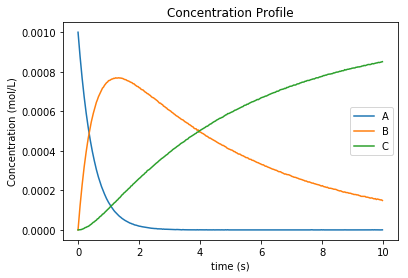

   Concentration profile results from tutorial example 2

.. figure:: ex2result2.png
   :width: 400px
   :align: center

   Pure component absorbance profiles (S) result from tutorial example 2

Tutorial 3 – Advanced reaction systems with additional states
-------------------------------------------------------------
It is also possible to combine additional complementary states, equations and variables into a KIPET model. In the example labeled “Ex_3_complementary.py” an example is solved that includes a temperature and volume change. In this example the model is defined in the same way as was shown before, however this time complementary state variable temperature is added using the following KIPET function:
::

    builder.add_complementary_state_variable('T',290.0)
    builder.add_complementary_state_variable('V',100.0)

This function now adds additional variables to the model, labeled “X”. This same formulation can be used to add any sort of additional complementary state information to the model. Now, similarly to with the components, each complementary state will require an ODE to accompany it. In the case of this tutorial example the following ODEs are defined:
::

    def rule_odes(m,t):
        k1 = 1.25*exp((9500/1.987)*(1/320.0-1/m.X[t,'T']))
        k2 = 0.08*exp((7000/1.987)*(1/290.0-1/m.X[t,'T']))
        ra = -k1*m.Z[t,'A']
        rb = 0.5*k1*m.Z[t,'A']-k2*m.Z[t,'B']
        rc = 3*k2*m.Z[t,'B']
        cao = 4.0
        vo = 240
        T1 = 35000*(298-m.X[t,'T'])
        T2 = 4*240*30.0*(m.X[t,'T']-305.0)
        T3 = m.X[t,'V']*(6500.0*k1*m.Z[t,'A']-8000.0*k2*m.Z[t,'B'])
        Den = (30*m.Z[t,'A']+60*m.Z[t,'B']+20*m.Z[t,'C'])*m.X[t,'V']+3500.0
        exprs = dict()
        exprs['A'] = ra+(cao-m.Z[t,'A'])/m.X[t,'V']
        exprs['B'] = rb-m.Z[t,'B']*vo/m.X[t,'V']
        exprs['C'] = rc-m.Z[t,'C']*vo/m.X[t,'V']
        exprs['T'] = (T1+T2+T3)/Den
        exprs['V'] = vo
        return exprs

Where “m.X[t,'V']” and “m.X[t,'T']” are the additional state variables and “m.Z[t,component]” is the concentration of the component at time t. We can then simulate the model (or use experimental data if available and estimate the parameters) in the same way as described in the previous examples. Please follow the rest of the code and run the examples to obtain the output.

.. figure:: ex3result1.png
   :width: 400px
   :align: center

   Output of Tutorial example 3

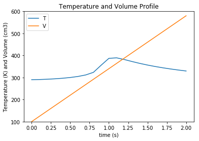

   Output of Tutorial example 3

Tutorial 4 – Simulation of Advanced Reaction system with Algebraic equations
----------------------------------------------------------------------------
Now that complementary states are understood we can explain perhaps the most conceptually difficult part in KIPET, the idea of algebraic variables. The terms algebraics and algebraic variables are used in KIPET when referring to equations and variables in larger models that can be used to determine the ODEs where we have a number of states and equations. This can be illustrated with the Aspirin case study from Chen et al. (2016) where we have the more complex reaction mechanism:

.. figure:: ex4eq1.png
   :width: 400px
   :align: center

With the rate laws being:
.. _fig-coordsys-rect:

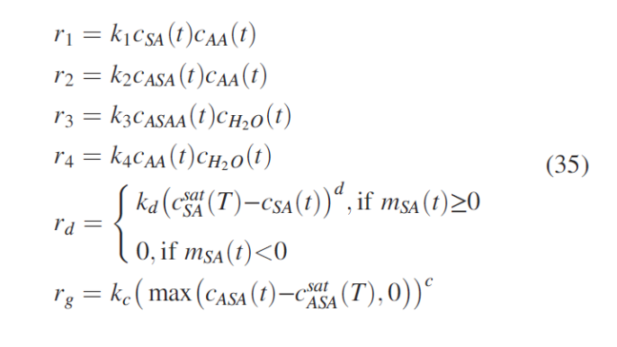

And these can then be used to describe the concentrations of the liquid and solid components with the ODEs:

.. figure:: ex4eq3.png
   :width: 400px
   :align: center

This example can be described by the equations 35 (which are the “algebraics” in KIPET) and the ODEs, equations 36. which will then be the ODEs defining the system, making use of the reaction rate laws from the algebraics.
Translating these equations into code for KIPET we get the file found in Ex_4_sim_aspirin. In this example we need to declare new sets of states in addition to our components and parameters, as with Tutorial 3:
::

    extra_states = dict()
    extra_states['V'] = 0.0202
    extra_states['Masa'] = 0.0
    extra_states['Msa'] = 9.537
    builder.add_complementary_state_variable(extra_states)

with the initial values given. In addition we can declare our algebraic variables (the rate variables and other algebraics):
::

    algebraics = ['f','r0','r1','r2','r3','r4','r5','v_sum','Csat']
    builder.add_algebraic_variable(algebraics)

Where f represents the addition of liquid to the reactor during the batch reaction.
For the final equation in the model (Equn 36) we also need to define the stoichiometric coefficients, gammas, and the epsilon for how the added water affects the changes in volume.
::

    gammas = dict()
    gammas['SA']=    [-1, 0, 0, 0, 1, 0]
    gammas['AA']=    [-1,-1, 0,-1, 0, 0]
    gammas['ASA']=   [ 1,-1, 1, 0, 0,-1]
    gammas['HA']=    [ 1, 1, 1, 2, 0, 0]
    gammas['ASAA']=  [ 0, 1,-1, 0, 0, 0]
    gammas['H2O']=   [ 0, 0,-1,-1, 0, 0]

    epsilon = dict()
    epsilon['SA']= 0.0
    epsilon['AA']= 0.0
    epsilon['ASA']= 0.0
    epsilon['HA']= 0.0
    epsilon['ASAA']= 0.0
    epsilon['H2O']= 1.0
    
    partial_vol = dict()
    partial_vol['SA']=0.0952552311614
    partial_vol['AA']=0.101672206869
    partial_vol['ASA']=0.132335206093
    partial_vol['HA']=0.060320218688
    partial_vol['ASAA']=0.186550717015
    partial_vol['H2O']=0.0883603912169

To define the algebraic equations in Equn (35) we then use:
::

    def rule_algebraics(m,t):
        r = list()
        r.append(m.Y[t,'r0']-m.P['k0']*m.Z[t,'SA']*m.Z[t,'AA'])
        r.append(m.Y[t,'r1']-m.P['k1']*m.Z[t,'ASA']*m.Z[t,'AA'])
        r.append(m.Y[t,'r2']-m.P['k2']*m.Z[t,'ASAA']*m.Z[t,'H2O'])
        r.append(m.Y[t,'r3']-m.P['k3']*m.Z[t,'AA']*m.Z[t,'H2O'])
        # dissolution rate
        step = 1.0/(1.0+exp(-m.X[t,'Msa']/1e-4))
        rd = m.P['kd']*(m.P['Csa']-m.Z[t,'SA']+1e-6)**1.90*step
        r.append(m.Y[t,'r4']-rd)
        #r.append(m.Y[t,'r4'])
        # crystalization rate
        diff = m.Z[t,'ASA'] - m.Y[t,'Csat']
        rc = 0.3950206559*m.P['kc']*(diff+((diff)**2+1e-6)**0.5)**1.34
        r.append(m.Y[t,'r5']-rc)
        Cin = 39.1
        v_sum = 0.0
        V = m.X[t,'V']
        f = m.Y[t,'f']
        for c in m.mixture_components:
            v_sum += partial_vol[c]*(sum(gammas[c][j]*m.Y[t,'r{}'.format(j)] for j in range(6))+ epsilon[c]*f/V*Cin)
        r.append(m.Y[t,'v_sum']-v_sum)

        return r
    builder.set_algebraics_rule(rule_algebraics)
    
Where the algebraics are given the variable name m.Y[t,’r1’]. We can then use these algebraic equations to define our system of ODEs:
::

    def rule_odes(m,t):
        exprs = dict()

        V = m.X[t,'V']
        f = m.Y[t,'f']
        Cin = 41.4
        # volume balance
        vol_sum = 0.0
        for c in m.mixture_components:
            vol_sum += partial_vol[c]*(sum(gammas[c][j]*m.Y[t,'r{}'.format(j)] for j in range(6))+ epsilon[c]*f/V*Cin)
        exprs['V'] = V*m.Y[t,'v_sum']

        # mass balances
        for c in m.mixture_components:
            exprs[c] = sum(gammas[c][j]*m.Y[t,'r{}'.format(j)] for j in range(6))+ epsilon[c]*f/V*Cin - m.Y[t,'v_sum']*m.Z[t,c]

        exprs['Masa'] = 180.157*V*m.Y[t,'r5']
        exprs['Msa'] = -138.121*V*m.Y[t,'r4']
        return exprs

    builder.set_odes_rule(rule_odes)
    model = builder.create_pyomo_model(0.0,210.5257)    

The rest can then be defined in the same way as other simulation problems. Note that in this problem  the method for providing initializations from an external file is also shown with the lines:
::

 dataDirectory = os.path.abspath(os.path.dirname( os.path.abspath( inspect.getfile(inspect.currentframe() ) ) ))
    filename_initZ = os.path.join(dataDirectory, 'init_Z.csv')#Use absolute 	paths
    initialization = pd.read_csv(filename_initZ,index_col=0)
    sim.initialize_from_trajectory('Z',initialization)
    filename_initX = os.path.join(dataDirectory, 'init_X.csv')#Use absolute paths

    initialization = pd.read_csv(filename_initX,index_col=0)
    sim.initialize_from_trajectory('X',initialization)
    filename_initY = os.path.join(dataDirectory, 'init_Y.csv')#Use absolute 	paths
    initialization = pd.read_csv(filename_initY,index_col=0)
    sim.initialize_from_trajectory('Y',initialization)
            
where the external files are the csv’s and the option index_col is from pandas and refers to the column to use for the labels. Following this, external files are also used for the flow of water fed into the reactor, as well as the saturation concentrations of SA and ASA (functions of temperature, calculated externally).
::

    dataDirectory = os.path.abspath(
        os.path.join( os.path.dirname( os.path.abspath( inspect.getfile(
            inspect.currentframe() ) ) ), 'data_sets'))
    traj =  os.path.join(dataDirectory,'extra_states.txt')

    dataDirectory = os.path.abspath(
        os.path.join( os.path.dirname( os.path.abspath( inspect.getfile(
            inspect.currentframe() ) ) ), 'data_sets'))
    conc =  os.path.join(dataDirectory,'concentrations.txt')    
    
    fixed_traj = read_absorption_data_from_txt(traj)
    C = read_absorption_data_from_txt(conc)

    sim.fix_from_trajectory('Y','Csat',fixed_traj)
    sim.fix_from_trajectory('Y','f',fixed_traj)

Tutorial 5 – Advanced reaction systems with additional states using finite element by finite element approach
-------------------------------------------------------------------------------------------------------------
Another functionality within KIPET is to use a finite element by element approach to initialize a problem. If you consider a fed-batch process, certain substances are added during the process in a specific manner dependent on time. This can be modeled using additional algebraic and state variables, similar to the process shown in Tutorial 4. In this tutorial, the following reaction system is simulated.

.. figure:: ex5eq1.png
   :width: 400px
   :align: center

Which is represented by the following ODE system:

.. figure:: ex5eq2.png
   :width: 400px
   :align: center

The file for this tutorial is Ex_5_sim_fe_by_fe.py. For using the finite element by finite element approach you have to import the following package 
::

   from KIPET.library.FESimulator import *

In the case of having 5 rate laws, you will have 5 algebraic variables but an extra algebraic variable can be added which basically works as an input, such that you have 6 in total. 
::

   # add algebraics
   algebraics = [0, 1, 2, 3, 4, 5]  # the indices of the rate rxns
   builder.add_algebraic_variable(algebraics)

Then additional state variables can be added, which in this example is one additional state variable which models the volume. 
::

   # add additional state variables
   extra_states = dict()
   extra_states['V'] = 0.0629418
   This is then included in the system of ordinary differential equations.
   def rule_odes(m, t):
        exprs = dict()
        eta = 1e-2
        step = 0.5 * ((m.Y[t, 5] + 1) / ((m.Y[t, 5] + 1) ** 2 + eta ** 2) **0.5 + (210.0 - m.Y[t,5]) / ((210.0 - m.Y[t, 5]) ** 2 + eta ** 2) **	0.5)
        exprs['V'] = 7.27609e-05 * step
        V = m.X[t, 'V']
        # mass balances
        for c in m.mixture_components:
		 exprs[c] = sum(gammas[c][j] * m.Y[t, j] for j in m.algebraics if j != 5) - exprs['V'] / V * m.Z[t, c]
            if c == 'C':
		 exprs[c] += 0.02247311828 / (m.X[t, 'V'] * 210) * step
        return exprs

Please be aware that the step equation and its application to the algebraic variable and equation m.Y[t,5] will act as a switch for the equations that require an action at a specific time. 
In order to use the fe_factory to initialize the PyomoSimulator, we can use FESimulator, which automatically sets up the fe_factory problem using the data set up in KIPET’s TemplateBuilder and then calls the PyomoSimulator to construct the simulation model. Similar to PyomoSimulator we first call FESimulator using:
::

    sim = FESimulator(model)

And define the discretization scheme:
::

   sim.apply_discretization('dae.collocation', nfe=50, ncp=3, scheme='LAGRANGE-RADAU')

It is then necessary to declare the inputs_sub which shows which variable acts as the input. And also to fix the values of the input variables time measurement points for the simulation.
::

    inputs_sub = {}
    inputs_sub['Y'] = [5]
    for key in sim.model.time.value:
        sim.model.Y[key, 5].set_value(key)
        sim.model.Y[key, 5].fix()  

Finally we call the fe_factory using the FESimulator. When this function is called, it automatically runs the finite element by finite element march forward along the elements, as well as automatically patching the solutions to the PyomoSimulator model, thereby providing the initializations for it. 
::

    init = sim.call_fe_factory(inputs_sub)

Following this, we can call the PyomoSimulator function, run_sim(), as before in order to provide us with the final solution for the simulation, which should provide the ouputs, Figures 11 and 12.
An example showing how fe_factory can be called directly within KIPET is also given in the file Ad_7_sim_fe_by_fe_detailed.py. This approach should not be required, however provides useful insight into the mechanisms of fe_factory.

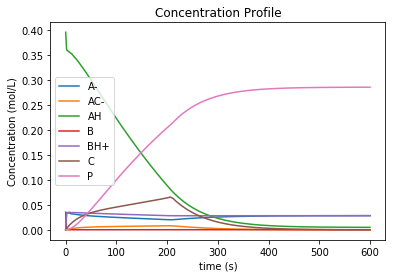

   Concentration profile of solution to Tutorial 5

.. figure:: ex5result2.png
   :width: 400px
   :align: center

   Algebraic state profiles of solution to Tutorial 5

Tutorial 6 – Reaction systems with known non-absorbing species in advance
-------------------------------------------------------------------------
If you are aware of which species are non-absorbing in your case in advance, you can exclude them from the identification process, fixing the associated column in the S-matrix to zero, and also excluding its variance.
You declare your components as in the examples above and then additionally declare the non-absorbing species by the following lines. If species ‘C’ is non-absorbing
::

    non_abs = ['C']
    builder.set_non_absorbing_species(opt_model, non_abs)

You can find an example for this in the examples folder called “Ex_6_non_absorbing.py”. 
In the plot of the absorbance profile the non-absorbing species then remains zero as you can see in the following results. 
::

   Confidence intervals:
   k2 (0.9999997318555397,1.0000000029408624)
   k1 (0.09999999598268668,0.10000000502792096)

   The estimated parameters are:
   k2 0.999999867398201
   k1 0.10000000050530382

.. figure:: ex6result1.png
   :width: 400px
   :align: center

   Concentration profile of solution to Tutorial 6

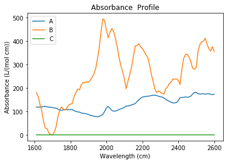

   Absorbance profile of Tutorial 6

Tutorial 7– Parameter Estimation using concentration data
---------------------------------------------------------
KIPET provides the option to also input concentration data in order to perform parameter estimation.  The first term in the objective function (equation 17) is disabled in order to achieve this, so the problem essentially becomes a least squares minimization problem. The example, “Ex_7_concentration_input.py”, shows how to use this feature. First, the data needs to be read and formatted using the data_tools function: 
::

    C_frame = read_concentration_data_from_txt(filename)

Following the TemplateBuilder call and parameter definition we can then add the concentration data to the model:
::

    builder.add_concentration_data(C_frame)

After these two lines, the parameter estimation problem can be completed as shown above. If the user is interested in analyzing the confidence intervals associated with each estimated parameter, the same procedure as shown previously is used. An example of how this is called is found in “Ex_7_conc_input_conf.py”.
That concludes the basic tutorials with the types of problems and how they can be solved. Provided in Table 2 is a list of the additional examples and how they differ. While this section not only acts as a tutorial, it also shows a host of the most commonly used functions in KIPET and how they work and which arguments they take. In the next section additional functions that are included in KIPET are explained, as well as any information regarding the functions discussed in the tutorials is also included.

Tutorial 8 – Time-dependent inputs of different kind using finite element by finite element approach
----------------------------------------------------------------------------------------------------
For modeling fed-batch processes, KIPET provides the option to add inputs due to dosing for certain species. For this the finite element by element approach is used to initialize the problem. If you consider a fed-batch process, certain substances are added during the process in a specific manner dependent on time. This can be modeled using additional algebraic and state variables, similar to the process shown in Tutorial 4.6. In this tutorial, the same reaction system as in Tutorial 4.6 is simulated. However, now we have discrete inputs for some substances.
An example of how this is realized with just one discrete input can be found in “Ex_5_sim_fe_by_fe_jump.py”. 
You have to add the time points where dosing takes place to a new set called feed_times:
::

    feed_times=[100.]
    builder.add_feed_times(feed_times)

Here we add a time point at 100.0 to the set feed_times which is then added to the model.
It is important that you add these additional time point(s) before you add the spectra or concentration data to the model. 
Before you call fe_factory, you specify the components and the amount as well as the corresponding time points where dosing takes place in the following way:
::

    Z_step = {'AH': .3} #Which component and which amount is added
    jump_states = {'Z': Z_step}
    jump_points = {'AH': 100.}#Which component is added at which point in time
    jump_times = {'Z': jump_points}

Then you call fe_factory by providing those as additional arguments:
::

    init = sim.call_fe_factory(inputs_sub, jump_states, jump_times, feed_times)

In case you want to use multiple inputs and also use dosing for algebraic components, you can find an example in “Ex_5_sim_fe_by_multjumpsandinputs.py”. A slightly modified version of the reaction system as in Tutorial 4.6 is implemented here. Here, the kinetic parameter k4 is also temperature dependent which is modeled by Arrhenius law.
The syntax for adding the specification of the components, the feeding amount and the time points, where dosing takes place, looks like this:
::

    Z_step = {'AH': .3, 'A-': .1} #Which component and which amount is added
    X_step = {'V': .01}
    jump_states = {'Z': Z_step, 'X': X_step}
    jump_points1 = {'AH': 101.035, 'A-': 400.} #Which component is added at which point in time
    jump_points2 = {'V': 303.126}
    jump_times = {'Z': jump_points1, 'X': jump_points2}

Example “Ex_5_sim_fe_by_multjumpsandinputs.py” also shows how to use discrete trajectories as inputs. In this case temperature values are read from a file where the fix_from_trajectory function interpolates in between the provided values as well.
 
The inputs can be read from a txt or csv file via 
::

    read_absorption_data_from_txt(Ttraj)
 
or via the following:
::

    read_absorption_data_from_csv(Ttraj)

where Ttraj should load a file including the values in the right format as already explained earlier. 
Then, an input for the algebraic state variable Temp can be fixed by calling the fix_from_trajectory function:
::

    inputs_sub = {}
    inputs_sub['Y'] = ['5', 'Temp']
    sim.fix_from_trajectory('Y', 'Temp', fixed_Ttraj)

Since the model can not discriminate inputs from other algebraic elements, we still need to define the inputs as inputs_sub.
We have to do all this before we call fe_factory as above. 

Tutorial 9 – Variance and parameter estimation with time-dependent inputs using finite element by finite element approach
-------------------------------------------------------------------------------------------------------------------------
In case of dealing with fed-batch processes as in Tutorial 8, KIPET provides the capabilities of also performing variance and parameter estimation for those kind of problems. For this the finite element by element model is used as the optimization model as well. 
An example of how this is realized with spectral data can be found in “Ex_2_estimationfefactoryTempV.py”.  This example uses the reaction mechanism introduced in Tutorial 1 but now with temperature dependence of the parameter k2 modeled by the Arrhenius law. Furthermore, volume change takes place here. You first run the simulation as in Tutorial 8. For the optimization in addition you have to declare additional arguments, such as algebraic variables that are fixed from a trajectory or that are fixed to certain keys. 
You declare your inputs by:
::

    inputs_sub = {}
    inputs_sub['Y'] = ['3','Temp'].

Then, you declare more optional arguments regarding these inputs:
::

    trajs = dict()
    trajs[('Y', 'Temp')] = fixed_Ttraj
    fixedy = True  # instead of things above
    fixedtraj = True
    yfix={}
    yfix['Y']=['3'] #needed in case of different input fixes
    yfixtraj={}
    yfixtraj['Y']=['Temp']

Thereby, 
::

   fixedy = True

should be set if you have inputs of this kind 
::

    for key in sim.model.time.value:    
	sim.model.Y[key, '3'].set_value(key)
	sim.model.Y[key, '3'].fix()

in combination with setting 
::

    yfix={}
    yfix['Y']=['3']  #needed in case of different input fixes.

In case of dealing with inputs that are fixed from trajectories, such as
::

    trajs = dict()
    trajs[('Y', 'Temp')] = fixed_Ttraj
    fixedtraj = True

All of these arguments are handed later to the VarianceEstimator or ParameterEstimator via:
::

    results_variances = v_estimator.run_opt('ipopt',
                                        tee=True,
                                        solver_options=options,
                                        tolerance=1e-5,
                                        max_iter=15,
                                        subset_lambdas=A_set,
                                        inputs_sub=inputs_sub,
                                        trajectories=trajs,
                                        jump=True,
                                        jump_times=jump_times,
                                        jump_states=jump_states,
                                        fixedy=True,
                                        fixedtraj=True,
                                        yfix=yfix,
                                        yfixtraj=yfixtraj,
                                        feed_times=feed_times
                                        )

and for parameter estimation:
::

    results_pyomo = p_estimator.run_opt('k_aug',
                                    tee=True,
                                    solver_opts=options,
                                    variances=sigmas,
                                    with_d_vars=True,
                                    covariance=True,
                                    inputs_sub=inputs_sub,
                                    trajectories=trajs,
                                    jump=True,
                                    jump_times=jump_times,
                                    jump_states=jump_states,
                                    fixedy=True,
                                    fixedtraj=True,
                                    yfix=yfix,
                                    yfixtraj=yfixtraj,
                                    feed_times=feed_times
                                    )

As the parameter values are fixed when running the simulation first. You have to change this before running the Variance Estimation and the Parameter Estimation via:
::

    model=builder.create_pyomo_model(0.0,10.0)
    #Now introduce parameters as non fixed
    model.del_component(params)
    builder.add_parameter('k1',bounds=(0.0,5.0))
    builder.add_parameter('k2Tr',0.2265)
    builder.add_parameter('E',2.)
    model = builder.create_pyomo_model(0, 10) 
    v_estimator = VarianceEstimator(model)

There are two important things that you should keep in mind. You have to add the feed points before adding the dataset of either concentration data or spectral data to the model. 
Furthermore, you should always check the feed times and points carefully, such that they match and the right values for the arguments above are provided. 
Everything else works as explained for the general estimation cases like for example “Ex_2_estimation_conf.py” and as explained for the example with inputs in Tutorial 8.
 
In addition to this, “Ad_5_conc_in_input_conf.py” provides an example for parameter estimation with concentration data instead of spectral data.

Tutorial 10 – Using k_aug to obtain confidence intervals
--------------------------------------------------------
This can be done using the new package developed by David M. Thierry called k_aug, which computes the reduced hessian instead of sIpopt. In order to use this instead of sIpopt, when calling the solver, the solver needs to be set to be ‘k_aug’. All other steps are the same as in previous examples. The examples that demonstrate this functionality are “Ex_7_conc_input_conf_k_aug.py” and “Ex_2_estimation_conf_k_aug.py”.
::

    results_pyomo = p_estimator.run_opt('k_aug',    tee=True,
                                        solver_opts = options,
                                        variances=sigmas,
                                        with_d_vars=True,
                                        covariance=True)

Tutorial 11 – Interfering species and fixing absorbances
--------------------------------------------------------
If we know in advance that one of the absorbing species does not react in advance, we are able to easily include this by merely adding the component to the model as with all other species and including the ODE as follows (see example “Ex_2_abs_not_react”):
::

    exprs['D'] = 0

In this example we obtain the following profile and absorbances:

.. figure:: ex11result1.png
   :width: 400px
   :align: center

   Absorbance profile of solution to Tutorial 11a

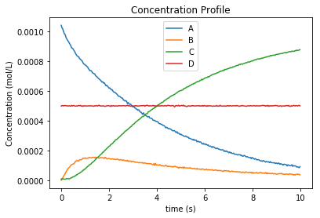

   Concentration profile of Tutorial 11a

If the user knows, in advance, the absorbance profile of a specific component then we can also fix this absorbance. This is shown in “Ex_2_abs_known_non_react.py” where we use the following function.
::

    known_abs = ['D']
    builder.set_known_absorbing_species(opt_model, known_abs, S_frame)   
 
where S_frame is a pandas dataframe containing the the species’ absorbance profile and opt_model is the pyomo model as shown in the example. From this we are able to run the VarianceEstimator and ParameterEstimator to obtain the solutions shown in Figure 16.    

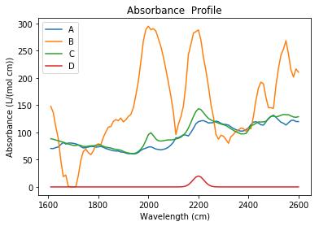

   Absorbance profile of solution to Tutorial 11b

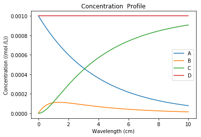

   Concentration profile of Tutorial 11b

Care should be taken when fixing species’ absorbance profiles, however as this reduces the degrees of freedom for the problem, resulting in issues when obtaining the confidence intervals, in particular.

Tutorial 12 – Estimability analysis
-----------------------------------
The EstimabilityAnalyzer module is used for all algorithms and tools pertaining to estimability. Thus far, estimability analysis tools are only provided for cases where concentration data is available. The methods rely on k_aug to obtain sensitivities, so will only work if k_aug is installed and added to path. The example from the example directory is “Ex_8_estimability.py”. 
After setting up the model in TemplateBuilder, we can now create the new class:
::

    e_analyzer = EstimabilityAnalyzer(opt_model)

It is very important to apply discretization before running the parameter ranking function.
::

    e_analyzer.apply_discretization('dae.collocation',nfe=60,ncp=1, scheme='LAGRANGE-RADAU')

The algorithm for parameter ranking requires the definition by the user of the confidences in the parameter initial guesses, as well as measurement device error in order to scale the sensitivities obtained. In order to run the full optimization problem, the variances for the model are also still required, as in previous examples.
:: 

    param_uncertainties = {'k1':0.09,'k2':0.01,'k3':0.02,'k4':0.01}
    sigmas = {'A':1e-10,'B':1e-10,'C':1e-11, 'D':1e-11,'E':1e-11,'device':3e-9}
    meas_uncertainty = 0.01

The parameter ranking algorithm from Yao, et al. (2003) needs to be applied first in order to supply a list of parameters that are ranked. This algorithm ranks parameters using a sensitivity matrix computed from the model at the initial parameter values (in the middle of the bounds automatically, or at the initial guess provided the user explicitly).  This function is only applicable to the case where you are providing concentration data, and returns a list of parameters ranked from most estimable to least estimable. Once these scalings are defined we can call the ranking function:
::
	
    listparams = e_analyzer.rank_params_yao(meas_scaling = meas_uncertainty, param_scaling = param_uncertainties, sigmas =sigmas)

This function returns the parameters in order from most estimable to least estimable. Finally we can use these ranked parameters to perform the estimability analysis methodology suggested by Wu, et al. (2011) which uses an algorithm where a set of simplified models are compared to the full model and the model which provides the smallest mean squared error is chosen as the optimal number of parameters to estimate. This is done using:
::

    params_to_select = e_analyzer.run_analyzer(method = 'Wu', parameter_rankings = listparams, meas_scaling = meas_uncertainty, variances = sigmas)

This will return a list with only the estimable parameters returned. All remaining parameters (non-estimable) should be fixed at their most likely values.

For a larger example with more parameters and which includes the data generation, noising of data, as well as the application of the estimability to a final parameter estimation problem see “Ex_9_estimability_with_problem_gen.py”
::

    sigmas = {'A':1e-10,'B':1e-10,'C':1e-11, 'D':1e-11,'E':1e-11,'device':3e-9}
    meas_uncertainty = 0.01

The parameter ranking algorithm from Yao, et al. (2003) needs to be applied first in order to supply a list of parameters that are ranked. This algorithm ranks parameters using a sensitivity matrix computed from the model at the initial parameter values (in the middle of the bounds automatically, or at the initial guess provided the user explicitly).  This function is only applicable to the case where you are providing concentration data, and returns a list of parameters ranked from most estimable to least estimable. Once these scalings are defined we can call the ranking function:
::

    listparams = e_analyzer.rank_params_yao(meas_scaling = meas_uncertainty, param_scaling = param_uncertainties, sigmas =sigmas)

This function returns the parameters in order from most estimable to least estimable. Finally we can use these ranked parameters to perform the estimability analysis methodology suggested by Wu, et al. (2011) which uses an algorithm where a set of simplified models are compared to the full model and the model which provides the smallest mean squared error is chosen as the optimal number of parameters to estimate. This is done using:
::

    params_to_select = e_analyzer.run_analyzer(method = 'Wu', parameter_rankings = listparams, meas_scaling = meas_uncertainty, variances = sigmas)

This will return a list with only the estimable parameters returned. All remaining parameters (non-estimable) should be fixed at their most likely values.

For a larger example with more parameters and which includes the data generation, noising of data, as well as the application of the estimability to a final parameter estimation problem see “Ex_9_estimability_with_problem_gen.py”

Tutorial 13 – Using the wavelength selection tools
--------------------------------------------------
In this example we are assuming that we have certain wavelengths that do not contribute much to the model, rather increasing the noise and decreasing the goodness of the fit of the model to the data. We can set up the problem in the same way as in Example 2 and solve the full variance and parameter estimation problem with all wavelengths selected.
Note that in order to use the wavelength selection functions, it is important to make a copy of the TemplateBuilder prior to adding the spectral data. This is shown on lines 70 – 76. Here, we make a copy of the TemplateBuilder class after adding the model equations, but before the spectral data:
::

    builder_before_data = builder
    builder.add_spectral_data(D_frame)
    end_time = 10
    opt_model = builder.create_pyomo_model(0.0,end_time)

After completing the normal parameter estimation, we can determine the lack of fit with the following function
::

    lof = p_estimator.lack_of_fit()

This returns the lack of fit as a percentage, in this case 1.37 % lack of fit. We can now determine which wavelengths have the most significant correlations to the concentration matrix predicted by the model:
::

    correlations = p_estimator.wavelength_correlation()

This function prints a figure that shows the correlations (0,1)  of each wavelngth in the output to the concentration profiles. As we can see from figure, some wavelengths are highly correlated, while others have little correlation to the model concentrations. Note that the returned correlations variable contains a dictionary (unsorted) with the wavelengths and their correlations. In order to print the figure, these need to be sorted and decoupled with the following code:
::

    if with_plots:
        lists1 = sorted(correlations.items())
        x1, y1 = zip(*lists1)
        plt.plot(x1,y1)   
        plt.xlabel("Wavelength (cm)")
        plt.ylabel("Correlation between species and wavelength")
        plt.title("Correlation of species and wavelength")

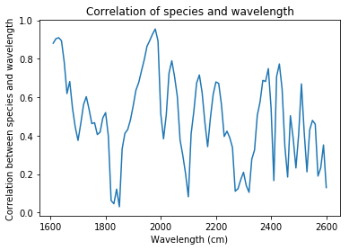

   Wavelength correlations for the tutorial example 13

We now have the option of whether to select a certain amount of correlation to cut off, or whether to do a quick analysis of the full correlation space, in the hopes that certain filter strengths will improve our lack of fit. Ultimately, we wish to find a subset of wavelengths that will provide us with the lowest lack of fit. In this example, we first run a lack of fit analysis that will solve, in succession, the parameter estimation problem with wavelengths of less than 0.2, 0.4, 0.6, and 0.8 correlation removed using the following function:
::

    p_estimator.run_lof_analysis(builder_before_data, end_time, correlations, lof, nfe, ncp, sigmas) 

Where the arguments are builder_before_data (the copied TemplateBuilder before the spectral data is added), the end_time (the end time of the experiment), correlations (the dictionary of wavelngths and their correlations obtained above), lof (the lack of fit from the full parameter estimation problem, i.e. where all the wavelengths are selected), followed by the nfe (number of finite elements), ncp (number of collocation points), and the sigmas (variances from VarianceEstimator).
These are the required arguments for the function. The outputs are as follows:

::

   When wavelengths of less than  0 correlation are removed
   The lack of fit is:  1.3759210191412483
   When wavelengths of less than  0.2 correlation are removed
   The lack of fit is:  1.3902630158740596
   When wavelengths of less than  0.4 correlation are removed
   The lack of fit is:  1.4369628529062384
   When wavelengths of less than  0.6000000000000001 correlation are removed
   The lack of fit is:  1.4585991614309648
   When wavelengths of less than  0.8 correlation are removed
   The lack of fit is:  1.5927062320924816

From this analysis, we can observe that by removing many wavelengths we do not obtain a much better lack of fit, however, let us say that we would like to do a finer search between 0 and 0.12 filter on the correlations with a search step size of 0.01. We can do that with the following extra arguments:
::

    p_estimator.run_lof_analysis(builder_before_data, end_time, correlations, lof, nfe, ncp, sigmas, step_size = 0.01, search_range = (0, 0.12))

::

   With the additional arguments above, the output is:
   When wavelengths of less than  0 correlation are removed
   The lack of fit is:  1.3759210191412483
   When wavelengths of less than  0.01 correlation are removed
   The lack of fit is:  1.3759210099692445
   When wavelengths of less than  0.02 correlation are removed
   The lack of fit is:  1.3759210099692445
   When wavelengths of less than  0.03 correlation are removed
   The lack of fit is:  1.3759210099692445
   When wavelengths of less than  0.04 correlation are removed
   The lack of fit is:  1.3733116835623844
   When wavelengths of less than  0.05 correlation are removed
   The lack of fit is:  1.3701575988048247
   When wavelengths of less than  0.06 correlation are removed
   The lack of fit is:  1.3701575988048247
   When wavelengths of less than  0.07 correlation are removed
   The lack of fit is:  1.3681439750540936
   When wavelengths of less than  0.08 correlation are removed
   The lack of fit is:  1.3681439750540936
   When wavelengths of less than  0.09 correlation are removed
   The lack of fit is:  1.366438881909768
   When wavelengths of less than  0.10 correlation are removed
   The lack of fit is:  1.366438881909768
   When wavelengths of less than  0.11 correlation are removed
   The lack of fit is:  1.3678616037309008
   When wavelengths of less than  0.12 correlation are removed
   The lack of fit is:  1.370173019880385

So from this output, we can see that the best lack of fit is possibly somewhere around  0.095, so we could either refine our search or we could just run a single parameter estimation problem based on this specific wavelength correlation. In order to do this, we can obtain the data matrix for the parameter estimation by running the following function:
::

    new_subs = wavelength_subset_selection(correlations = correlations, n = 0.095)

Which will just return  the dictionary with all the correlations below the threshold removed. Finally, we run the ParameterEstimator on this new data set, followed by a lack of fit analysis, using:
::

    results_pyomo = p_estimator.run_param_est_with_subset_lambdas(builder_before_data, end_time, new_subs, nfe, ncp, sigmas)

In this function, the arguments are all explained above and the outputs are the follows:
::

   The lack of fit is 1.366438881909768  %
   k2 0.9999999977885373
   k1 0.22728234196932856

.. figure:: ex13result2.png
   :width: 400px
   :align: center

   Concentration profile for the tutorial example 13

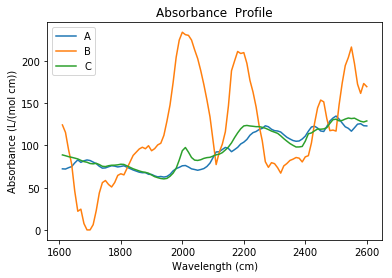

   Absorbance profile for the tutorial example 13

Tutorial 14 – Parameter estimation over multiple datasets
---------------------------------------------------------
KIPET now also allows for the estimation of kinetic parameters with multiple experimental datasets through the MultipleExperimentsEstimator class. Internally, this procedure is performed by running the VarianceEstimator (optionally) over each dataset, followed by ParameterEstimator on individual models. After the local parameter estimation has been performed, the code blocks are used to initialize the full parameter estimation problem. The algorithm automatically detects whether parameters are shared across experiments based on their names within each model. Note that this procedure can be fairly time-consuming. In addition, it may be necessary to spend considerable time tuning the solver parameters in these problems, as the system involves the solution of large, dense linear systems in a block structure linked via equality constraints (parameters). It is advised to try different linear solver combinations with various IPOPT solver options if difficulty is found solving these. The problems may also require large amounts of RAM, depending on the size.
The first example we will look at in this tutorial is entitled “Ex_11_mult_exp_conc.py”, wherein we have a dataset that contains concentration data for a simple reaction and another dataset that is the same one with added noise using the following function:
::

    C_frame2 = add_noise_to_signal(C_frame1, 0.0001)

We then define our model as we have done before. In contrast to previously, however, we create dictionaries containing the datasets, start and end times for the experiments, as well as the variances:
::

    datasets = {'Exp1': C_frame1, 'Exp2': C_frame2}
    start_time = {'Exp1':0.0, 'Exp2':0.0}
    end_time = {'Exp1':10.0, 'Exp2':10.0}
    sigmas = {'A':1e-10,'B':1e-10,'C':1e-10}    
    variances = {'Exp1':sigmas, 'Exp2':sigmas}

Notice here that we need to be consistent with labelling each dataset, as these are used internally to define the individual block names. Now we are ready to call the MultipleExperimentsEstimator class. When we do this, we define our class using the datasets as the argument. This ensures that we know the type of data and names for our separate blocks of data.
::

    pest = MultipleExperimentsEstimator(datasets)

Instead of applying the discretization directly to the model, we can now just add it to the function as an argument. Notice here that this function performs all the steps of estimation in one go.
::

    results_pest = pest.run_parameter_estimation(solver = 'ipopt', 
                                                        tee=True,
                                                         nfe=nfe,
                                                         ncp=ncp,
                                                         solver_opts = options,
                                                         start_time=start_time, 
                                                         end_time=end_time,
                                                       spectra_problem = False,
                                                         sigma_sq=variances,
                                                         builder = builder)

In the above code block, the builder can be either a dictionary of different models (labelled with the dataset labels) or a single model that applies to all datasets. The ‘spectra_problem’ argument is automatically set to True, so when concentration is provided, we need to set this to False.
After running this, we will obtain the results from both datasets separately and then a combined datasets solution at the end. Note that when printing solutions we now need to use the following notation to get the solutions from both blocks:
::

    for k,v in results_pest.items():
        print(results_pest[k].P)
   
    if with_plots:
        for k,v in results_pest.items():
            results_pest[k].C.plot.line(legend=True)
            plt.xlabel("time (s)")
            plt.ylabel("Concentration (mol/L)")
            plt.title("Concentration Profile")
    
            results_pest[k].Z.plot.line(legend=True)
            plt.xlabel("time (s)")
            plt.ylabel("Concentration (mol/L)")
            plt.title("Concentration Profile")
        
            plt.show()

Where the dictionary results_pest contains each of the experimental datasets. The results are as follows:
::

   The estimated parameters are:
   k1    0.224999
   k2    0.970227

Another example here is the example where we have multiple experimental datasets from spectroscopic data and we also perform variance estimation. This example is “Ex_11_estimation_mult_exp.py”. In this example we have three datasets, each perturbed by different levels of noise for illustrative purposes. One dataset is also of different size, just to demonstrate KIPET’s ability to do so:
::

    D_frame1 = decrease_wavelengths(D_frame1,A_set = 2)

This function removes every second wavelengths from the data matrix D_frame1. Similar to before, we add the three datasets separately into the MultipleExperiments class as a dictionary and finally run the variance estimation:
::

    results_variances = pest.run_variance_estimation(solver = 'ipopt', 
                                                     tee=False,
                                                     nfe=nfe,
                                                     ncp=ncp, 
                                                     solver_opts = options,
                                                     start_time=start_time, 
                                                     end_time=end_time, 
                                                     builder = builder)

This function runs the variance estimation on each block separately and automatically inserts them into the parameter estimation section, so there is no need to supply them if this is run prior to the parameter estimation. Finally we can run the parameter estimation as before:
::

    results_pest = pest.run_parameter_estimation(solver = 'ipopt', 
                                                        tee=True,
                                                         nfe=nfe,
                                                         ncp=ncp,
                                                         solver_opts = options,
                                                         start_time=start_time, 
                                                         end_time=end_time, 
                                                         builder = builder)

This outputs the following:
::

   The estimated parameters are:
   k2    1.357178
   k1    0.279039

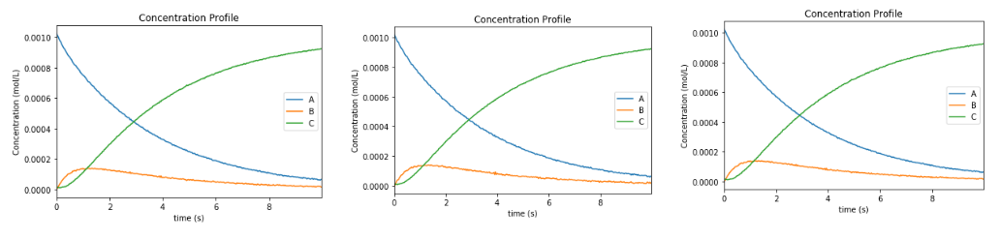

   Concentration profiles for the tutorial example 14

.. figure:: ex15result2.png
   :width: 400px
   :align: center

   Absorbance profiles for the tutorial example 14

There are a number of other examples showing how to implement the multiple experiments across different models with shared global and local parameters as well as how to obtain confidence intervals for the problems.
It should be noted that obtaining confidence intervals can only be done when declaring a global model, as opposed to different models in each block. This is due to the construction of the covariance matrices. When obtaining confidence intervals for multiple experimental datasets it is very important to ensure that the solution obtained does not include irrationally large absorbances (from species with low or no concentration) and that the solution of the parameters is not at very close to a bound. This will cause the sensitivity calculations to be aborted, or may result in incorrect confidence intervals.
All the additional problems demonstrating various ways to obtain kinetic parameters from different experimental set-ups are shown in the example table and included in the folder with tutorial examples.

Tutorial 14 – Using the alternative VarianceEstimator
-----------------------------------------------------
Since the above method that was used in the other problems, described in the initial paper from Chen et al. (2016), can be problematic for certain problems, new variance estimation procedures have been developed and implemented in KIPET version 1.1.01. In these new variance estimation strategies, we solve the maximum likelihood problems directly. The first method, described in the introduction in section 3 involves first solving for the overall variance in the problem and then solving iteratively in order to find how much of that variance is found in the model and how much is found in the device. This tutorial problem can be found in the example directory as “Ex_13_alt_variance_tutorial.py”.
After setting the problem up in the normal way, we then call the variance estimation routine with a number of new options that help to inform this new technique. 
::

    results_variances = v_estimator.run_opt('ipopt',
                                            method = 'alternate',
                                            tee=False,
                                            initial_sigmas = init_sigmas,
                                            solver_opts=options,
                                            tolerance = 1e-10,
                                            secant_point = 5e-7,
                                            individual_species = False)

The new options include the method, which in this case is ‘alternate’, initial_sigmas, which is our initial value for the sigmas that we wish to start searching from, and the secant_point, which provides a second point for the secant method to start from. The final new option is the individual_species option. When this is set to False, we will obtain only the overall model variance, and not the specific species. Since the problem is unbounded when solving for this objective function, if you wish to obtain the individual species’ variances, this can be set to True, however this should be used with caution as this is most likely not the real optimum, as the device variance that is used will not be the true value, as the objective functions are different.

A number of other functions and tools exist for variance estimation and to help with finding the correct initial values. A second method is referred to as “direct_sigmas”. This method first assumes that there is no model variance and solves directly for a worst-case device variance. This tutorial problem can be found in the example directory as “Ex_13_alt_variance_tutorial_direct_sigmas.py”. After defining the model and calling the VarianceEstimator class as was done previously, we first solve for our worst possible variance on the device using:
::

    worst_case_device_var = v_estimator.solve_max_device_variance('ipopt', 
                                                        tee = False, 
                                                        solver_opts = options)

Once the worst-possible device variance is known, we can obtain some region in which to solve for the model variances knowing the range in which the device variance is likely to lie. This can be obtained perhaps from the device manufacturer as the best possible device accuracy. We can then solve a sequence of problems within this range of device variances.
::

    best_possible_accuracy = 1e-8
    search_range = (best_possible_accuracy, worst_case_device_var)
    num_points = 10

    results_variances = v_estimator.run_opt('ipopt',
                                            method = 'direct_sigmas',
                                            tee=False,
                                            solver_opts=options,
                                            num_points = num_points,                                            
                                            #subset_lambdas=A_set,
                                            device_range = search_range)

Note here that the num_points argument is the number of evenly-spaced evaluations that will occur and that the range needs to be inputted as a tuple.
This will output a number of difference model variances and parameter estimates based on different fixed values of delta within the range. Following this, it may be necessary to fix the device variance to a particular value and return the sigmas that we wish to use in the parameter estimation problem.
::

    delta_sq = 1e-7
    results_vest = v_estimator.solve_sigma_given_delta('ipopt', 
                                                         #subset_lambdas= A, 
                                                         solver_opts = options, 
                                                         tee=False,
                                                         delta = delta_sq)

Note here, importantly, that the “delta” argument is the squared variance of the device and that the resultsvest returns a dictionary of the sigmas including the device variance that you have inputted. After this you may solve the parameter estimation problem as before. 
Included in this tutorial problem is the ability to compare solutions with the standard Chen approach as well as to compare the solutions to the generated data. One can see that both approaches do give differing solutions. And that, in this case, the new variance estimator gives superior solutions.
This concludes the last of the tutorial examples. This hopefully provides a good overview of the capabilities of the package and we look forward to getting feedback once these have been applied to your own problems. Table 2 on the following page provides a complete list of all of the example problems in the KIPET package, with some additional explanations.

The next section of the documentation provides more detailed and miscellaneous functions from within KIPET that were not demonstrated in the tutorials.

.. _example-list:
.. table:: List of example problems

   +------------------------------------------------+-------------------------------------------------------+
   | Filename                                       | Example problem description                           | 
   +================================================+=======================================================+
   | Ex_1_ode_sim.py                                | Tutorial example of simulation (of reaction system    |
   |						    | 1, RS1)                                               |
   +------------------------------------------------+-------------------------------------------------------+
   | Ex_2_estimation.py                             | Tutorial example of parameter estimation with         |
   |                                                | variance estimation (of RS1)                          |
   +------------------------------------------------+-------------------------------------------------------+
   | Ex_2_estimation_conf.py                        | Tutorial example of parameter estimation problem above|
   |						    | with variance estimation and confidence intervals     |
   |						    | from sIpopt (RS1)                                     |
   +------------------------------------------------+-------------------------------------------------------+
   | Ex_2_estimation_conf_k_aug.py                  | Tutorial example of parameter estimation problem above|
   |						    | with variance estimation and confidence intervals     |
   |						    | from k_aug (RS1)                                      |
   +------------------------------------------------+-------------------------------------------------------+
   | Ex_2_estimation_filter_msc.py                  | Same problem as above with MSC followed by SG         |
   |						    | pre-processing                                        |
   +------------------------------------------------+-------------------------------------------------------+
   | Ex_2_estimation_filter_snv.py                  | Same problem as above with SNV followed by SG         |
   |						    | pre-processing                                        |
   +------------------------------------------------+-------------------------------------------------------+
   | Ex_2_estimationfefactoryTempV.py               | Tutorial estimation for variance and parameter        |
   |						    | estimation with inputs (modified RS1)                 |
   +------------------------------------------------+-------------------------------------------------------+
   | Ex_2_abs_not_react.py                          | Tutorial example of parameter estimation where one    |
   |                                                | species is absorbing but not reacting                 |
   +------------------------------------------------+-------------------------------------------------------+
   | Ex_2_abs_known_non_react.py                    | Tutorial example of parameter estimation where one    |
   |						    | species is absorbing and not reacting, however we     |
   |						    | know this species absorbance profile.                 |
   +------------------------------------------------+-------------------------------------------------------+
   | Ex_2_with_SVD.py                               | Example demonstrating how to use the basic_pca        |
   |                                                | function                                              |
   +------------------------------------------------+-------------------------------------------------------+
   | Ex_2_estimation_bound_prof_fixed_variance.py   | Example demonstrating how to fix device variance and  |
   |                                                | also how to bound and fix variable profiles.          |
   +------------------------------------------------+-------------------------------------------------------+
   | Ex_2_alternate_variance.py                     | Example to show the usage of the new variance         |
   |						    | estimation procedure with the secant method. Obtains  |
   |						    | either overall model variance or individual species’  | 
   |						    | variances.                                            |
   +------------------------------------------------+-------------------------------------------------------+
   | Ex_2_alternate_variance_direct_sigmas.py       | Example to show the usage of another of the variance  |
   |                                                | estimation procedures whereby we solve driectly for   |
   |                                                | sigmas based on a range of delta values.              |
   +------------------------------------------------+-------------------------------------------------------+
   | Ex_3_complementary.py                          | Tutorial simulation that includes additional          |
   |						    | complementary states (RS2)                            |
   +------------------------------------------------+-------------------------------------------------------+
   | Ex_4_sim_aspirin.py                            | Tutorial simulation of an aspirin batch reactor (RS3) |
   |						    | shows how additional stateand algebraics are used     |
   +------------------------------------------------+-------------------------------------------------------+
   | Ex_5_sim_fe_by_fe_jump.py                      | Tutorial simulation of a large reaction system (RS4)  |
   |						    | including demonstration of the finite element by      |
   |						    | finite element initialization method. The reaction    |
   |						    | system is that of the Michael’s reaction but here     | 
   |						    | dosing takes place. That means for one of the species |
   |						    | feeding takes place at one time point during the      | 
   |						    | process. This example shows how dosing inputs can be  |
   |						    | realized (Section 4.9).                               |
   +------------------------------------------------+-------------------------------------------------------+
   | Ex_5_sim_fe_by_fe_multjumpsandinputs.py        | Tutorial simulation of a large reaction system (RS4)  |
   |						    | including demonstration of the finite element by      |
   |						    | finite element initialization method. The reaction    |
   |						    | system is that of the Michael’s reaction. Here dosing | 
   |						    | takes place for multiple species that means for       |
   |						    | multiple species feeding takes place at different     | 
   |						    | example shows how inputs via discrete trajectories can|
   |						    | be realized. For this, one of the kinetic parameters  |
   |						    | is now assumed to be temperature dependent and        |
   |						    | temperature inputs are provided via temperature       |
   |						    | values read from a file (Section 4.9).                |
   +------------------------------------------------+-------------------------------------------------------+
   | Ex_6_non_absorbing                             | Example of a problem where non-absorbing components   |
   |						    | are included.                                         |
   +------------------------------------------------+-------------------------------------------------------+
   | Ex_7_concentration_input.py                    | Tutorial problem describing RS1 where concentration   |
   |                                                | data is provided by the user.                         |
   +------------------------------------------------+-------------------------------------------------------+
   | Ex_7_conc_input_conf.py                        | Tutorial problem describing RS1 where concentration   |
   |						    | data is provided by the user and confidence intervals |
   |						    | are shown.                                            |
   +------------------------------------------------+-------------------------------------------------------+
   | Ex_8_estimability.py                           | Tutorial problem demonstrating the estimability       |
   |                                                | analysis.                                             |
   +------------------------------------------------+-------------------------------------------------------+
   | Ex_9_estimability_with_prob_gen.py             | Tutorial problem where problem generation is done via |
   |                                                | simulation, random normal noise is added, followed by |
   |                                                | estimability analysis and finally parameter estimation|
   |                                                | on reduced model.                                     |
   +------------------------------------------------+-------------------------------------------------------+
   | Ex_10_estimation_lof_correlation.py            | Tutorial problem 14 where subset selection is made    |
   |                                                | based on the correlation between wavelengths and the  |
   |                                                | estimability analysis and finally parameter estimation|
   |                                                | species concentrations. We also introduce the lack of |
   |                                                | of fit as a way to judge the selection.               |
   +------------------------------------------------+-------------------------------------------------------+
   | Ex_11_estimation_mult_exp.py                   | Tutorial problem 15 with 2 spectroscopic datasets and |
   |                                                | shared parameters.                                    |
   +------------------------------------------------+-------------------------------------------------------+
   | Ex_11_estimation_mult_exp_conf.py              | Tutorial problem 15 with 2 spectroscopic datasets and |
   |                                                | shared parameters with confidence intervals.          |
   +------------------------------------------------+-------------------------------------------------------+
   | Ex_11_estimation_mult_exp_diff.py              | Tutorial problem 15 with 2 spectroscopic datasets and |
   |                                                | models used in each dataset with shared parameters.   |
   +------------------------------------------------+-------------------------------------------------------+
   | Ex_11_estimation_mult_locglob.py               | Tutorial problem 15 with 2 spectroscopic datasets and |
   |                                                | models used in each dataset with shared parameters    |
   |                                                | and local parameters.                                 |
   +------------------------------------------------+-------------------------------------------------------+
   | Ex_12_estimation_mult_exp_conc.py              | Tutorial 15 : parameter estimation with 2             |
   |                                                | concentration datasets.                               |
   +------------------------------------------------+-------------------------------------------------------+
   | Ex_12_estimation_mult_exp_conc_conf.py         | Tutorial 15 : parameter estimation with 2             |
   |                                                | concentration datasets with confidence intervals.     |
   +------------------------------------------------+-------------------------------------------------------+
   | Ex_12_multexp_conc_diffreact.py                | Parameter estimation with 2 concentration datasets,   |
   |                                                | including  data simulation with different initial     |
   |                                                | conditions and including confidence intervals.        |
   +------------------------------------------------+-------------------------------------------------------+
   | Ex_13_original_variance.py                     | Tutorial 14 problem with generated data to show how   |
   |                                                | the original Chen method performs in comparison to the|
   |                                                | newer alternative method.                             |
   +------------------------------------------------+-------------------------------------------------------+
   | Ex_13_alt_variance_tutorial_direct_sigmas.py   | Tutorial 14 problem with generated data to show how   |
   |						    | one can apply the second alternative variance         |
   |						    | estimation procedure with direct calculation of sigmas| 
   |						    | based on fixed device variance.                       |
   +------------------------------------------------+-------------------------------------------------------+
   | Ex_13_alt_variance_tutorial.py                 | Tutorial 14 problem with generated data to show how to|
   |						    | use the new method for obtaining overall and/or       |
   |						    | individual model variances using the secant method.   | 
   +------------------------------------------------+-------------------------------------------------------+
   | Ad_1_estimation.py                             | Additional parameter estimation problem with known    |
   |						    | variances, but with a least squares optimization run  |
   |						    | to get initialization for the parameter estimation    | 
   |						    | problem (Section 5.6). (RS1)                          |
   +------------------------------------------------+-------------------------------------------------------+
   | Ad_2_estimation_warmstart.py                   | Tutorial example of parameter estimation with variance|
   |						    | estimation (of RS1) with warmstart option and estimate|
   |						    | parameters in steps.                                  | 
   +------------------------------------------------+-------------------------------------------------------+
   | Ad_2_estimation_uplc.py                        | Tutorial example of parameter estimation with variance|
   |						    | estimation (of RS1) with additional UPLC data for     |
   |						    | estimation of parameters                              | 
   +------------------------------------------------+-------------------------------------------------------+
   | Ad_2_ode_sim.py                                | Simulation of RS3 from Sawall, et al. (2012),         |
   |                                                | nonlinear system.                                     |
   +------------------------------------------------+-------------------------------------------------------+
   | Ad_2_scaled_estimation.py                      | RS3 parameter estimator, including least squares      |
   |                                                | initialization, variance estimator, and parameter     |
   |                                                | estimation.                                           |
   +------------------------------------------------+-------------------------------------------------------+
   | Ad_3_sdae_sim_non_abs.py                       | RS1 system with generated absorbance data and a non-  |
   |						    | absorbing component, this problem generates absorbance|
   |						    | to get initialization for the parameter estimation    | 
   |						    | data and then runs a simulation that generates a      |
   |                                                | D-matrix for the parameter estimation and variance    |
   |                                                | estimation.                                           |
   +------------------------------------------------+-------------------------------------------------------+
   | Ad_4_sdae_sim.py                               | Tutorial problem with inputted absorbances (RS1)      |
   +------------------------------------------------+-------------------------------------------------------+
   | Ad_5_complementary_sim.py                      | RS3 with temperature included in simulation           |
   +------------------------------------------------+-------------------------------------------------------+
   | Ad_5_conc_in_input_conf.py                     | Parameter estimation with inputs for RS3 with         |
   |                                                | concentration data                                    |
   +------------------------------------------------+-------------------------------------------------------+
   | Ad_6_sawall.py                                 | Parameter estimation of another nonlinear reaction    |
   |                                                | system from the Sawall, et al., 2012, paper.          |
   +------------------------------------------------+-------------------------------------------------------+
   | Ad_7_sim_fe_by_fe_detailed.py                  | Example of using fe_factory explicitly within KIPET   |
   +------------------------------------------------+-------------------------------------------------------+
   | Ad_8_conc_input_est_conf.py                    | RS1 with concentration data as the input. Parameters  |
   |                                                | estimated with confidence intervals.                  |
   +------------------------------------------------+-------------------------------------------------------+
   | Ad_9_conc_in_sawall_est.py                     | Parameter estimation on nonlinear reaction system     |
   |                                                | from the Sawall, et al., 2012, paper with             |
   |                                                | concentration data inputted.                          |
   +------------------------------------------------+-------------------------------------------------------+
   | Ad_10_aspirin_FESimulator.py                   | The aspirin example simulated using FESimulator       |
   +------------------------------------------------+-------------------------------------------------------+
   | Ad_11_estimation_mult_exp_conf.py              | Example with multiple datasets including reactions    |
   |                                                | that do not occur in some datasets with confidence int|
   +------------------------------------------------+-------------------------------------------------------+
   | Ad_12_varianceestimatordatagenerator.py        | The data generation for Tutorial 14 to show the true  |
   |                                                | variances in the tutorial problem.                    |
   +------------------------------------------------+-------------------------------------------------------+

