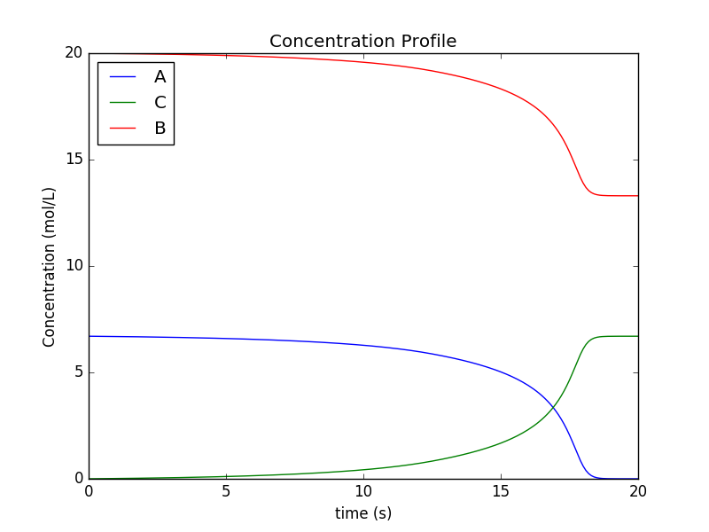
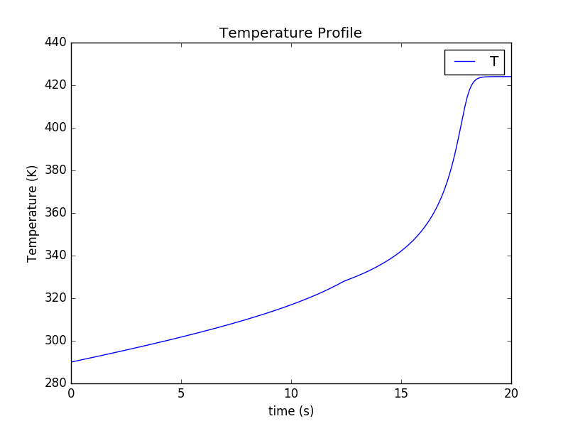
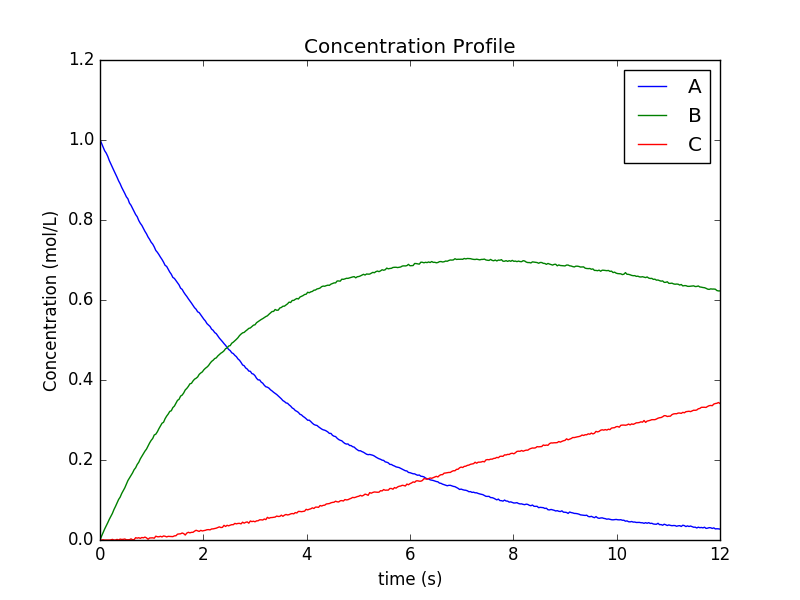
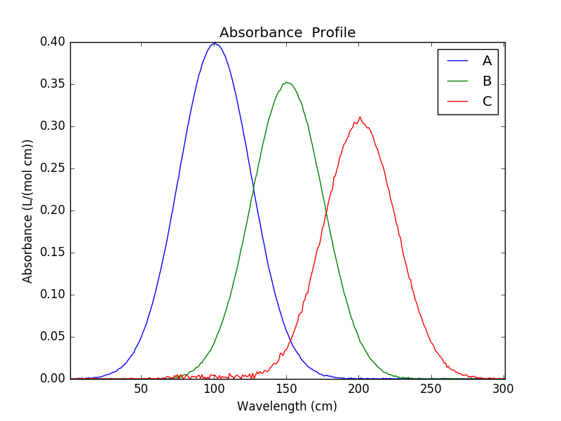
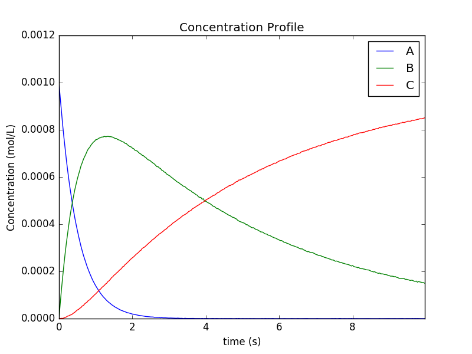
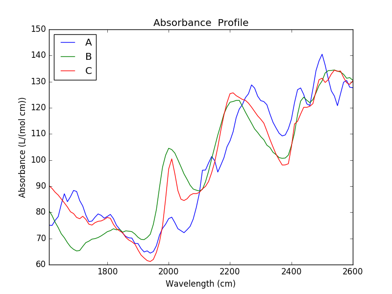

Examples
========

Running a simulation with the pyomo simulator and ipopt
-------------------------------------------------------
.. literalinclude:: ../kipet/examples/sawall/pyomo/ode_sim.py
		    
Running a simulation with casadi
--------------------------------
.. literalinclude:: ../kipet/examples/complementary_states/casadi/ode_conditional_sim.py

		    
Solving a parameter estimation problem with known variance noise
----------------------------------------------------------------
.. literalinclude:: ../kipet/examples/case51c/pyomo/estimation.py

	   
Solving a variance and parameter estimation problem
---------------------------------------------------
.. literalinclude:: ../kipet/examples/Paper/replicate_example51a.py

