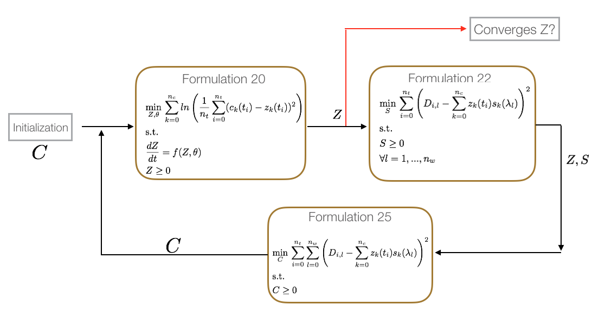
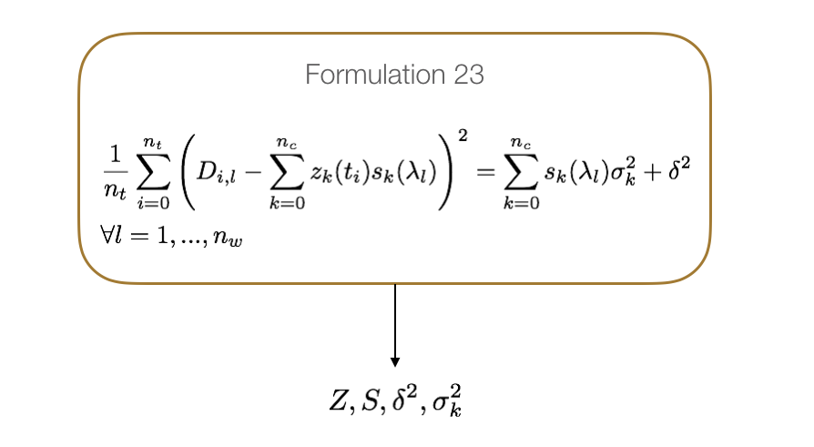

Getting started
======================================

In the context of this documentation, we focus on kinetic studies for the investigation of chemical reactions and the identification of its associated rate constants. We will concentrate on how to use kipet to estimate kinetic parameters of chemical reaction mechanisms of interest from multi-wavelength spectroscopic data 

Before getting started with kipet users should know basic Python programming. If you are lacking basic knowledge of Python please take a look at the following link

https://docs.python.org/3/tutorial/

To use kipet, import the package from within a python console::

	import kipet	

After importing the package users can do the following things:

* Build a chemical reaction model 
* Simulate model
* Estimate variances
* Estimate parameters
* Compute confidence intervals of estimated parameters
* Plot concentration and absorbance profiles

For the construction of optimization models kipet relies on the Python-based open-source software PYOMO. Pyomo can be used to formulate general optimization problems in Python. Within kipet pyomo is used to formulate the optimization models required for estimating kinetic parameters of chemical reaction systems. The following examples provide guidance on how to create pyomo optimization models to estimate kinetic parameters from spectral data.

==============================  =========================================================================================================
Example File                    Description
==============================  =========================================================================================================
plain_pyomo/sawall_example.py   Two component model. Details in [Sawall2012]_
plain_pyomo/case51a.py          Three component model. Details in [Weifeng2016]_, [Jaumot2005]_
plain_pyomo/case51b.py          Three component model. Details in [Weifeng2016]_
plain_pyomo/case51c.py          Four component model. Details in [Weifeng2016]_, [Puxty2005]_
==============================  =========================================================================================================

To facilitate the creation of models kipet provides a helper class that makes it easier the creation of kinetic models. The helper class TemplateModelBuilder uses pyomo under the hood and builds models like the ones presented in the 4 examples listed previously. In general the template builder creates models with the following attributes:

* Unnoised concentration variable Z
* Noised concentration variable C
* Absorption variable S
* Complementary state variables X
* Parameters P

Once the model is created it can be simulated or optimized. Kipet simulates and optimizes pyomo models following a simultaneous approach. In the simultaneous approach all time dependent variables are discretize to construct a large nonlinear problem, and therefore good initial guesses need to be provided to simulate or optimize pyomo models. To facilitate the determination of such initial guess kipet provides a second type of models called CasADi models. CasADi models are intended only for simulation. The simulation of CasADi models is based on multistep integrators offered in the ODE/DAE integration software SUNDIALS. While pyomo models may require a good initialization in order to find a feasible solution, CasADi models do not need to be initialized. Therefore, users can simulate a CasADi model and provide the resulting trajectories to pyomo models. The creation of CasADi and Pyomo models with the help of the TemplateBuilder follows the same steps. Examples can be found in the following files:

==============================  =========================================================================================================
Example File                    Description
==============================  =========================================================================================================
sawall/casadi/ode_sim.py        Two component model simulation. Details in [Sawall2012]_
sawall/pyomo/ode_sim.py         Two component model simulation. Details in [Sawall2012]_
complementary_states/casadi     Fogler examples [Fogler]_
complementary_states/pyomo      Fogler examples [Fogler]_
==============================  =========================================================================================================

Note that after a model is created it does not need to be used only with kipet tools. For instance, users can use the TemplateBuilder just to create the model and later use the model only with pyomo or CasADi tools. This means, after the creation of the model the users can simulate or optimize it by directly calling the solvers from pyomo or CasADi Functionality. However, kipet offers simulator and optimizer classes that facilitate the initialization and scaling of models before the corresponding is called for simulation. In addition, the simulator and optimizer classes available in kipet will store the results of the simulation/optimization in pandas DataFrames for easy visualization and analysis. Examples of simulations and optimizations can be found in the following files:

==================================  =========================================================================================================
Example File                        Description
==================================  =========================================================================================================
case51b/casadi/ode_sim.py           Three component model simulation. Details in [Weifeng2016]_ 
case51b/pyomo/estimation.py         Parameter estimation. Details in [Weifeng2016]_
case51b/pyomo/scaled_estimation.py  Parameter estimation with scaling. Details in [Weifeng2016]_ 
==================================  =========================================================================================================

Kiper offers two classes for optimization of reactive models. The ParameterEstimator class estimates kinetic parameters from spectral data by solving the problem formulation described in [Weifeng2016]_. Within this class the objective function is constructed with pyomo and added to the model passed to the optimizer. However, if the user provides a model with an active objective function, the ParameterEstimator will optimize the objective function provided by the user. This class also offers functionality to determine the confidence intervals of the estimated parameters. For all calculations in the ParameterEstimator class the variances of the spectral data need to be provided. When the variances are not known the user can use the VarianceEstimator optimizer class instead. 

The variance estimation procedure is described in detail in [Weifeng2016]_. The procedure consist basically on solving three different nonlinear optimization problems in a loop until convergence on the concentration profiles is reached. The following figure summarizes the variance estimation procedure 

The VarianceEstimator class will construct the three problems and solve them with a nonlinear solver until the convergence criteria is satisfy. By Default kipet checks for the infinite norm of the residulas of Z between two iterations. If the infinity norm is less than the tolerance (default 5e-5) then variances are estimated by solving the following overdetermined system

Examples on how to use the optimization classes and there corresponding options can be found in the examples section of this document. 

Additional examples are included in the examples folder.  
